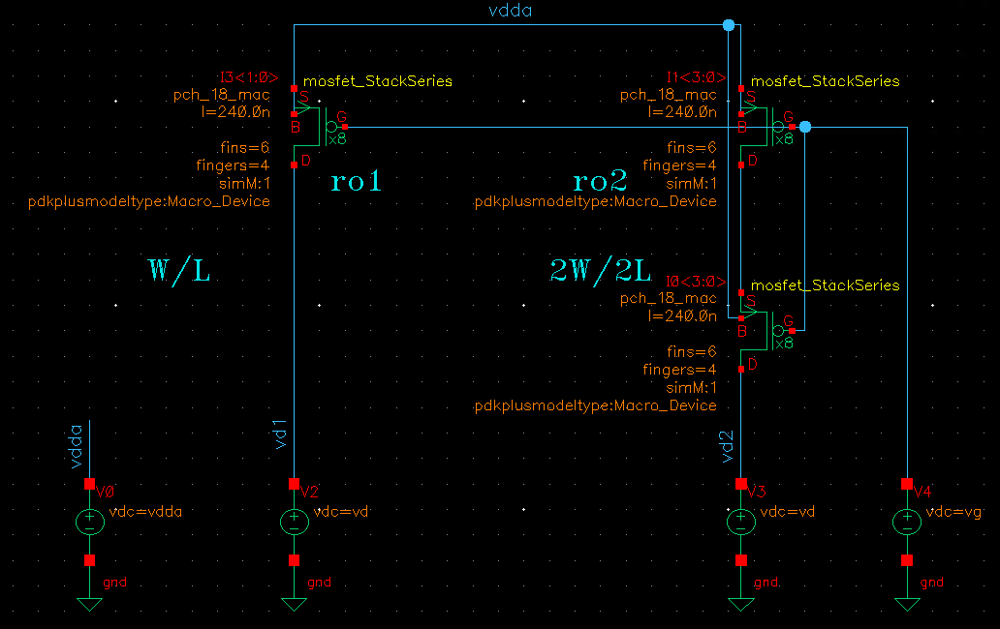

> short-channel effects

$$\begin{align}
I_D &=\frac{1}{2}\mu_nC_{ox}\frac{W}{L}(V_{GS}-V_{TH})^2(1+\frac{\Delta L}{L}) \\
I_D &=\frac{1}{2}\mu_nC_{ox}\frac{W}{L}(V_{GS}-V_{TH})^2(1+\lambda V_{DS}) \\
I_D &=\frac{1}{2}\mu_nC_{ox}\frac{W}{L}(V_{GS}-V_{TH})^2(1+\frac{V_{DS}}{V_A})
\end{align}$$

where $\frac{\Delta L}{L}=\lambda V_{DS}$ and $V_A=\frac{1}{\lambda}$ 

$\lambda$ is channel length modulation parameter

$V_A$, i.e. Early voltage is equal to inverse of channel length modulation parameter

The output resistance $r_o$

$$\begin{align}
r_o &= \frac{\partial V_{DS}}{\partial I_D} \\
&= \frac{1}{\partial I_D/\partial V_{DS}} \\
&= \frac{1}{\lambda I_D} \\
&= \frac{V_A}{I_D}
\end{align}$$

Due to  $\lambda \propto 1/L$, i.e. $V_A \propto L$
$$
r_o \propto \frac{L}{I_D}
$$

The output resistance is almost doubled using Stacked FET  in *saturation region*

> $V_t$ and mobility $\mu_{n,p}$ are sensitive to temperature
>
> - $V_t$ decreases by 2-mV for every 1$^oC$ rise in temperature
> - mobility $\mu_{n,p}$ decreases with temperature
>
>  Overall, increase in temperature results in lower drain currents
