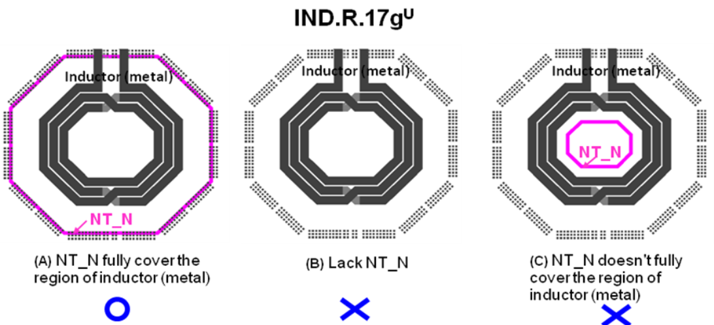

A **native layer (NT_N)** is usually added under inductors or transformers in the nanoscale CMOS to define the non-doped high-resistance region of substrate, which decreases eddy currents in the substrate thus maintaining high Q of the coils.

> For T* PDK offered inductor, a native substrate region is created under the inductor coil to minimize *eddy currents* 

> OD inside NT_N only can be used for NT_N potential pickup purpose, such as the guarding-ring of MOM and inductor

## Derived Geometries

| Term | Definition  |
| ---- | ----------- |
| *PW* | *{NOT NW}*  |
| N+OD | {NP AND OD} |
| P+OD | {PP AND OD} |
| GATE | {PO AND OD} |
| TrGATE | {GATE NOT PODE_GATE} |

NP: N+ Source/Drain Ion Implantation

PP: P+ Source/Drain Ion Implantation

OD: Gate Oxide and Diffustion

NW: N-WELL

PW: P-WELL

## CMOS Processing Technology

*Four main CMOS technologies:*

- *n-well process*
- *p-well process*
- *twin-tub process*
- *silicon on insulator*

Triple well, Deep N-Well (optional):

- NWell:  NMOS svt, lvt, ulvt ...
- PWell: PMOS svt, lvt, ulvt ...
- DNW:  For isolating P-Well from the substrate

> The NT_N drawn layer adds **no** process cost and **no** extra mask
>
> The N-well / P-well technology, where n-type diffusion is done over a p-type substrate or p-type diffusion is done over n-type substrate respectively.
>
> The **Twin well technology**, where **NMOS and PMOS transistor** are developed over the wafer by simultaneous diffusion over an epitaxial growth base, rather than a substrate.

## reference

Principles of VLSI Design CMOS Processing CMPE 413 [[https://redirect.cs.umbc.edu/~cpatel2/links/315/lectures/chap3_lect09_processing2.pdf](https://redirect.cs.umbc.edu/~cpatel2/links/315/lectures/chap3_lect09_processing2.pdf)]

CMOS processing [[http://users.ece.utexas.edu/~athomsen/cmos_processing.pdf](http://users.ece.utexas.edu/~athomsen/cmos_processing.pdf)]

The Fabrication Process of CMOS Transistor [[https://www.elprocus.com/the-fabrication-process-of-cmos-transistor/#:~:text=latch%2Dup%20susceptibility.-,N%2D%20well%2F%20P%2D%20well%20Technology,well%20it%20is%20vice%2D%20verse.](https://www.elprocus.com/the-fabrication-process-of-cmos-transistor/#:~:text=latch%2Dup%20susceptibility.-,N%2D%20well%2F%20P%2D%20well%20Technology,well%20it%20is%20vice%2D%20verse.)]

CMOS Processing Technology [[link1](http://ece-research.unm.edu/jimp/vlsi/slides/chap3_1.html), [link2](http://ece-research.unm.edu/jimp/vlsi/slides/chap3_2.html)]
