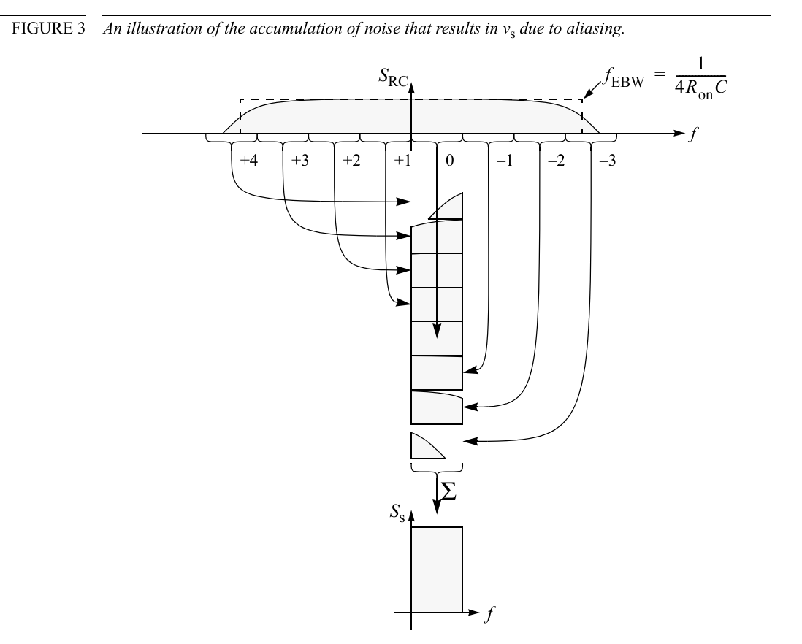

## bootstrap T/H Switch
*TODO* &#128197;

## kick-back

kick-back increases CDAC settling time

> *add pre-amp (more power)*

##  SAR redundancy 

*TODO* &#128197;

That redundancy, that use of non-binary weighting, allowed it to tolerate mismatch and also slow settling

## Hold Mode Feedthrough
*TODO* &#128197;

> P. Schvan et al., "A 24GS/s 6b ADC in 90nm CMOS," 2008 IEEE International Solid-State Circuits Conference - Digest of Technical Papers, San Francisco, CA, USA, 2008, pp. 544-634
>
> B. Sedighi, A. T. Huynh and E. Skafidas, "A CMOS track-and-hold circuit with beyond 30 GHz input bandwidth," 2012 19th IEEE International Conference on Electronics, Circuits, and Systems (ICECS 2012), Seville, Spain, 2012, pp. 113-116
>
> Tania Khanna, ESE 568: Mixed Signal Circuit Design and Modeling [[https://www.seas.upenn.edu/~ese5680/fall2019/handouts/lec11.pdf](https://www.seas.upenn.edu/~ese5680/fall2019/handouts/lec11.pdf)]

## sub-binary radix DAC

*TODO* &#128197;

> Roermund, Arthur & Hegt, Hans & Harpe, Pieter. (2010). Smart AD and DA Conversion. 10.1007/978-90-481-9042-3.
>
> M. Pastre and M. Kayal, "High-precision DAC based on a self-calibrated sub-binary radix converter," 2004 IEEE International Symposium on Circuits and Systems (IEEE Cat. No.04CH37512), 2004, pp. I-I, doi: 10.1109/ISCAS.2004.1328201.

## Coherent Sampling

To avoid **spectral leakage** completely, the method of **coherent sampling** is recommended. Coherent sampling requires that the input- and clock-frequency generators are **phase locked**, and that the input frequency be chosen based on the following relationship:
$$
\frac{f_{\text{in}}}{f_{\text{s}}}=\frac{M_C}{N_R}
$$

where:

- $f_{\text{in}}$ = the desired input frequency
- $f_s$ = the clock frequency of the data converter under test
- $M_C$ = the number of cycles in the data window (to make all samples unique, choose odd or prime numbers)
- $N_R$ = the data record length (for an 8192-point FFT, the data record is 8192s long)

$$\begin{align}
f_{\text{in}} &=\frac{f_s}{N_R}\cdot M_C \\
&= f_{\text{res}}\cdot M_C
\end{align}$$

### irreducible ratio

An **irreducible ratio** ensures identical code sequences not to be repeated multiple times. Unnecessary repetition of the same code is not desirable as it increases ADC test time.

> Given that $\frac{M_C}{N_R}$ is irreducible, and $N_R$ is a power of 2, an **odd number** for $M_C$ will always produce an **irreducible ratio**

Assuming there is a common factor $k$ between $M_C$ and $N_R$, i.e. $\frac{M_C}{N_R}=\frac{k M_C'}{k N_R'}$

The samples  ($n\in[1, N_R]$)

$$\begin{align}
y[n] &= \sin\left( \omega_{\text{in}} \cdot t_n \right) \\
&= \sin\left( \omega_{\text{in}} \cdot n\frac{1}{f_s} \right)  \\
& = \sin\left( \omega_{\text{in}} \cdot n\frac{1}{f_{\text{in}}}\frac{M_C}{N_R} \right) \\
& = \sin\left( 2\pi n\frac{M_C}{N_R} \right)
\end{align}$$

Then

$$\begin{align}
y[n+N_R'] &= \sin\left( 2\pi (n+N_R')\frac{M_C}{N_R} \right) \\
& = \sin\left( 2\pi n \frac{M_C}{N_R} + 2\pi N_R'\frac{M_C}{N_R}\right) \\
& = \sin\left( 2\pi n \frac{M_C}{N_R} + 2\pi N_R'\frac{kM_C'}{kN_R'} \right) \\
& = \sin\left( 2\pi n \frac{M_C}{N_R} + 2\pi M_C' \right) \\
& = \sin\left( 2\pi n \frac{M_C}{N_R}\right) 
\end{align}$$

So,  the samples is repeated $y[n] = y[n+N_R']$.  Usually, no additional information is gained by repeating with the same sampling points.

### Example

$$
N \cdot \frac{1}{F_s} = M \cdot \frac{1}{F_{in}}
$$
where $F_s$ is sample frequency, $F_{in}$ input signal frequency. 

And $N$ often is 256, 512; M is 3, 5, 7, 11.

##  Sampled Thermal Noise

The **aliasing of the noise**, or **noise folding**, plays an important role in switched-capacitor as it does in all switched-capacitor filters

Assume for the moment that the switch is *always closed* (that there is no hold phase), the single-sided noise density would be

$v_s[n]$ is the sampled version of $v_{RC}(t)$, i.e. $v_s[n]= v_{RC}(nT_C)$
$$
S_s(e^{j\omega}) = \frac{1}{T_C} \sum_{k=-\infty}^{\infty}S_{RC}(j(\frac{\omega}{T_C}-\frac{2\pi k}{T_C})) \cdot d\omega
$$
where $\omega \in [-\pi, \pi]$,  furthermore $\frac{d\omega}{T_C}= d\Omega$
$$
S_s(j\Omega) = \sum_{k=-\infty}^{\infty}S_{RC}(j(\Omega-k\Omega_s)) \cdot d\Omega
$$

> 

The noise in $S_{RC}$ is a *stationary process* and so is *uncorrelated* over $f$ allowing the $N$ rectangles to be combined by simply summing their noise powers

> $$
> X(j\Omega)d\Omega = \frac{1}{T_c}X(e^{j\omega})d\omega  
> $$
>
> ref. *[[Sampling of Continuous Time Signals]](https://raytroop.github.io/2022/05/01/sampling-dft)* of EQ.(31) in the blog

where $m$ is the duty cycle

> - Calculate autocorrelation function of noise at the output of the RC filter
> - Calculate the spectrum by taking the **discrete** time Fourier transform of the autocorrelation function

> Kundert, Ken. (2006). Simulating Switched-Capacitor Filters with SpectreRF.
>
> Pavan, Schreier and Temes, "Understanding Delta-Sigma Data Converters, Second Edition" ISBN 978-1-119-25827-8
>
> Boris Murmann, EE315B VLSI Data Conversion Circuits, Autumn 2013
>
> \- Noise Analysis in Switched-Capacitor Circuits, ISSCC 2011 / tutorials
>
> Tania Khanna, ESE568 Fall 2019, Mixed Signal Circuit Design and Modeling URL: [https://www.seas.upenn.edu/~ese568/fall2019/](https://www.seas.upenn.edu/~ese568/fall2019/)
>
> Matt Pharr, Wenzel Jakob, and Greg Humphreys. 2016. Physically Based Rendering: From Theory to Implementation (3rd. ed.). Morgan Kaufmann Publishers Inc., San Francisco, CA, USA.
>
> Bernhard E. Boser . Advanced Analog Integrated Circuits Switched Capacitor Gain Stages [[https://people.eecs.berkeley.edu/~boser/courses/240B/lectures/M05%20SC%20Gain%20Stages.pdf](https://people.eecs.berkeley.edu/~boser/courses/240B/lectures/M05%20SC%20Gain%20Stages.pdf)]
>
> R. Gregorian and G. C. Temes. Analog MOS Integrated Circuits for Signal Processing. Wiley-Interscience, 1986
>
> Trevor Caldwell, Lecture 9 Noise in Switched-Capacitor Circuits  [[http://individual.utoronto.ca/trevorcaldwell/course/NoiseSC.pdf](http://individual.utoronto.ca/trevorcaldwell/course/NoiseSC.pdf)]

## comparator noise

### transient noise method

### PSS method

$$
\overline{V^2_{n,in}}=\frac{\overline{V^2_{n,out}}}{A_v}
$$

### RX sensitivity and input referred noise

> J. Silva, D. Brito, G. Rodrigues, T. Rabuske, A. C. Pinto and J. Fernandes, "Methods for Fast Characterization of Noise and Offset in Dynamic Comparators," 2021 19th IEEE International New Circuits and Systems Conference (NEWCAS), 2021, pp. 1-4, doi: 10.1109/NEWCAS50681.2021.9462744.
>
> P. Lund, “Comparator Design for High-Speed ADCs,” Dissertation, 2022. URL: [https://www.diva-portal.org/smash/get/diva2:1688161/FULLTEXT01.pdf](https://www.diva-portal.org/smash/get/diva2:1688161/FULLTEXT01.pdf)
>
> Art Schaldenbrand, Senior Product Manager, Keeping Things Quiet: A New Methodology for Dynamic Comparator Noise Analysis URL:[https://www.cadence.com/content/dam/cadence-www/global/en_US/videos/tools/custom-_ic_analog_rf_design/NoiseAnalyisposting201612Chalk%20Talk.pdf](https://www.cadence.com/content/dam/cadence-www/global/en_US/videos/tools/custom-_ic_analog_rf_design/NoiseAnalyisposting201612Chalk%20Talk.pdf)
>
> Masaya Miyahara, Yusuke Asada, Daehwa Paik and Akira Matsuzawa, "A low-noise self-calibrating dynamic comparator for high-speed ADCs," 2008 IEEE Asian Solid-State Circuits Conference, 2008, pp. 269-272, doi: 10.1109/ASSCC.2008.4708780.
>
> J. Kim, B. S. Leibowitz, J. Ren and C. J. Madden, "Simulation and Analysis of Random Decision Errors in Clocked Comparators," in IEEE Transactions on Circuits and Systems I: Regular Papers, vol. 56, no. 8, pp. 1844-1857, Aug. 2009, doi: 10.1109/TCSI.2009.2028449. URL:[https://people.engr.tamu.edu/spalermo/ecen689/simulation_analysis_clocked_comparators_kim_tcas1_2009.pdf](https://people.engr.tamu.edu/spalermo/ecen689/simulation_analysis_clocked_comparators_kim_tcas1_2009.pdf)
>
> Jaeha Kim, Lecture 12. Aperture and Noise Analysis of Clocked Comparators URL:[https://ocw.snu.ac.kr/sites/default/files/NOTE/7038.pdf](https://ocw.snu.ac.kr/sites/default/files/NOTE/7038.pdf)
>
> Shanthi Pavan, NOC:Introduction to Time - Varying Electrical Networks, IIT Madras [https://youtube.com/playlist?list=PLyqSpQzTE6M8qllAtp9TTODxNfaoxRLp9](https://youtube.com/playlist?list=PLyqSpQzTE6M8qllAtp9TTODxNfaoxRLp9)
>
> Rabuske, Taimur & Fernandes, Jorge. (2014). Noise-aware simulation-based sizing and optimization of clocked comparators. Analog Integr. Circuits Signal Process.. 81. 723-728. 10.1007/s10470-014-0428-4.
>
> Rabuske, Taimur & Fernandes, Jorge. (2017), Chapter 5 Noise-Aware Synthesis and Optimization of Voltage Comparators, "Charge-Sharing SAR ADCs for Low-Voltage Low-Power Applications"
>
> Eric Chang, EE240B Discussion 9 [https://inst.eecs.berkeley.edu/~ee240b/sp18/discussions/dis9.pdf](https://inst.eecs.berkeley.edu/~ee240b/sp18/discussions/dis9.pdf)
>
> Y. Luo, A. Jain, J. Wagner and M. Ortmanns, "Input Referred Comparator Noise in SAR ADCs," in IEEE Transactions on Circuits and Systems II: Express Briefs, vol. 66, no. 5, pp. 718-722, May 2019, doi: 10.1109/TCSII.2019.2909429.
>
> E. Gillen, G. Panchanan, B. Lawton and D. O'Hare, "Comparison of transient and PNOISE simulation techniques for the design of a dynamic comparator," 2022 33rd Irish Signals and Systems Conference (ISSC), Cork, Ireland, 2022, pp. 1-5, doi: 10.1109/ISSC55427.2022.9826195.
>
> Sam Palermo Lecture 6: RX Circuits  URL:[https://people.engr.tamu.edu/spalermo/ecen689/lecture6_ee689_rx_circuits.pdf](https://people.engr.tamu.edu/spalermo/ecen689/lecture6_ee689_rx_circuits.pdf)

## reference

everynanocounts. Memos on FFT With Windowing. URL: [https://everynanocounts.com/2018/02/01/memos-on-fft-with-windowing/](https://everynanocounts.com/2018/02/01/memos-on-fft-with-windowing/)

How to choose FFT depth for ADC performance analysis (SINAD, ENOB). URL:[https://dsp.stackexchange.com/a/38201](https://dsp.stackexchange.com/a/38201)

Computation of Effective Number of Bits, Signal to Noise Ratio, & Signal to Noise & Distortion Ratio Using FFT. URL:[https://cdn.teledynelecroy.com/files/appnotes/computation_of_effective_no_bits.pdf](https://cdn.teledynelecroy.com/files/appnotes/computation_of_effective_no_bits.pdf)

Kester, Walt. (2009). Understand SINAD, ENOB, SNR, THD, THD + N, and SFDR so You Don't Get Lost in the Noise Floor. URL:[https://www.analog.com/media/en/training-seminars/tutorials/MT-003.pdf](https://www.analog.com/media/en/training-seminars/tutorials/MT-003.pdf)

T. C. Hofner: Dynamic ADC testing part I. Defining and testing dynamic ADC parameters, Microwaves & RF, 2000, vol. 39, no. 11, pp. 75-84,162

T. C. Hofner: Dynamic ADC testing part 2. Measuring and evaluating dynamic line parameters, Microwaves & RF, 2000, vol. 39, no. 13, pp. 78-94

AN9675: A Tutorial in Coherent and Windowed Sampling with A/D Converters [https://www.renesas.com/us/en/document/apn/an9675-tutorial-coherent-and-windowed-sampling-ad-converters](https://www.renesas.com/us/en/document/apn/an9675-tutorial-coherent-and-windowed-sampling-ad-converters)

APPLICATION NOTE 3190: Coherent Sampling Calculator (CSC)  [https://www.stg-maximintegrated.com/en/design/technical-documents/app-notes/3/3190.html](https://www.stg-maximintegrated.com/en/design/technical-documents/app-notes/3/3190.html)

Coherent Sampling (Very Brief and Simple) [https://www.dsprelated.com/thread/469/coherent-sampling-very-brief-and-simple](https://www.dsprelated.com/thread/469/coherent-sampling-very-brief-and-simple)

Signal Chain Basics #160: Making sense of coherent and noncoherent sampling in data-converter testing [https://www.planetanalog.com/signal-chain-basics-160-making-sense-of-coherent-and-noncoherent-sampling-in-data-converter-testing/](https://www.planetanalog.com/signal-chain-basics-160-making-sense-of-coherent-and-noncoherent-sampling-in-data-converter-testing/)

Signal Chain Basics #104: Understanding noise in ADCs [https://www.planetanalog.com/signal-chain-basics-part-104-understanding-noise-in-adcs/](https://www.planetanalog.com/signal-chain-basics-part-104-understanding-noise-in-adcs/)

Signal Chain Basics #101: ENOB Degradation Analysis Over Frequency Due to Jitter [https://www.planetanalog.com/signal-chain-basics-part-101-enob-degradation-analysis-over-frequency-due-to-jitter/](https://www.planetanalog.com/signal-chain-basics-part-101-enob-degradation-analysis-over-frequency-due-to-jitter/)

Clock jitter analyzed in the time domain, Part 1, Texas Instruments Analog Applications Journal (slyt379), Aug 2010 [https://www.ti.com/lit/an/slyt379/slyt379.pdf](https://www.ti.com/lit/an/slyt379/slyt379.pdf)

Clock jitter analyzed in the time domain, Part 2  [https://www.ti.com/lit/slyt389](https://www.ti.com/lit/slyt389)

Measurement of Total Harmonic Distortion and Its Related Parameters using Multi-Instrument [[pdf](https://www.virtins.com/doc/Measurement-of-Total-Harmonic-Distortion-and-Its-Related-Parameters-using-Multi-Instrument.pdf)]

Application Note AN-4: Understanding Data Converters' Frequency Domain Specifications [[pdf](https://www.datel.com/data/ads/adc-an4.pdf)]

Belleman, J. (2008). From analog to digital. 10.5170/CERN-2008-003.131.  [[pdf](https://cds.cern.ch/record/1100535/files/p131.pdf)]

HandWiki. Coherent sampling [[link](https://handwiki.org/wiki/Coherent_sampling)]

Luis Chioye, TI.  Leverage coherent sampling and FFT windows when evaluating SAR ADCs (Part 1) [[link](https://e2e.ti.com/blogs_/archives/b/precisionhub/posts/leverage-coherent-sampling-and-fft-windows-when-evaluating-sar-adcs-part-1)]

Coherent Sampling vs. Window Sampling | Analog Devices [https://www.analog.com/en/technical-articles/coherent-sampling-vs-window-sampling.html](https://www.analog.com/en/technical-articles/coherent-sampling-vs-window-sampling.html)

Understanding Effective Number of Bits [https://robustcircuitdesign.com/signal-chain-explorer/understanding-effective-number-of-bits/](https://robustcircuitdesign.com/signal-chain-explorer/understanding-effective-number-of-bits/)

ADC Input Noise: The Good, The Bad, and The Ugly. Is No Noise Good Noise? [[https://www.analog.com/en/resources/analog-dialogue/articles/adc-input-noise.html](https://www.analog.com/en/resources/analog-dialogue/articles/adc-input-noise.html)]

Walt Kester, Taking the Mystery out of the Infamous Formula, "SNR = 6.02N + 1.76dB," and Why You Should Care [[https://www.analog.com/media/en/training-seminars/tutorials/MT-001.pdf](https://www.analog.com/media/en/training-seminars/tutorials/MT-001.pdf)]

Dan Boschen, "How to choose FFT depth for ADC performance analysis (SINAD, ENOB)", [[https://dsp.stackexchange.com/a/38201](https://dsp.stackexchange.com/a/38201)]
