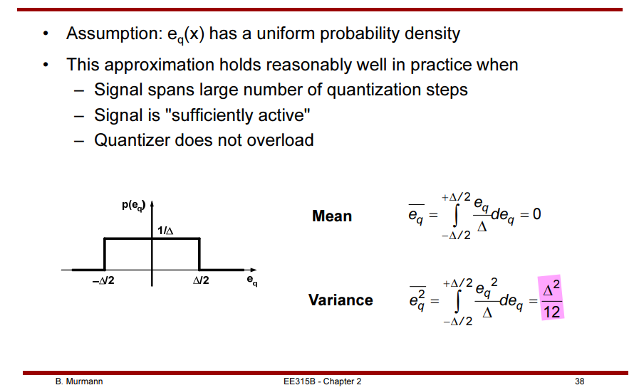
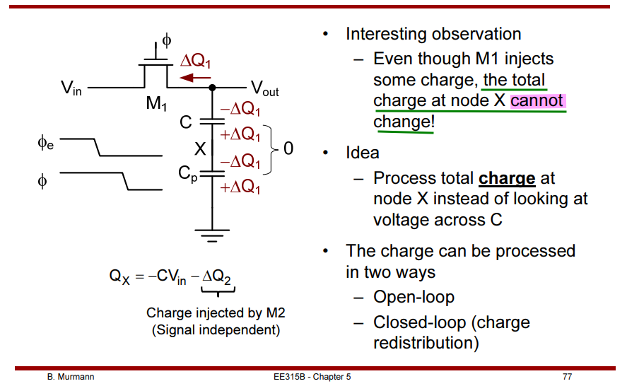
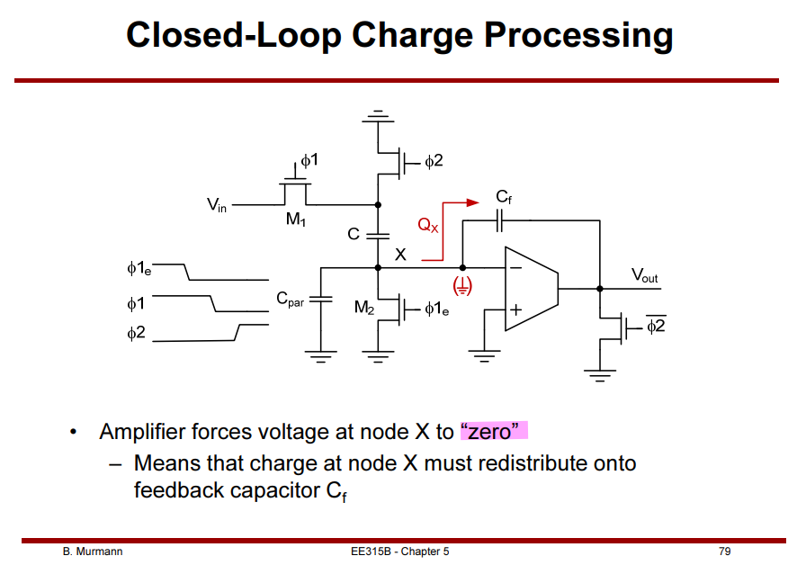
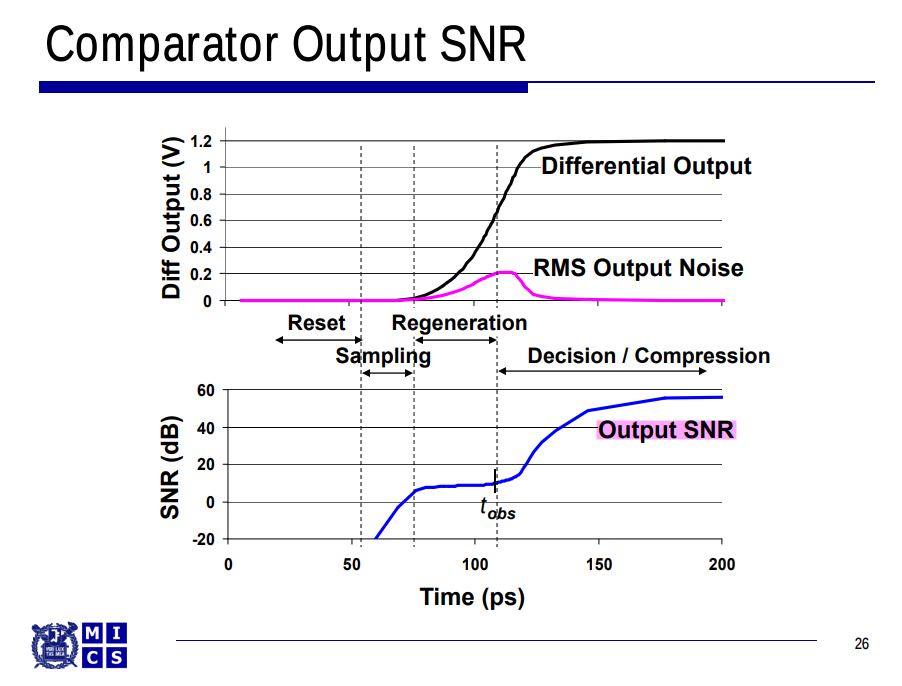

## kick-back

kick-back increases CDAC settling time

> *add pre-amp (more power)*

## bootstrap T/H Switch

> A. Abo et al., “A 1.5-V, 10-bit, 14.3-MS/s CMOS Pipeline Analog-toDigital Converter,” IEEE J. Solid-State Circuits, pp. 599, May 1999
>
> Dessouky and Kaiser, "Input switch configuration suitable for rail-to-rail operation of switched opamp circuits," Electronics Letters, Jan. 1999.

## Quantization Noise

> Quantization noise is less with higher resolution as the input range is divided into a greater number of smaller ranges
>
> This error can be considered a quantization noise with **RMS**

## Bottom plate sampling

> Sample signal at the *"grounded"* side of the capacitor to achieve ***signal independent sampling***

---

> [[https://indico.cern.ch/event/1064521/contributions/4475393/attachments/2355793/4078773/esi_sampling_and_converters2022.pdf](https://indico.cern.ch/event/1064521/contributions/4475393/attachments/2355793/4078773/esi_sampling_and_converters2022.pdf)]

> EE 435 Spring 2024 Analog VLSI Circuit Design - Switched-Capacitor Amplifiers Other Integrated Filters, [https://class.ece.iastate.edu/ee435/lectures/EE%20435%20Lect%2044%20Spring%202008.pdf](https://class.ece.iastate.edu/ee435/lectures/EE%20435%20Lect%2044%20Spring%202008.pdf)

## Hold Mode Feedthrough

> P. Schvan et al., "A 24GS/s 6b ADC in 90nm CMOS," 2008 IEEE International Solid-State Circuits Conference - Digest of Technical Papers, San Francisco, CA, USA, 2008, pp. 544-634
>
> B. Sedighi, A. T. Huynh and E. Skafidas, "A CMOS track-and-hold circuit with beyond 30 GHz input bandwidth," 2012 19th IEEE International Conference on Electronics, Circuits, and Systems (ICECS 2012), Seville, Spain, 2012, pp. 113-116
>
> Tania Khanna, ESE 568: Mixed Signal Circuit Design and Modeling [[https://www.seas.upenn.edu/~ese5680/fall2019/handouts/lec11.pdf](https://www.seas.upenn.edu/~ese5680/fall2019/handouts/lec11.pdf)]

## CDAC intuition

The *charge redistribution capacitor network* is used to sample the input signal and serves as a
digital-to-analog converter (DAC) for creating and subtracting reference voltages

sampling charge
$$
Q = V_{in} C_{tot}
$$
conversion charge
$$
Q = -C_{tot}V_c + V_{ref}C_\Delta
$$
That is
$$
V_c = \frac{C_\Delta}{C_{tot}}V_{ref} - V_{in}
$$

---

CDAC is actually working as a **capacitive divider** during *conversion phase*, the charge of internal node is not changed (*charge conservation law*)

assuming $\Delta V_i$ is applied to series capacitor $C_1$ and $C_2$

$$
(\Delta V_i - \Delta V_x) C_1 = \Delta V_x \cdot C_2
$$
Then
$$
\Delta V_x = \frac{C_1}{C_1+C_2}\Delta V_i
$$

> $V_x= V_{x,0} + \Delta V_x$

## comparator noise

> SNR during sampling region and decison region increase
>
> SNR during regeneration region is consant, where noise is critical 

$$
\text{SNR} = \frac{V_{o,sig}^2}{V_{o,n}^2} = \frac{V_{i,sig}^2}{V_{i,n}^2}
$$
That is 
$$
V_{i,n}^2 = \frac{V_{i,sig}^2}{V_{o,sig}^2}V_{o,n}^2 = \frac{V_{o,n}^2}{A_v^2}
$$
where $V_{i,sig}$ is constant signal applied to input of comparator

> J. Kim, B. S. Leibowitz, J. Ren and C. J. Madden, "Simulation and Analysis of Random Decision Errors in Clocked Comparators," in IEEE Transactions on Circuits and Systems I: Regular Papers, vol. 56, no. 8, pp. 1844-1857, Aug. 2009, doi: 10.1109/TCSI.2009.2028449. URL:[https://people.engr.tamu.edu/spalermo/ecen689/simulation_analysis_clocked_comparators_kim_tcas1_2009.pdf](https://people.engr.tamu.edu/spalermo/ecen689/simulation_analysis_clocked_comparators_kim_tcas1_2009.pdf)
>
> Jaeha Kim, Lecture 12. Aperture and Noise Analysis of Clocked Comparators URL:[https://ocw.snu.ac.kr/sites/default/files/NOTE/7038.pdf](https://ocw.snu.ac.kr/sites/default/files/NOTE/7038.pdf)
>
> Rabuske, Taimur & Fernandes, Jorge. (2017), Chapter 5 Noise-Aware Synthesis and Optimization of Voltage Comparators, "Charge-Sharing SAR ADCs for Low-Voltage Low-Power Applications"
>
> Eric Chang, EE240B Discussion 9 [https://inst.eecs.berkeley.edu/~ee240b/sp18/discussions/dis9.pdf](https://inst.eecs.berkeley.edu/~ee240b/sp18/discussions/dis9.pdf)
>
> Y. Luo, A. Jain, J. Wagner and M. Ortmanns, "Input Referred Comparator Noise in SAR ADCs," in IEEE Transactions on Circuits and Systems II: Express Briefs, vol. 66, no. 5, pp. 718-722, May 2019. [[https://sci-hub.se/10.1109/TCSII.2019.2909429](https://sci-hub.se/10.1109/TCSII.2019.2909429)]
>
> Art Schaldenbrand, Senior Product Manager, Keeping Things Quiet: A New Methodology for Dynamic Comparator Noise Analysis URL:[https://www.cadence.com/content/dam/cadence-www/global/en_US/videos/tools/custom-_ic_analog_rf_design/NoiseAnalyisposting201612Chalk%20Talk.pdf](https://www.cadence.com/content/dam/cadence-www/global/en_US/videos/tools/custom-_ic_analog_rf_design/NoiseAnalyisposting201612Chalk%20Talk.pdf)

### comparator noise vs input common voltage

*TODO* &#128197;

> higher input common voltage -> greater slew rate -> higher noise (input referred comparator noise)

> X. Tang et al., "An Energy-Efficient Comparator With Dynamic Floating Inverter Amplifier," in IEEE Journal of Solid-State Circuits, vol. 55, no. 4, pp. 1011-1022, April 2020
>
> T. Sepke, P. Holloway, C. G. Sodini and H. -S. Lee, "Noise Analysis for Comparator-Based Circuits," in IEEE Transactions on Circuits and Systems I: Regular Papers, vol. 56, no. 3, pp. 541-553, March 2009 [[https://dspace.mit.edu/bitstream/handle/1721.1/61660/Speke-2009-Noise%20Analysis%20for%20Comparator-Based%20Circuits.pdf](https://dspace.mit.edu/bitstream/handle/1721.1/61660/Speke-2009-Noise%20Analysis%20for%20Comparator-Based%20Circuits.pdf)]
> 
> Sepke, Todd. "Comparator design and analysis for comparator-based switched-capacitor circuits." (2006). [[https://dspace.mit.edu/handle/1721.1/38925](https://dspace.mit.edu/handle/1721.1/38925)]

## comparator offset

## reference

everynanocounts. Memos on FFT With Windowing. URL: [https://everynanocounts.com/2018/02/01/memos-on-fft-with-windowing/](https://everynanocounts.com/2018/02/01/memos-on-fft-with-windowing/)

How to choose FFT depth for ADC performance analysis (SINAD, ENOB). URL:[https://dsp.stackexchange.com/a/38201](https://dsp.stackexchange.com/a/38201)

Computation of Effective Number of Bits, Signal to Noise Ratio, & Signal to Noise & Distortion Ratio Using FFT. URL:[https://cdn.teledynelecroy.com/files/appnotes/computation_of_effective_no_bits.pdf](https://cdn.teledynelecroy.com/files/appnotes/computation_of_effective_no_bits.pdf)

Kester, Walt. (2009). Understand SINAD, ENOB, SNR, THD, THD + N, and SFDR so You Don't Get Lost in the Noise Floor. URL:[https://www.analog.com/media/en/training-seminars/tutorials/MT-003.pdf](https://www.analog.com/media/en/training-seminars/tutorials/MT-003.pdf)

T. C. Hofner: Dynamic ADC testing part I. Defining and testing dynamic ADC parameters, Microwaves & RF, 2000, vol. 39, no. 11, pp. 75-84,162

T. C. Hofner: Dynamic ADC testing part 2. Measuring and evaluating dynamic line parameters, Microwaves & RF, 2000, vol. 39, no. 13, pp. 78-94

AN9675: A Tutorial in Coherent and Windowed Sampling with A/D Converters [https://www.renesas.com/us/en/document/apn/an9675-tutorial-coherent-and-windowed-sampling-ad-converters](https://www.renesas.com/us/en/document/apn/an9675-tutorial-coherent-and-windowed-sampling-ad-converters)

APPLICATION NOTE 3190: Coherent Sampling Calculator (CSC)  [https://www.stg-maximintegrated.com/en/design/technical-documents/app-notes/3/3190.html](https://www.stg-maximintegrated.com/en/design/technical-documents/app-notes/3/3190.html)

Coherent Sampling (Very Brief and Simple) [https://www.dsprelated.com/thread/469/coherent-sampling-very-brief-and-simple](https://www.dsprelated.com/thread/469/coherent-sampling-very-brief-and-simple)

Signal Chain Basics #160: Making sense of coherent and noncoherent sampling in data-converter testing [https://www.planetanalog.com/signal-chain-basics-160-making-sense-of-coherent-and-noncoherent-sampling-in-data-converter-testing/](https://www.planetanalog.com/signal-chain-basics-160-making-sense-of-coherent-and-noncoherent-sampling-in-data-converter-testing/)

Signal Chain Basics #104: Understanding noise in ADCs [https://www.planetanalog.com/signal-chain-basics-part-104-understanding-noise-in-adcs/](https://www.planetanalog.com/signal-chain-basics-part-104-understanding-noise-in-adcs/)

Signal Chain Basics #101: ENOB Degradation Analysis Over Frequency Due to Jitter [https://www.planetanalog.com/signal-chain-basics-part-101-enob-degradation-analysis-over-frequency-due-to-jitter/](https://www.planetanalog.com/signal-chain-basics-part-101-enob-degradation-analysis-over-frequency-due-to-jitter/)

Clock jitter analyzed in the time domain, Part 1, Texas Instruments Analog Applications Journal (slyt379), Aug 2010 [https://www.ti.com/lit/an/slyt379/slyt379.pdf](https://www.ti.com/lit/an/slyt379/slyt379.pdf)

Clock jitter analyzed in the time domain, Part 2  [https://www.ti.com/lit/slyt389](https://www.ti.com/lit/slyt389)

Measurement of Total Harmonic Distortion and Its Related Parameters using Multi-Instrument [[pdf](https://www.virtins.com/doc/Measurement-of-Total-Harmonic-Distortion-and-Its-Related-Parameters-using-Multi-Instrument.pdf)]

Application Note AN-4: Understanding Data Converters' Frequency Domain Specifications [[pdf](https://www.datel.com/data/ads/adc-an4.pdf)]

Belleman, J. (2008). From analog to digital. 10.5170/CERN-2008-003.131.  [[pdf](https://cds.cern.ch/record/1100535/files/p131.pdf)]

HandWiki. Coherent sampling [[link](https://handwiki.org/wiki/Coherent_sampling)]

Luis Chioye, TI.  Leverage coherent sampling and FFT windows when evaluating SAR ADCs (Part 1) [[link](https://e2e.ti.com/blogs_/archives/b/precisionhub/posts/leverage-coherent-sampling-and-fft-windows-when-evaluating-sar-adcs-part-1)]

Coherent Sampling vs. Window Sampling | Analog Devices [https://www.analog.com/en/technical-articles/coherent-sampling-vs-window-sampling.html](https://www.analog.com/en/technical-articles/coherent-sampling-vs-window-sampling.html)

Understanding Effective Number of Bits [https://robustcircuitdesign.com/signal-chain-explorer/understanding-effective-number-of-bits/](https://robustcircuitdesign.com/signal-chain-explorer/understanding-effective-number-of-bits/)

ADC Input Noise: The Good, The Bad, and The Ugly. Is No Noise Good Noise? [[https://www.analog.com/en/resources/analog-dialogue/articles/adc-input-noise.html](https://www.analog.com/en/resources/analog-dialogue/articles/adc-input-noise.html)]

Walt Kester, Taking the Mystery out of the Infamous Formula, "SNR = 6.02N + 1.76dB," and Why You Should Care [[https://www.analog.com/media/en/training-seminars/tutorials/MT-001.pdf](https://www.analog.com/media/en/training-seminars/tutorials/MT-001.pdf)]

Dan Boschen, "How to choose FFT depth for ADC performance analysis (SINAD, ENOB)", [[https://dsp.stackexchange.com/a/38201](https://dsp.stackexchange.com/a/38201)]
