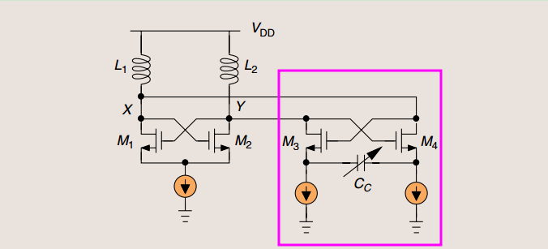
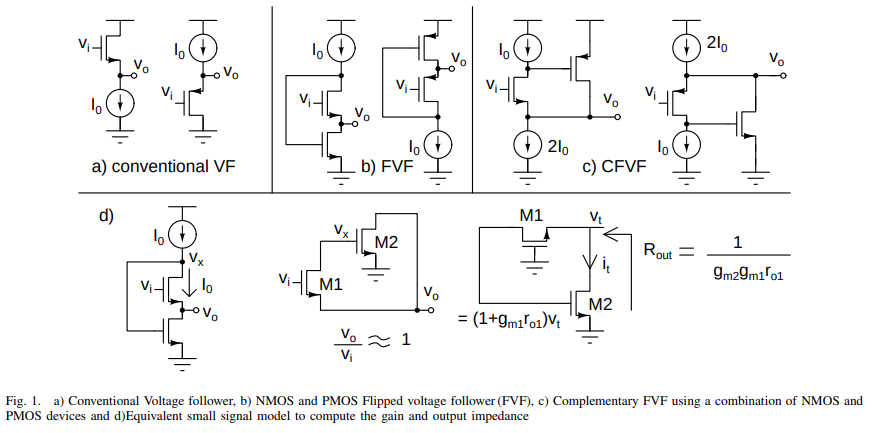
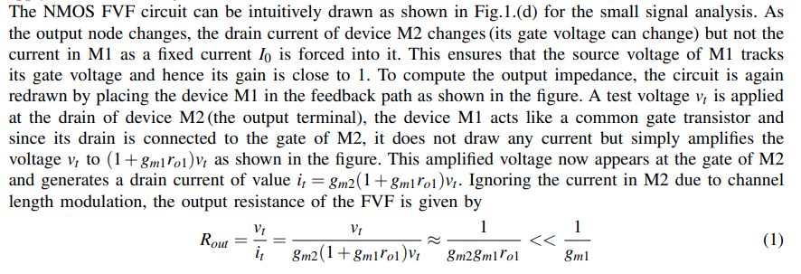
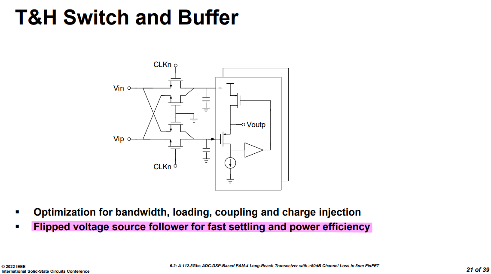
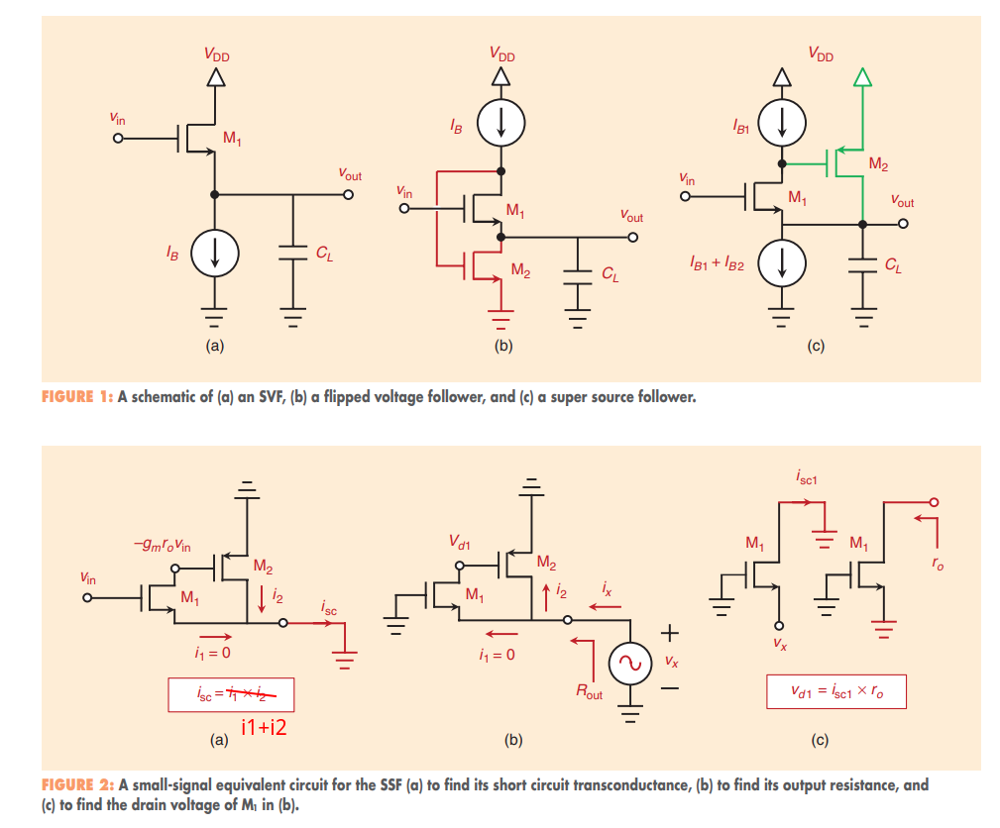

## MOS parasitic Rd&Rs, Cd&Cs

Decrease  the parasitic R&C

priority: $R_s \gt R_d$, $C_s \gt C_d$

## XCP as Negative Impedance Converter (NIC)

The **Cross-Coupled Pair (XCP)** can operate as an **impedance negator** [a.k.a. a **negative impedance converter** (**NIC**)] 

A common application is to create a *negative capacitance* that can cancel the *positive capacitance*
seen at a port, thereby improving the *speed*

$$
I_{NIC} =\frac{V_{im} - V_{ip}}{\frac{2}{g_m}+\frac{1}{sC_c}} = \frac{-2V_{ip}}{\frac{2}{g_m}+\frac{1}{sC_c}}
$$
Therefore
$$
Z_{NIC} = \frac{V_{ip} - V_{im}}{I_{NIC}}=\frac{2V_{ip}}{I_{NIC}} =- \frac{2}{g_m}-\frac{1}{sC_c}
$$
***half-circuit***

If $C_{gd}$ is considered, and apply miller effect. half equivalent circuit is shown as below

> B. Razavi, "The Cross-Coupled Pair - Part III [A Circuit for All Seasons]," IEEE Solid-State Circuits Magazine, Issue. 1, pp. 10-13, Winter 2015. [[https://www.seas.ucla.edu/brweb/papers/Journals/BR_Magzine3.pdf](https://www.seas.ucla.edu/brweb/papers/Journals/BR_Magzine3.pdf)]
>
> S. Galal and B. Razavi, "10-Gb/s Limiting Amplifier and Laser/Modulator Driver in 0.18um CMOS Technology,” IEEE Journal of Solid-State Circuits, vol. 38, pp. 2138-2146, Dec. 2003.  [[https://www.seas.ucla.edu/brweb/papers/Journals/G&RDec03_2.pdf](https://www.seas.ucla.edu/brweb/papers/Journals/G&RDec03_2.pdf)]

## Flipped Voltage Follower (FVF)

**T&H buffer in ADC**

> [[https://www.linkedin.com/posts/chembiyan-t-0b34b910_flipped-voltage-follower-fvf-basics-activity-7118482840803020800-qwyX?utm_source=share&utm_medium=member_desktop](https://www.linkedin.com/posts/chembiyan-t-0b34b910_flipped-voltage-follower-fvf-basics-activity-7118482840803020800-qwyX?utm_source=share&utm_medium=member_desktop)]
>
> Z. Guo et al., "A 112.5Gb/s ADC-DSP-Based PAM-4 Long-Reach Transceiver with >50dB Channel Loss in 5nm FinFET," 2022 IEEE International Solid-State Circuits Conference (ISSCC), San Francisco, CA, USA, 2022, pp. 116-118, doi: 10.1109/ISSCC42614.2022.9731650.

## Super-source follower (SSF)

> A. Sheikholeslami, "Voltage Follower, Part III [Circuit Intuitions]," in *IEEE Solid-State Circuits Magazine*, vol. 15, no. 2, pp. 14-26, Spring 2023, doi: 10.1109/MSSC.2023.3269457
>
> Paul R. Gray. 2009. Analysis and Design of Analog Integrated Circuits (5th. ed.). Wiley Publishing.

## Double differential Pair

$V_\text{ip}$ and $V_\text{im}$ are input, $V_\text{rp}$ and $V_\text{rm}$ are reference voltage
$$
V_o = A_v(\overline{V_\text{ip} - V_\text{im}} - \overline{V_\text{rp} - V_\text{rm}})
$$

In differential comparison mode, the feedback loop ensure $V_\text{ip} = V_\text{rp}$, $V_\text{im} = V_\text{rm}$ in the end 

> assume input and reference common voltage are **same**

Pros of *(b)*

- larger input range i.e.,  $\gt \pm \sqrt{2}V_\text{ov}$ of *(a)*, it works even one differential is off due to lower voltage
- larger $g_m$ (smaller input difference of pair)

Cons of *(b)*

- sensitive to the difference of common voltage between $V_\text{ip}$,  $V_\text{im}$ and  $V_\text{rp}$,  $V_\text{rm}$

### common-mode voltage difference

copy aforementioned formula here for convenience 
$$
V_o = A_v(\overline{V_\text{ip} - V_\text{im}} - \overline{V_\text{rp} - V_\text{rm}})
$$

*at sample phase*
$V_\text{ip}= V_\text{im}= V_\text{cmi}$ and $V_\text{rp}= V_\text{rm}= V_\text{cmr}$

- $I_\text{ip0}= I_\text{im0} = I_\text{i0}$
- $I_\text{rp0}= I_\text{rm0} = I_\text{r0}$

i.e. $\overline{I_\text{ip} + I_\text{rm}} - \overline{I_\text{im} + I_\text{rp}} = 0$

*at compare start*

- $V_\text{ip}= V_\text{im}= V_\text{cmi}$ and $V_\text{rp}= V_\text{cmr}+\Delta$, $V_\text{rp}= V_\text{cmr}-\Delta$
- $I_\text{ip}\lt I_\text{ip0}$, $I_\text{rp} \gt I_\text{rp0}$

- $I_\text{im}\gt I_\text{im0}$, $I_\text{rm} \lt I_\text{rm0}$

i.e. $\overline{I_\text{ip} + I_\text{rm}} - \overline{I_\text{im} + I_\text{rp}} \lt 0$, we need to increase $V_\text{ip}$ and decrease $V_\text{im}$.

*at the compare finish*

$$\begin{align}
V_\text{ip}= V_\text{cmi} + \Delta \\
V_\text{im}= V_\text{cmi} - \Delta
\end{align}$$

and $I_\text{ip0}= I_\text{im0} = I_\text{i0}$, $I_\text{rp0}= I_\text{rm0} = I_\text{r0}$

i.e. $\overline{I_\text{ip} + I_\text{rm}} - \overline{I_\text{im} + I_\text{rp}} = 0$

---

If $V_\text{cmr} - V_\text{cmi} = \sqrt{2}V_{OV} + \delta$, and $\delta \gt 0$. one transistor carries the entire tail current

- $I_\text{ip} =0$ and $I_\text{rp} = I_{SS}$,  all the time

At the end, $V_\text{im} = V_\text{cmi} - (\Delta - \delta)$, the error is $\delta$

In closing, $V_\text{cmr} - V_\text{cmi} \lt \sqrt{2}V_{OV}$ for normal work

Furthermore, the difference between $V_\text{cmr}$ and $V_\text{cmi}$ should be minimized due to **limited impedance of current source** and **input pair offset**

### pair mismatch

$$\begin{align}
I_{SE} &= g_m(\sigma_{vth,0} + \sigma_{vth,1}) \\
I_{DE} &= g_m(\sigma_{vth,0} + \sigma_{vth,1})
\end{align}$$

The input equivalient offset voltage
$$\begin{align}
V_{os,SE} &= \frac{I_{SE}}{2g_m} = \frac{\sigma_{vth,0} + \sigma_{vth,1}}{2} \\
V_{os,DE} &= \frac{I_{DE}}{g_m} = \sigma_{vth,0} + \sigma_{vth,1}
\end{align}$$

Then
$$\begin{align}
\sigma_{vos,SE} &= \sqrt{\frac{2\sigma_{vth}^2}{4}} = \frac{\sigma_{vth}}{\sqrt{2}} \\
\sigma_{vos,DE} &= \sqrt{2\sigma_{vth}^2} = \sqrt{2}\sigma_{vth}
\end{align}$$

We obtain
$$
\sigma_{vos,DE} = 2\sigma_{vos,SE}
$$

## peaking without inductor

*TODO* &#128197;

> How to generate **complex poles without inductor**? [[https://a2d2ic.wordpress.com/2020/02/19/basics-on-active-rc-low-pass-filters/](https://a2d2ic.wordpress.com/2020/02/19/basics-on-active-rc-low-pass-filters/)]

## Input Diff-Pair

### DM Distortion

### CM Distortion

### Resistive Degeneration

*Resistive degeneration* in differential pairs serves as one major technique for linear amplifier

The linear region for CMOS differential pair would be extended by $±I_{SS}R/2$ as all of $I_{SS}/2$ flows
through $R$. 
$$\begin{align}
V_{in}^+ -V_{in}^-  &= V_{OV} + V_{TH}+\frac{I_{SS}}{2}R - V_{TH} \\
&= \sqrt{\frac{2I_{SS}}{\mu_nC_{OX}\frac{W}{L}}} + \frac{I_{SS}R}{2}
\end{align}$$

> Jri Lee, "Communication Integrated Circuits." [https://cc.ee.ntu.edu.tw/~jrilee/publications/Comm_IC.pdf](https://cc.ee.ntu.edu.tw/~jrilee/publications/Comm_IC.pdf)
>
> Figure 14.12, Design of Analog CMOS Integrated Circuits, Second Edition [[https://electrovolt.ir/wp-content/uploads/2014/08/Design-of-Analog-CMOS-Integrated-Circuit-2nd-Edition-ElectroVolt.ir_.pdf](https://electrovolt.ir/wp-content/uploads/2014/08/Design-of-Analog-CMOS-Integrated-Circuit-2nd-Edition-ElectroVolt.ir_.pdf)]

### Biasing Tradeoffs in Resistive-Degenerated Diff Pair

> Todd Brooks, Broadcom "Input Programmable Gain Amplifier (PGA) Design for ADC Signal Conditioning" [[https://classes.engr.oregonstate.edu/eecs/spring2021/ece627/Lecture%20Notes/OSU%20Classroom%20Presentaton%20042511.ppt](https://classes.engr.oregonstate.edu/eecs/spring2021/ece627/Lecture%20Notes/OSU%20Classroom%20Presentaton%20042511.ppt)]

## reference

Elad Alon, ISSCC 2014, "T6: Analog Front-End Design for Gb/s Wireline Receivers" [[https://picture.iczhiku.com/resource/eetop/wHKfZPYpAleAKXBV.pdf](https://picture.iczhiku.com/resource/eetop/wHKfZPYpAleAKXBV.pdf)]

Byungsub Kim,  ISSCC 2022, "T11: Basics of Equalization Techniques: Channels, Equalization, and Circuits"

Minsoo Choi et al., "An Approximate Closed-Form Channel Model for Diverse Interconnect Applications," IEEE Transactions on Circuits and Systems-I: Regular Papers, vol. 61, no. 10, pp. 3034-3043, Oct. 2014.

