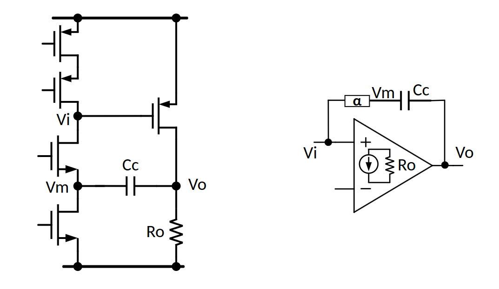

This **cascode compensation** topology is popularly known as **Ahuja compensation**

## Miller's approximation

### Right-Half-Plane Zero

$$
\left[(v_i - v_o)sC_c - g_m v_i\right]R_o = v_o
$$
Then
$$
\frac{v_o}{v_i} = -g_mR_o\frac{1-s\frac{C_c}{g_m}}{1+sR_oC_c}
$$
 right-half-plane Zero $\omega _z = \frac{g_m}{C_c}$

### Equivalent cap

The amplifier gain magnitude $A_v = g_m R_o$
$$
I_\text{c,in} = (v_i - v_o)sC_c
$$
Then
$$\begin{align}
I_\text{c,in}  &= (v_i + A_v v_i)sC_c \\
& = v_i s (1+A_v)C_c
\end{align}$$

we get $C_\text{in,eq}= (1+A_v)C_c\simeq A_vC_c$

Similarly
$$\begin{align}
I_\text{c,out}  &= (v_o - v_i)sC_c \\
& = v_o s (1+\frac{1}{A_v})C_c
\end{align}$$

we get $C_\text{out,eq}= (1+\frac{1}{A_v})C_c\simeq C_c$

## Ahuja compensation

### Right-Half-Plane Zero

$$
\left[(\alpha v_i - v_o)sC_c - g_m v_i\right]R_o = v_o
$$

where $v_m = \alpha v_i$ and $\alpha \ll 1$

Then
$$
\frac{v_o}{v_i} = -g_mR_o\frac{1-s\frac{\alpha C_c}{g_m}}{1+sR_oC_c}
$$
 right-half-plane Zero $\omega _z = \frac{g_m}{\alpha C_c} \gg \frac{g_m}{C_c}$

> Ahuja compensation push right-half-plane Zero to higher frequency

### Equivalent cap

Then
$$\begin{align}
I_\text{c,in}  &= (\alpha v_i + A_v v_i)sC_c \\
& = v_i s (\alpha+A_v)C_c
\end{align}$$

we get $C_\text{in,eq}= (\alpha+A_v)C_c\simeq A_v C_c$

Similarly
$$\begin{align}
I_\text{c,out}  &= (v_o - \alpha v_i)sC_c \\
& = v_o s (1+\frac{\alpha}{A_v})C_c
\end{align}$$

we get $C_\text{out,eq}= (1+\frac{\alpha }{A_v})C_c\simeq C_c$

## reference

B. K. Ahuja, "An Improved Frequency Compensation Technique for CMOS Operational Amplifiers," IEEE 1. Solid-State Circuits, vol. 18, no. 6, pp. 629-633, Dec. 1983.

U. Dasgupta, "Issues in "Ahuja" frequency compensation technique", IEEE International Symposium on Radio-Frequency Integration Technology, 2009.

R. 1. Reay and G. T. A. Kovacs, "An unconditionally stable two-stage CMOS amplifier," IEEE 1. Solid-State Circuits, vol. 30, no. 5, pp. 591- 594, May 1995. 

A. Garimella and P. M. Furth, "Frequency compensation techniques for op-amps and LDOs: A tutorial overview," 2011 IEEE 54th International Midwest Symposium on Circuits and Systems (MWSCAS), 2011, pp. 1-4, doi: 10.1109/MWSCAS.2011.6026315.

H. Aminzadeh, R. Lotfi and S. Rahimian, "Design Guidelines for Two-Stage Cascode-Compensated Operational Amplifiers," 2006 13th IEEE International Conference on Electronics, Circuits and Systems, 2006, pp. 264-267, doi: 10.1109/ICECS.2006.379776.

H. Aminzadeh and K. Mafinezhad, "On the power efficiency of cascode compensation over Miller compensation in two-stage operational amplifiers," Proceeding of the 13th international symposium on Low power electronics and design (ISLPED '08), Bangalore, India, 2008, pp. 283-288, doi: 10.1145/1393921.1393995.

Stabilizing a 2-Stage Amplifier URL:[https://everynanocounts.com/2016/11/10/stabilizing-a-2-stage-amplifier/](https://everynanocounts.com/2016/11/10/stabilizing-a-2-stage-amplifier/)

