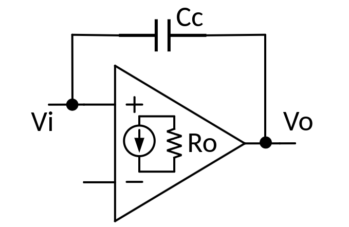

This **cascode compensation** topology is popularly known as **ahuja compensation**

The cause of the positive zero is the *feedforward current through $C_m$*.

To abolish this zero, we have to cut the feedforward path and create a unidirectional feedback through $C_m$.

1. Adding a resistor(nulling resistor) is one way to mitigate the effect of the feedforward current.

2. Another approach uses a current buffer cascode to pass the small-signal feedback current but cut the feedforward current

> People name this approach after the author *Ahuja*

The benefits of *Ahuja* compensation over Miller compensation are severa

- better PSRR

- higher unity-gain bandwidth using smaller compensation capacitor

- ability to cope better with heavy capacitive and resistive loads

## Miller's approximation

### Right-Half-Plane Zero

$$
\left[(v_i - v_o)sC_c - g_m v_i\right]R_o = v_o
$$
Then
$$
\frac{v_o}{v_i} = -g_mR_o\frac{1-s\frac{C_c}{g_m}}{1+sR_oC_c}
$$
 right-half-plane Zero $\omega _z = \frac{g_m}{C_c}$

### Equivalent cap

The amplifier gain magnitude $A_v = g_m R_o$
$$
I_\text{c,in} = (v_i - v_o)sC_c
$$
Then
$$\begin{align}
I_\text{c,in}  &= (v_i + A_v v_i)sC_c \\
& = v_i s (1+A_v)C_c
\end{align}$$

we get $C_\text{in,eq}= (1+A_v)C_c\simeq A_vC_c$

Similarly
$$\begin{align}
I_\text{c,out}  &= (v_o - v_i)sC_c \\
& = v_o s (1+\frac{1}{A_v})C_c
\end{align}$$

we get $C_\text{out,eq}= (1+\frac{1}{A_v})C_c\simeq C_c$

## cascode compensation

Of course, , if the capacitance at the gate of $M_1$ is taken into account, pole splitting is less pronounced.

---

**including $r_\text{o2}$**

$$
\frac{V_{out}}{I_{in}} \approx \frac{-g_{m1}R_SR_L(g_{m2}+C_Cs)}{\frac{R_S+r_\text{o2}}{r_\text{o2}}R_LC_LC_Cs^2+g_{m1}g_{m2}R_LR_SC_Cs+g_{m2}}
$$
The poles as

$$\begin{align}
\omega_{p1} &\approx  \frac{1}{g_{m1}R_LR_SC_c} \\
\omega_{p2} &\approx \frac{g_{m2}R_Sg_{m1}}{C_L}\frac{r_\text{o2}}{R_S+r_\text{o2}}
\end{align}$$

and zero is not affected, which is $\omega_z =\frac{g_{m2}}{C_C}$

the above model simulation result is shown below

> the zero is located between two poles

take into the capacitance at the gate of $M_1$ and all other second-order effect

## intuitive analysis of zero

miller compensation

- zero in the **right** half plane
  $$
  g_\text{m1}V_P = sC_c V_P
  $$
  

cascode compensation

- zero in the **left** half plane
  $$
  g_\text{m2}V_X = - sC_c V_X
  $$
  

## How to Mitigate Impact of Zero

**dominant pole** 
$$
\omega_\text{p,d} = \frac {1} {R_\text{eq}g_\text{m9}R_{L}C_{c}}
$$
**first nondominant pole**
$$
\omega_\text{p,nd} = \frac {g_\text{m4}R_\text{eq}g_\text{m9}} {C_L}
$$
**zero** 
$$
\omega_\text{z} = (g_\text{m4}R_\text{eq})(\frac {g_\text{m9}} {C_c})
$$
a much greater magnitude than $g_\text{m9}/C_C$

> **Lectures**
>
> EE 240B: Advanced Analog Circuit Design, Prof. Bernhard E. Boser [[OTA II, Multi-Stage](https://people.eecs.berkeley.edu/~boser/courses/240B/lectures/M07%20OTA%20II.pdf)]
>
> **Papers**
>
> B. K. Ahuja, "An improved frequency compensation technique for CMOS operational amplifiers," in IEEE Journal of Solid-State Circuits, vol. 18, no. 6, pp. 629-633, Dec. 1983, doi: 10.1109/JSSC.1983.1052012.
>
> D. B. Ribner and M. A. Copeland, "Design techniques for cascoded CMOS op amps with improved PSRR and common-mode input range," in IEEE Journal of Solid-State Circuits, vol. 19, no. 6, pp. 919-925, Dec. 1984, doi: 10.1109/JSSC.1984.1052246.
>
> Abo, Andrew & Gray, Paul. (1999). A 1.5V, 10-bit, 14MS/s CMOS Pipeline Analog-to-Digital Converter.
>
> **Book's chapters**
>
> Design of analog CMOS integrated circuits, Behzad Razavi
>
> - 10.5 Compensation of Two-Stage Op Amps
> - 10.7 Other Compensation Techniques
>
> Analog Design Essentials, Willy M.C. Sansen
>
> - chapter #5 Stability of operational amplifiers - Compensation of positive zero
>
> Analysis and Design of Analog Integrated Circuits 5th Edition,  Paul R. Gray, Paul J. Hurst, Stephen H. Lewis, Robert G. Meyer
>
> - 9.4.3 Two-Stage MOS Amplifier Compensation
>
> CMOS Analog Circuit Design 3rd Edition,  Phillip E. Allen, Douglas R. Holberg
>
> - 6.2.2 Miller Compensation of the Two-Stage Op Amp

## reference

B. K. Ahuja, "An Improved Frequency Compensation Technique for CMOS Operational Amplifiers," IEEE 1. Solid-State Circuits, vol. 18, no. 6, pp. 629-633, Dec. 1983.

U. Dasgupta, "Issues in "Ahuja" frequency compensation technique", IEEE International Symposium on Radio-Frequency Integration Technology, 2009.

R. 1. Reay and G. T. A. Kovacs, "An unconditionally stable two-stage CMOS amplifier," IEEE 1. Solid-State Circuits, vol. 30, no. 5, pp. 591- 594, May 1995. 

A. Garimella and P. M. Furth, "Frequency compensation techniques for op-amps and LDOs: A tutorial overview," 2011 IEEE 54th International Midwest Symposium on Circuits and Systems (MWSCAS), 2011, pp. 1-4, doi: 10.1109/MWSCAS.2011.6026315.

H. Aminzadeh, R. Lotfi and S. Rahimian, "Design Guidelines for Two-Stage Cascode-Compensated Operational Amplifiers," 2006 13th IEEE International Conference on Electronics, Circuits and Systems, 2006, pp. 264-267, doi: 10.1109/ICECS.2006.379776.

H. Aminzadeh and K. Mafinezhad, "On the power efficiency of cascode compensation over Miller compensation in two-stage operational amplifiers," Proceeding of the 13th international symposium on Low power electronics and design (ISLPED '08), Bangalore, India, 2008, pp. 283-288, doi: 10.1145/1393921.1393995.

Stabilizing a 2-Stage Amplifier URL:[https://everynanocounts.com/2016/11/10/stabilizing-a-2-stage-amplifier/](https://everynanocounts.com/2016/11/10/stabilizing-a-2-stage-amplifier/)

