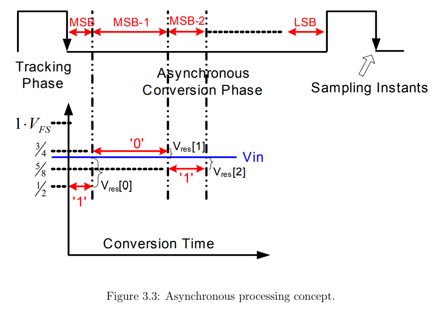

>assign the amount of time based on the time needed for each step

## pipeline ADC

$$
V_{N-1} = \sum_{i=0}^{N-2} B[i]\frac{1}{2^{N-i}}+ B[N-1]\frac{1}{2}
$$
Compare with $\frac{1}{2}$, and determine $B[N-1]$
$$\begin{align}
V_{N-2}  &= \left(V_{N-1} - B[N-1]\frac{1}{2}\right)\cdot 2 \\
&= \left(\sum_{i=0}^{N-1} B[i]\frac{1}{2^{N-i}} - B[N-1]\frac{1}{2}\right) \cdot 2 \\
&= \sum_{i=0}^{N-2} B[i]\frac{1}{2^{N-i}} \cdot 2 \\
&= \sum_{i=0}^{N-3} B[i]\frac{1}{2^{N-i}}\cdot 2 + B[N-2]\frac{1}{2}
\end{align}$$

On your intuition, input can be expressed as below
$$\begin{align}
V_{N-1} &= \sum_{i=0}^{N-1} B[i] \frac{1}{2}\cdot 2^{i-N+1} \\
&= B[N-1]\frac{1}{2} + B[N-2]\frac{1}{2}\cdot 2^{-1} + B[N-3]\frac{1}{2}\cdot 2^{-2 }...
\end{align}$$

It divides the process into several comparison stages, the number of which is proportional to the number of bits

> Due to the pipeline structure of both analog and digital signal path, inter-stage **residue amplification** is needed which consumes considerable power and limits high speed operation

### reduced residue amplification gain

*TODO* &#128197;

## Synchronous SAR ADC

It also divides a full conversion into several comparison stages in a way similar to the *pipeline ADC*, except the algorithm is executed **sequentially** rather than in *parallel* as in the pipeline case.

However, the sequential operation of the SA algorithm has traditionally been a *limitation in achieving high-speed operation*

- a clock running at least $(N + 1) \cdot F_s$ is required for an $N$-bit converter with conversion rate of $F_s$
- every clock cycle has to tolerate the worst case comparison time
- every clock cycle requires margin for the clock jitter 

> The power and speed limitations of a synchronous SA design comes largely from the *high-speed internal clock*

### Split Arrary CDAC

> *Split* capacitor, double-array cap
>
> attenuation capacitance $C_a$

$$\begin{align}
\Delta V_{dac} &= \frac{1}{2}b_3+\frac{1}{4}b_2+\frac{1}{4}\left(\frac{1}{2}b_1+\frac{1}{4}b_0 \right) \\
&= \frac{1}{2}b_3+\frac{1}{4}b_2 + \frac{1}{8}b_1+\frac{1}{16}b_0
\end{align}$$

###  Non-Binary Successive Approximation

*TODO* &#128197;

The *overlapped search range* compensates for wrong decisions made in earlier stages as long as they are within the error tolerance range

> Kuttner, Franz. “A 1.2V 10b 20MSample/s non-binary successive approximation ADC in 0.13/spl mu/m CMOS.” *2002 IEEE International Solid-State Circuits Conference. Digest of Technical Papers (Cat. No.02CH37315)* 1 (2002): 176-177 vol.1.

### Redundancy

*TODO* &#128197;

## Asynchronous processing

a global clock running at the sample rate is still used for an **uniform sampling**

> The concept of asynchronous processing is to trigger the internal comparison from MSB to LSB like
> *dominoes*. 

The maximum resolving time reduction between synchronous and asynchronous case is ***two fold***  

## reference

S. -W. M. Chen and R. W. Brodersen, "A 6-bit 600-MS/s 5.3-mW Asynchronous ADC in 0.13-μm CMOS," in *IEEE Journal of Solid-State Circuits*, vol. 41, no. 12, pp. 2669-2680, Dec. 2006

Shuo-Wei Chen, Power Efficient System and A/D Converter Design for Ultra-Wideband Radio [[http://www2.eecs.berkeley.edu/Pubs/TechRpts/2006/EECS-2006-71.pdf](http://www2.eecs.berkeley.edu/Pubs/TechRpts/2006/EECS-2006-71.pdf)]

Andrea Baschirotto, "T6: SAR ADCs" ISSCC2009

Pieter Harpe, ISSCC 2016 Tutorial: "Basics of SAR ADCs Circuits & Architectures"
