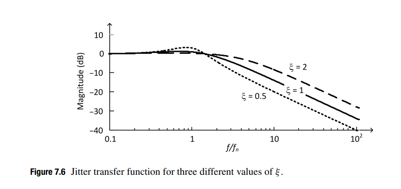
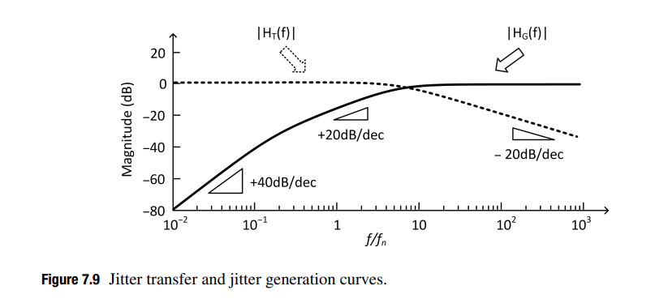
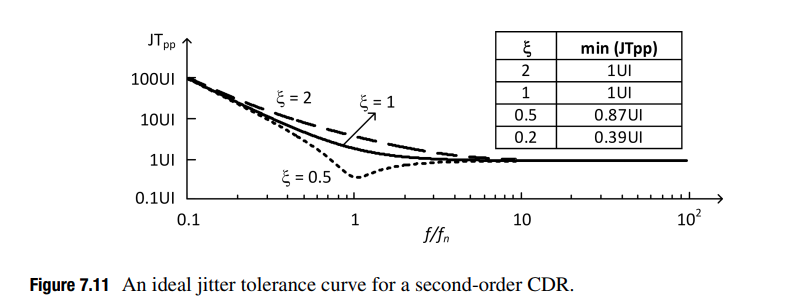
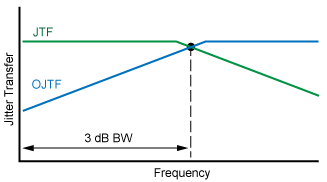
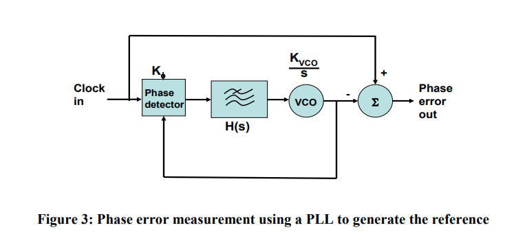

> condition:
>
> Linear model of the CDR is used in a **frequency lock condition** and is approaching to achieve **phase lock**

Using this model, the power spectral density (PSD) of jitter in the recovered clock $S_{out}(f)$ is
$$
S_{out}(f)=|H_T(f)|^2S_{in}(f)+|H_G(f)|^2S_{VCO}(f)
$$
Here, we assume $\varphi_{in}$ and $\varphi_{VCO}$ are uncorrelated as they come from independent sources.

## Jitter Transfer

$$
H_T(s) = \frac{\varphi_{out}(s)}{\varphi_{in}(s)}|_{\varphi_{vco}=0}=\frac{K_{PD}K_{VCO}R_s+\frac{K_{PD}K_{VCO}}{C}}{s^2+K_{PD}K_{VCO}R_s+\frac{K_{PD}K_{VCO}}{C}}
$$

Using below notation
$$\begin{align}
\omega_n^2=\frac{K_{PD}K_{VCO}}{C} \\
\xi=\frac{K_{PD}K_{VCO}}{2\omega_n^2}
\end{align}$$

We can rewrite transfer function as follows
$$
H_T(s)=\frac{2\xi\omega_n s+\omega_n^2}{s^2+2\xi \omega_n s+\omega_n^2}
$$

> The jitter transfer represents a **low-pass filter** whose magnitude is around 1 (0 dB) for low jitter frequencies and drops at 20 db/decade for frequencies above $\omega_n$

- the recovered clock **track** the *low-frequency jitter* of the input data
- the recovered clock **DONT** track the *high-frequency jitter* of the input data

The recovered clock does not suffer from high-frequency jitter even though the input signal may contain high-frequency jitter, which will limit the CDR tolerance to high-frequency jitter.

## Jitter Peaking in Jitter Transfer Function

The peak, slightly larger than 1 (0dB) implies that jitter will be **amplified** at some frequencies in the CDR, producing a jitter amplitude in the recovered clock, and thus also in the recovered data, that is slightly **larger** than the jitter amplitude in the input data.

This is certainly undesirable, especially in applications such as repeaters.

## Jitter Generation

If the input data to the CDR is clean with no jitter, i.e., $\varphi_{in}=0$, the jitter of the recovered clock comes directly from the VCO jitter. The transfer function that relates the VCO jitter to the recovered clock jitter is known as **jitter generation**.
$$
H_G(s)=\frac{\varphi_{out}}{\varphi_{VCO}}|_{\varphi_{in}=0}=\frac{s^2}{s^2+2\xi \omega_n s+\omega_n^2}
$$
Jitter generation is **high-pass filter** with two zeros, at zero frequency, and two poles identical to those of the jitter transfer function

## Jitter Tolerance

To quantify jitter tolerance, we often apply a sinusoidal jitter of a fixed frequency to the CDR input data and observe the BER of the CDR

The jitter tolerance curve **DONT** capture a CDR's true tolerance to **random** jitter. Because we are applying "sinusoidal" jitter, which is **deterministic** signal.

We can deal only with the jitter's amplitude and frequency instead of the PSD of the jitter thanks to deterministic sinusoidal jitter signal.
$$
JTOL(f) = \left | \varphi_{in}(f)  \right |_{\text{pp-max}} \quad \text{for a fixed BER}
$$
Where the subscript $\text{pp-max}$ indicates the maximum peak-to-peak amplitude. We can further expand this equation as follows
$$
JTOL(f)=\left| \frac{\varphi_{in}(f)}{\varphi_{e}(f)} \right| \cdot |\varphi_e(f)|_{pp-max}
$$

> Relative jitter, $\varphi_e$ must be less than 1UIpp for error-free operation

In an ideal CDR, the **maximum peak-to-peak amplitude** of $|\varphi_e(f)|$ is **1UI**, i.e.,$|\varphi_e(f)|_{pp-max}=1UI$

Accordingly, jitter tolerance can be expressed in terms of the number of UIs as
$$
JTOL(f)=\left| \frac{\varphi_{in}(f)}{\varphi_{e}(f)} \right|\quad \text{[UI]}
$$
Given the linear CDR model, we can write
$$
JTOL(f)=\left| 1+\frac{K_{PD}K_{VCO}H_{LF}(f)}{j2\pi f} \right|\quad \text{[UI]}
$$
Expand $H_{LF}(f)$ for the CDR, we can write
$$
JTOL(f)=\left| 1-2\xi j \left(\frac{f_n}{f}\right) - \left(\frac{f_n}{f}\right)^2 \right|\quad \text{[UI]}
$$

At frequencies far below and above the natural frequency, the jitter tolerance can be approximated by the following
$$
JTOL(f) = \left\{ \begin{array}{cl}
\left(\frac{f_n}{f}\right)^2 & : \ f\ll f_n \\
1 & : \ f\gg f_n
\end{array} \right.
$$

- the jitter tolerance at very **high jitter frequencies** is limited to **1UIpp**
  - This is consistent with that the recovered clock does not track the high-frequency jitter, limiting the maximum peak-to-peak deviation of the data edge from its nominal position to 1UI
  - The circumstance, (b) jittery data with ideal clock
- the jitter tolerance is increased at 40dB/decade for jitter frequencies below $f_c$
  - This is consistent with our obervation earlier that the recovered clock better tracks data jitter at lower jitter frequencies
  - Equivalently, the data edge and the clock edge move together in the **same direction**. As a result, the relative jitter between the data and the clock remains small, i.e., below 1UI peak-to-peak
  - The circumstance, (c) jittery data and jittery clock

## OJTF

### Concepts of JTF and OJTF

Simplified Block Diagram of a Clock-Recovery PLL

**Jitter Transfer Function (JTF)**

- Input Signal Versus Recovered Clock
- JTF, by jitter frequency, compares how much input signal jitter is transferred to the **output of a clock-recovery's PLL (recovered clock)**
  - Input signal jitter that is within the clock recovery PLL's loop bandwidth results in jitter that is faithfully transferred (closed-loop gain) to the clock recovery PLL's output signal. JTF in this situation is approximately 1.
  - Input signal jitter that is outside the clock recovery PLL's loop bandwidth results in decreasing jitter (open-loop gain) on the clock recovery PLL's output, because the jitter is filtered out and no longer reaches the PLL's VCO

**Observed Jitter Transfer Function**

- Input Signal Versus Sampled Signal
- OJTF compares how much input signal jitter is transferred to the **output of a receiver's decision making circuit** as effected by a clock recovery's PLL. As the recovered clock is the reference for detecting the input signal
  - Input signal jitter that is **within** the clock recovery PLL's loop bandwidth results in jitter on the recovered clock which reduces the amount of jitter that can be detected. The input signal and clock signal are closer in phase
  - Input signal jitter that is **outside** the clock recovery PLL's loop bandwidth results in **reduced jitter on the recovered cloc**k which increases the amount of jitter that can be detected. The input signal and clock signal are more out of phase. Jitter that is on both the input and clock signals can not detected or is reduced

JTF and OJTF for 1st Order PLLs

> The observed jitter is a complement to the PLL jitter transfer response OJTF=1-JTF **(Phase matters!)**
>
> OTJF gives the amount of jitter which is tracked and therefore not observed at the output of the CDR as a function of the jitter rate applied to the input.

### Jitter Measurement

$$
J_{\text{measured}} = JTF_{\text{DUT}} \cdot OJTF_{\text{instrument}}
$$
The combination of the OJTF of a jitter measurement device and the JTF of the clock generator under test gives the measured jitter as a function of frequency.

For example, a clock generator with a type 1, 1st order PLL measured with a jitter measurement device employing a golden PLL is
$$
J_{\text{measured}} = \frac{\omega_1}{s+\omega_1}\frac{s}{s+\omega_2}
$$

Accurate measurement of the clock JTF requires that the OJTF cutoff of the jitter measurement be significantly below that of the clock JTF and that the measurement is compensated for the instrument's OJTF.

The overall response is a band pass filter because the clock JTF is low pass and the jitter measurement device OJTF is high pass.

The compensation for the instrument OJTF is performed by measuring the jitter of the reference clock at each jitter rate being tested and comparing the **reference jitter** with the **jitter measured at the output of the DUT**.

The lower the cutoff frequency of the jitter measurement device the better the accuracy of the measurement will be.

The cutoff frequency is limited by several factors including the phase noise of the DUT and measurement time.

### Digital Sampling Oscilloscope

How to analyze jitter:

- TIE (Time Interval Error) track
- histogram
- FFT

**TIE track** provides a direct view of how the phase of the clock evolves over time.

**histogram** provides valuable information about the long term variations in the timing.

**FFT** allows jitter at specific rates to be measured down to the femto-second range.

> Maintaining the record length at a minimum of $1/10$ of the inverse of the PLL loop bandwidth minimizes the response error

## reference

Dalt, Nicola Da and Ali Sheikholeslami. “Understanding Jitter and Phase Noise: A Circuits and Systems Perspective.” (2018).

neuhelium, 抖动、眼图和高速数字链路分析基础 URL: [http://www.neuhelium.com/ueditor/net/upload/file/20200826/DSOS254A/03.pdf](http://www.neuhelium.com/ueditor/net/upload/file/20200826/DSOS254A/03.pdf)

Keysight JTF & OJTF Concepts, [https://rfmw.em.keysight.com/DigitalPhotonics/flexdca/FlexPLL-UG/Content/Topics/Quick-Start/jtf-pll-theory.htm?TocPath=Quick%20Start%7C_____4](https://rfmw.em.keysight.com/DigitalPhotonics/flexdca/FlexPLL-UG/Content/Topics/Quick-Start/jtf-pll-theory.htm?TocPath=Quick%20Start%7C_____4)

Complementary Transmitter and Receiver Jitter Test Methodlogy, URL: [https://www.ieee802.org/3/bm/public/mar14/ghiasi_01_0314_optx.pdf](https://www.ieee802.org/3/bm/public/mar14/ghiasi_01_0314_optx.pdf)

SerDesDesign.com CDR_BangBang_Model URL: [https://www.serdesdesign.com/home/web_documents/models/CDR_BangBang_Model.pdf](https://www.serdesdesign.com/home/web_documents/models/CDR_BangBang_Model.pdf)

M. Schnecker, Jitter Transfer Measurement in Clock Circuits, LeCroy Corporation, DesignCon 2009. URL: [http://cdn.teledynelecroy.com/files/whitepapers/designcon2009_lecroy_jitter_transfer_measurement_in_clock_circuits.pdf](http://cdn.teledynelecroy.com/files/whitepapers/designcon2009_lecroy_jitter_transfer_measurement_in_clock_circuits.pdf)
