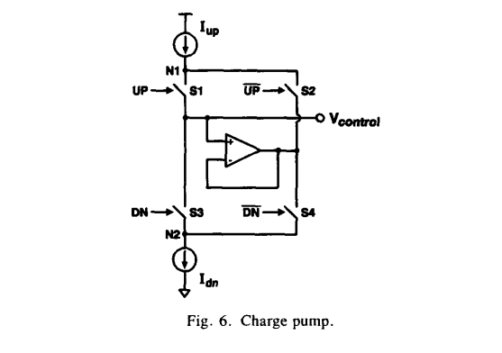
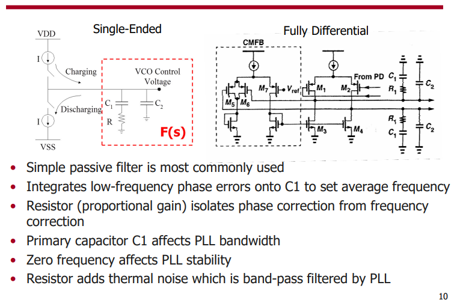
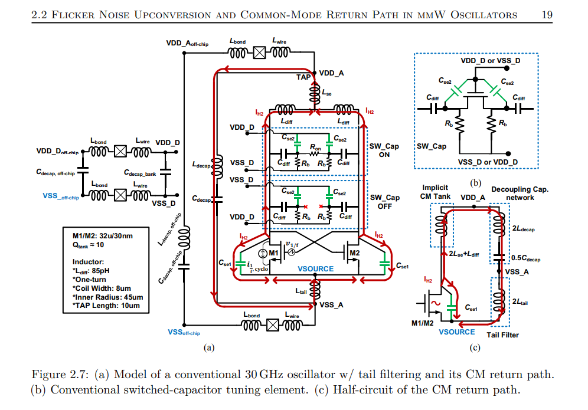
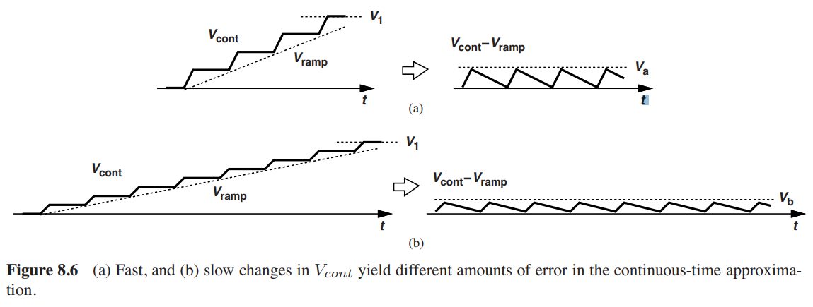
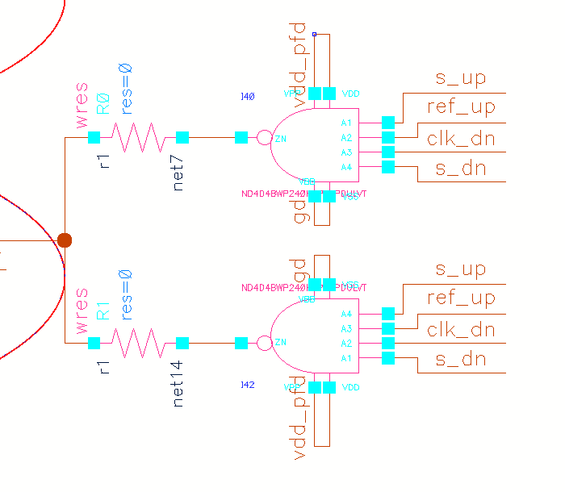
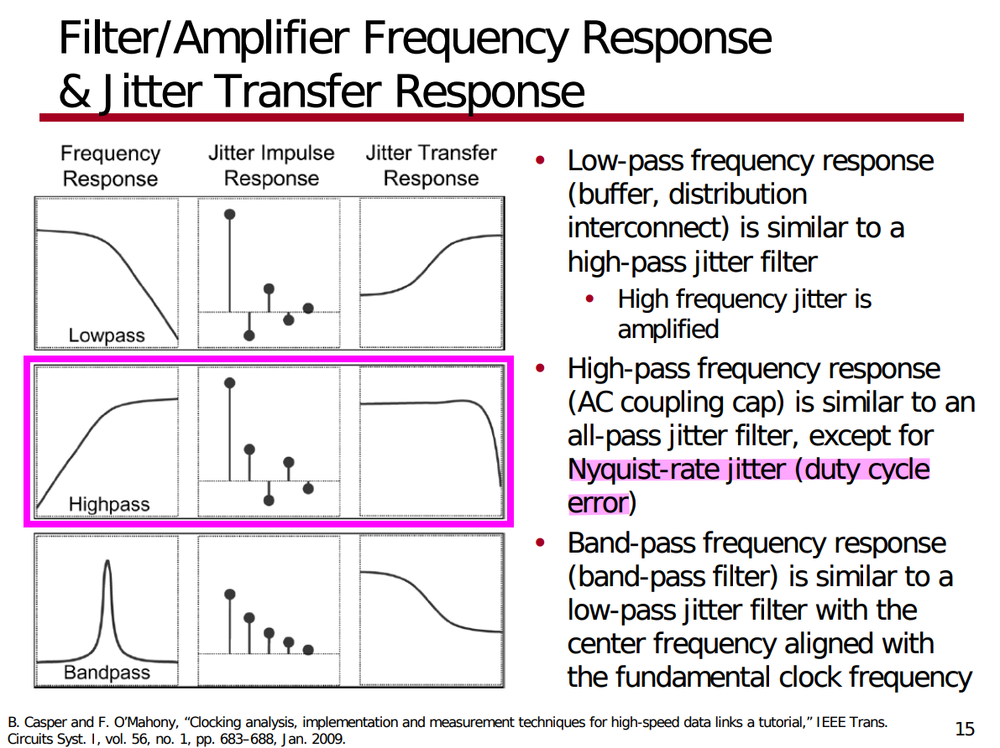
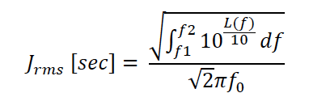
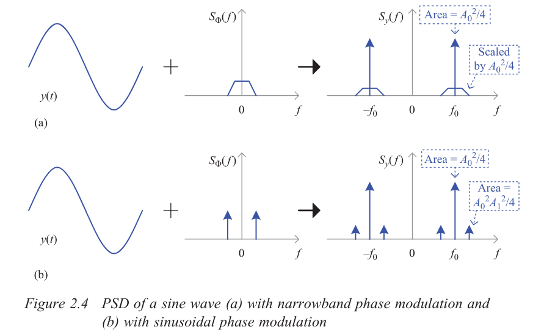

## Temperature compensation for VCO

*Temperature compensation for the VCO oscillation frequency* is a critical issue

*TODO* &#128197;

## charge pump with amplifier

This reduces the charge sharing effect, when the switch is turned on. 

> Young, I.A., Greason, J.K., Wong, K.L.: A PLL Clock Generator with 5 to 110MHz of Lock Range for Microprocessors. IEEE Journal of Solid-State Circuits 27(11), 1599– 1607 (1992)  [[https://people.engr.tamu.edu/spalermo/ecen620/pll_intel_young_jssc_1992.pdf](https://people.engr.tamu.edu/spalermo/ecen620/pll_intel_young_jssc_1992.pdf)]
>
> Johnson, M., Hudson, E.: A variable delay line PLL for CPU-coprocessor synchronization. IEEE Journal of Solid-State Circuits 23(10), 1218–1223 (1988)  [[https://sci-hub.se/10.1109/4.5947](https://sci-hub.se/10.1109/4.5947)]

## why 2nd loop filter ?

> PI (proportional - integral) Loop Filter

## Switched Capacitor Banks

Q: why $R_b$ ?

A:  *TODO* &#128197;

> Hu, Yizhe. "Flicker noise upconversion and reduction mechanisms in RF/millimeter-wave oscillators for 5G communications." PhD diss., 2019.
>
> S. D. Toso, A. Bevilacqua, A. Gerosa and A. Neviani, "A thorough analysis of the tank quality factor in LC oscillators with switched capacitor banks," *Proceedings of 2010 IEEE International Symposium on Circuits and Systems*, Paris, France, 2010, pp. 1903-1906

## Injection Lock

*TODO* &#128197;

## Phase Interpolator (PI)

!!! Clock Edges

And for a phase interpolator, you need those reference clocks to be completely the opposite. Ideally they would be **triangular** shaped

> *four input clocks given by the cyan, black, magenta, red* 

> John T. Stonick, ISSCC 2011 tutorial. "DPLL Based Clock and Data Recovery" [[https://www.nishanchettri.com/isscc-slides/2011%20ISSCC/TUTORIALS/ISSCC2011Visuals-T5.pdf](https://www.nishanchettri.com/isscc-slides/2011%20ISSCC/TUTORIALS/ISSCC2011Visuals-T5.pdf)]

***kink problem***

> B. Razavi, **"The Design of a Phase Interpolator [The Analog Mind],"** IEEE Solid-State Circuits Magazine, Volume. 15, Issue. 4, pp. 6-10, Fall 2023.([https://www.seas.ucla.edu/brweb/papers/Journals/BR_SSCM_4_2023.pdf](https://www.seas.ucla.edu/brweb/papers/Journals/BR_SSCM_4_2023.pdf))

## DIV 1.5

*TODO* &#128197;

> Xu, Haojie & Luo, Bao & Jin, Gaofeng & Feng, Fei & Guo, Huanan & Gao, Xiang & Deo, Anupama. (2022). A Flexible 0.73-15.5 GHz Single LC VCO Clock Generator in 12 nm CMOS. IEEE Transactions on Circuits and Systems II: Express Briefs. 69. 4238 - 4242. [[https://www.researchgate.net/publication/382240520_A_Flexible_073-155_GHz_Single_LC_VCO_Clock_Generator_in_12_nm_CMOS](https://www.researchgate.net/publication/382240520_A_Flexible_073-155_GHz_Single_LC_VCO_Clock_Generator_in_12_nm_CMOS)]

## False locking

*TODO* &#128197;

- divider failure
- even-stage ring oscillator ( multipath ring oscillators)
- DLL: harmonic locking,  stuck locking

## different frequency clock impact on edge

> ck1 is div2 of ck0

- edge of ck0 is affected differently by ck1

- edge of ck1 is affected equally by ck0

## limit cycle & hunting jitter 

>  *hunting jitter* is also called as **dithering jitter**

## CDR Loop Latency 

Denoting the CDR loop latency by $\Delta T$ , we note that the loop transmission is multiplied by $exp(-s\Delta T)\simeq 1-s\Delta T$.The resulting right-half-plane zero, $f_z$ degrades the phase margin and must remain about **one decade beyond the BW**
$$
f_z\simeq \frac{1}{2\pi \Delta T}
$$

> This assumption is true in practice since the bandwidth of the CDR (few mega Hertz) is much smaller than the data rate (multi giga bits/second).

> [Fernando , Marvell Italy."Considerations for CDR
Bandwidth Proposal" [https://www.ieee802.org/3/bs/public/16_03/debernardinis_3bs_01_0316.pdf](https://www.ieee802.org/3/bs/public/16_03/debernardinis_3bs_01_0316.pdf)]
>
>

## Loop Bandwidth

> The *closed-loop −3-dB bandwidth* is sometimes called the **“loop bandwidth”**

## Continuous-Time Approximation Limitations 

A rule of thumb often used to ensure slow changes in the loop is to select the *loop bandwidth* approximately equal to **one-tenth** of the *input frequency*. 

> Gardner, F.M. (1980). Charge-Pump Phase-Lock Loops. *IEEE Trans. Commun., 28*, 1849-1858.
>
> Homayoun, Aliakbar and Behzad Razavi. “On the Stability of Charge-Pump Phase-Locked Loops.” *IEEE Transactions on Circuits and Systems I: Regular Papers* 63 (2016): 741-750.
>
> N. Kuznetsov, A. Matveev, M. Yuldashev and R. Yuldashev, "Nonlinear Analysis of Charge-Pump Phase-Locked Loop: The Hold-In and Pull-In Ranges," in *IEEE Transactions on Circuits and Systems I: Regular Papers*, vol. 68, no. 10, pp. 4049-4061, Oct. 2021
>
> 

## clock distribution

> X. Mo, J. Wu, N. Wary and T. C. Carusone, "Design Methodologies for Low-Jitter CMOS Clock Distribution," in *IEEE Open Journal of the Solid-State Circuits Society*, vol. 1, pp. 94-103, 2021
>

## PFD

> symmetric???

## Feedback Dividers

- Large values of N lowers the loop BW which is bad for jitter

> Gunnman, Kiran, and Mohammad Vahidfar. *Selected Topics in RF, Analog and Mixed Signal Circuits and Systems*. Aalborg: River Publishers, 2017.

## clock gating

## PLL Type & Order

**Type**: # of integrators within the loop

**Order**: # of poles in the *closed-loop* transfer function 

> *Type $\leq$ Order*

## Why Type 2 PLL ?

1. That is, to have a wide bandwidth, a high loop gain is required
2. More importantly, the type 1 PLL has the problem of a static phase error for the change of an input frequency

## AC-coupled buffer 

> Since duty-cycle error is *high frequency* component, the high-pass filter suppresses the duty-cycle error propagating to the output

- The AC-coupling capacitor blocks the low-frequency component of the input
- The feedback resistor sets common mode voltage to the crossover voltage

> Bae, Woorham; Jeong, Deog-Kyoon: 'Analysis and Design of CMOS Clocking Circuits for Low Phase Noise' (Materials, Circuits and Devices, 2020)
>
> Casper B, O’Mahony F. Clocking analysis, implementation and measurement techniques for high-speed data links: A tutorial. IEEE Transactions on Circuits and Systems I: Regular Papers. 2009;56(1):17–39

## Clock Division with Jitter and Phase Noise

- Multiplying the frequency of a signal by a factor of N using an **ideal** frequency multiplier increases the phase noise of the multiplied signal by $20\log(N)$ dB. 
- Similarly dividing a signal frequency by N reduces the phase noise of the output signal by $20\log(N)$  dB

> The sideband offset from the carrier in the frequency multiplied/divided signal is the same as for the original signal.

### The 20log(N) Rule

If the carrier frequency of a clock is divided down by a factor of $N$ then we expect the phase noise to decrease by $20\log(N)$.The primary assumption here is a *noiseless* conventional digital divider.

> The $20\log(N)$ rule only applies to *phase noise* and *not integrated phase noise or phase jitter*. Phase jitter should generally measure about the **same**.

### What About Phase Jitter?

We integrate *SSB* phase noise *L*(f) [dBc/Hz] to obtain rms phase jitter in seconds as follows for “brick wall” integration from f1 to f2 offset frequencies in Hz and where f0 is the carrier or clock frequency.

Note that the rms phase jitter in seconds is inversely proportional to f0. When frequency is divided down, the phase noise, *L*(f), goes down by a factor of 20log(N). However, since the frequency goes down by N also, the phase jitter expressed in units of time is constant. 

Therefore, phase noise curves, related by 20log(N), with the same phase noise shape over the *jitter bandwidth*, are expected to yield the same phase jitter in seconds.

> [[Timing 101: The Case of the Jitterier Divided-Down Clock, Silicon Labs]](https://community.silabs.com/s/share/a5U1M000000knweUAA/timing-101-the-case-of-the-jitterier-divideddown-clock?language=en_US)
>
> [[How division impacts spurs, phase noise, and phase]](https://www.planetanalog.com/how-division-impacts-spurs-phase-noise-and-phase/)
>
> [[Phase Noise Theory: Ideal Frequency Multipliers and Dividers]](http://www.ko4bb.com/~bruce/IdealFreqMultDiv.html)

## Bang-Bang Phase Detector

> It's **ternary**, because *early*, *late* and *no transition*

### Linearing BB-PD

BB Gain is the slope of average BB output $\mu$, versus phase offset $\phi$, i.e. $\frac {\partial \mu}{\partial \phi}$,

BB only produces output for a transition and this de-rates the gain. Transition density = *0.5* for random data

$$
K_{BB} = \frac{1}{2}\frac {\partial \mu}{\partial \phi}
$$

where $\mu = (1)\times \mathrm{P}(\text{late}|\phi) + (-1)\times \mathrm{P}(\text{early}|\phi)$

> Both jitter and amplitude noise distribution are same, just scaled by slope 

### Self-Noise Term

One price we pay for *BB PD* versus *linear PD* is the self-noise term. For small phase errors BB output noise is the full
magnitude of the sliced data.

> BB-PD don't have any measure as to how early or how late and the way that tell loop is locked, is over a long time average, BB-PD have an equal number of earlies and lates 

$$\begin{align}
\sigma_{BB} &= [E(X^2) - E(X)^2] \cdot \mathrm{P}(\text{trans}) \\
&= [1 - 0]\cdot 0.5 \\
&= 0.5
\end{align}$$

> John T. Stonick, ISSCC 2011 TUTORIALS *T5: DPLL-Based Clock and Data Recovery*
>
> Walker, Richard. (2003). Designing Bang-Bang PLLs for Clock and Data Recovery in Serial Data Transmission Systems.  [[pdf](https://www.omnisterra.com/walker/pdfs.papers/BBPLL.pdf)]
>
> \- Clock and Data Recovery for Serial Data Communications, focusing on bang-bang CDR design methodology, ISSCC Short Course, February 2002. [[slides](https://www.omnisterra.com/walker/pdfs.talks/ISSCC2002.pdf)]

## PLL bandwidth test

A *step response test* is an easy way to determine the bandwidth.

*Sum a small step into the control voltage* of your oscillator (VCO or NCO), and measure the *90% to 10%* fall time of the corrected response at the output of the loop filter as shown in this block diagram

a first order loop 
$$
BW = \frac{0.35}{t} \space\space\space\space \text{(first order system)}
$$
Where $BW$ is the 3 dB bandwidth in Hz and $𝑡$​ is the 10%/90% rise or fall time.

For second order loops with a typical damping factor of *0.7* this relationship is closer to:
$$
BW = \frac{0.33}{t}\space\space\space\space \text{(second order system, damping factor = 0.7)}
$$

> [How can I experimentally find the bandwidth of my PLL?, [https://dsp.stackexchange.com/a/73654/59253](https://dsp.stackexchange.com/a/73654/59253)]

## narrowband approximation

A sine wave with phase modulation is expressed as
$$
y(t) = A_0 \sin(2\pi f_0 t + \phi _0 +\phi (t))
$$
where $\phi (t)$ is a time-varying phase modulation function

Assuming a *narrowband phase modulation (PM)*, that is, the absolute amount of modulated phase is small enough

> *otherwise the modulation becomes frequency modulation (FM) and its analysis becomes more complex*

$$
y(t) \simeq A_0 \sin(2\pi f_0 t +\phi _0) + A_0 \phi (t)\cos(2\pi f_0 t + \phi _0)
$$

> Because $\cos \phi(t)$ and $\sin \phi(t)$ are approximated to $1$ and $\phi (t)$, respectively

The Fourier transform of $y(t)$ is
$$
Y(f) = \frac{1}{2}A_0 e^{j\phi _0}\delta(f-f_0) -\frac{1}{2}A_0e^{-j\phi_0}\delta(f+f_0)+\frac{1}{2}A_0e^{j\phi_0}\Phi(f-f_0)-\frac{1}{2}A_0e^{-j\phi_0}\Phi(f+f_0)
$$

> where $\Phi(f)$ is the Fourier transform pair of $\phi(t)$

The autocorrelation of $y(t)$ is

$$\begin{align}
R(\tau) &= E(y(t)y(t+\tau))\\
&= E([A_0\sin(2\pi f_0 t + \phi_0)+A_0\phi(t)\cos(2\pi f_0 t+\phi _0)]\\
&= \frac{1}{2}A_0^2 \cos(2\pi f_0 \tau)(1+R_{\phi}(\tau))
\end{align}$$

Fourier transform of $R(\tau)$ is
$$
S_y(f) = \frac{1}{4}A_0^2 \delta (f-f_0) + \frac{1}{4}A_0\delta(f+f_0) + \frac{1}{4}A_0^2S_\phi (f-f_0)+\frac{1}{4}A_0^2S_\phi (f+f_0)
$$

> Bae, Woorham; Jeong, Deog-Kyoon: 'Analysis and Design of CMOS Clocking Circuits for Low Phase Noise' (Materials, Circuits and Devices, 2020)

### approximation limitation

**Don't** retain the same total power

## Leeson's model

Leeson's equation is an *empirical* expression that describes an oscillator's phase noise spectrum

Limitation:

​	that the PSD diverges to *infinity* for very low values of the frequency offset $f$​

## Lorentzian Spectrum

We typically use the two spectra, $S_{\phi n}(f)$ and $S_{out}(f)$, interchangeably, but we must resolve these inconsistencies. **voltage spectrum**  is called **Lorentzian spectrum**

---

The periodic signal $x(t)$ can be expanded in Fourier series as:

Assume that the signal is subject to excess phase noise, which is modeled by adding a time-dependent noise component $\alpha(t)$. The noisy signal can be written $x(t+\alpha(t))$, the added excess phase $\phi(t)= \frac{\alpha(t)}{\omega_0}$

The autocorrelation of the noisy signal is by definition:

The *autocorrelation averaged over time* results in:

By taking the Fourier transform of the autocorrelation, the spectrum of the signal $x(t + \alpha(t))$​ can be expressed as

It is also interesting to note how the integral in Equation 9.80 around each harmonic is equal to the power of the harmonic itself $|X_n|^2$

The integral $S_x(f)$ around harmonic is
$$\begin{align}
P_{x,n} &= \int_{f=-\infty}^{\infty} |X_n|^2\frac{\omega_0^2n^2c}{\frac{1}{4}\omega_0^4n^4c^2+(\omega +n\omega_0)^2}df \\
&= |X_n|^2\int_{\Delta f=-\infty}^{\infty}\frac{2\beta}{\beta^2+(2\pi\cdot\Delta f)^2}d\Delta f \\
&= |X_n|^2\frac{1}{\pi}\arctan(\frac{2\pi \Delta f}{\beta})|_{-\infty}^{\infty} \\
&= |X_n|^2
\end{align}$$

> The phase noise does not affect the total power in the signal, it only affects its distribution. 
>
> - Without phase noise, $S_v(f)$ is a series of impulse functions at the harmonics of $f_o$. 
> - With phase noise, the impulse functions spread, becoming fatter and shorter but retaining the *same total power*

## AM-PM conversion

*TODO* &#128197;

