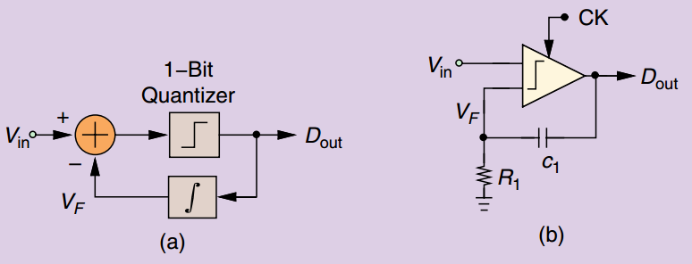

### The Delta Modulator

(a) A delta modulator and (b) its simple implementation

 The high loop gain ensures that $V_F \simeq V_{in}$

The principal difficulty with the delta modulator is that the output digital representation in fact contains only the **derivative of the input**, as can be seen by noting $V_F=\int D_{out}dt$, i.e.
$$
D_{out} = \frac{dV_F}{dt}
$$

- This differentiation alters the signal spectrum
- attenuates the low-frequency content of the signal
- and amplifies high-frequency noise

### Delta-Sigma modulators

###  Charge Balancing

### Decimation Filters

A simple time-domain analysis shows that a **sinc filter** is a suitable decimation filter for a first-order modulator. Such a filter has a rectangular impulse response, and can be implemented as a **counter**.

### reference

B. Razavi, "The Delta-Sigma Modulator [A Circuit for All Seasons]," IEEE Solid-State Circuits Magazine, Volume. 8, Issue. 20, pp. 10-15, Spring 2016.

Pavan, Shanthi, Richard Schreier, and Gabor Temes. (2016) 2016. Understanding Delta-Sigma Data Converters. 2nd ed. Wiley.

Richard Schreier (2022). Delta Sigma Toolbox (https://www.mathworks.com/matlabcentral/fileexchange/19-delta-sigma-toolbox), MATLAB Central File Exchange. Retrieved June 28, 2022.

Micheal, A., P., Pertijs., Johan, H., Huijsing., Pertijs., Johan, H., Huijsing. (2006). Precision Temperature Sensors in CMOS Technology.
