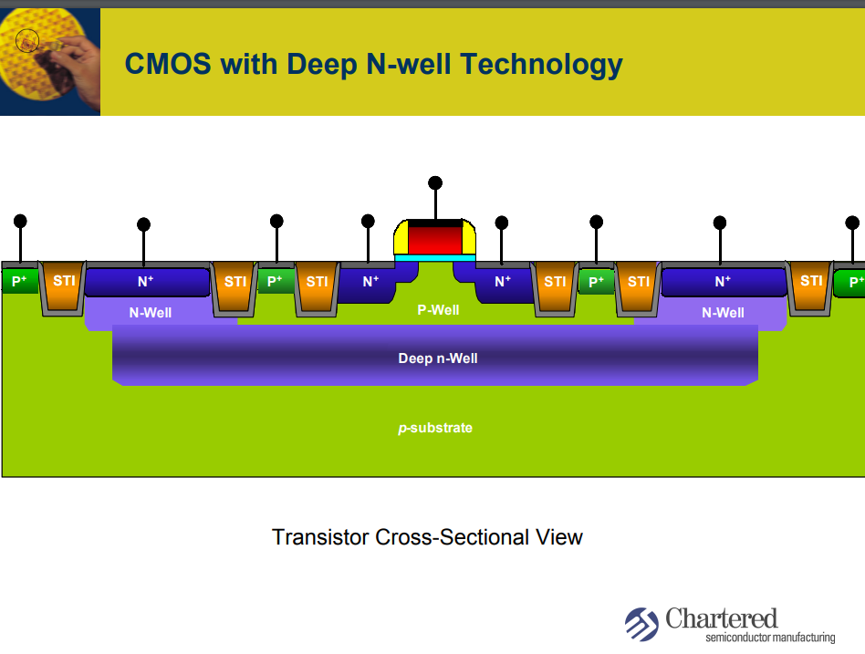
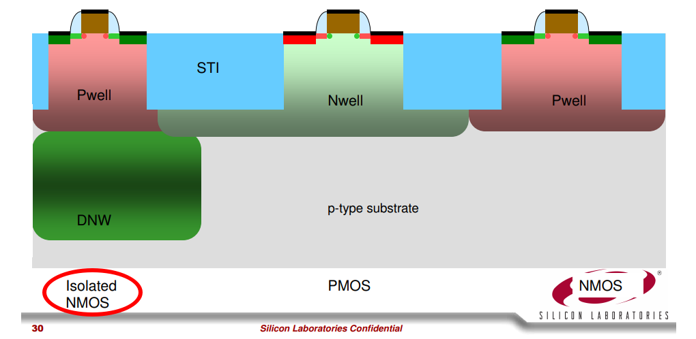

## Substrate noise

A variety of techniques can be used to minimize this noise, for example by keeping analog devices surrounded by guard rings, or using a separate supply for the substrate/well taps. 

However *guard rings alone cannot prevent noise coupling deep in the substrate, only surface currents*.

> PMOS are less noisy than NMOS since PMOS has its nwell which isolates the substrate noise, but such is not valid for NMOS .

## DNW

The N-channel devices built directly into the P-type substrate are not as effectively isolated as P-channel devices in their N-wells. This is because despite creating a P+ guard ring around the devices, there remains an electrical path below the guard ring for charge to flow. 

To overcome this issue, a *deep N-well* can be used to more effectively isolate these N-channel devices.

> pwdnw: PW/DNW diode
>
> dnwpsub: DNW/PSUB diode
>
> [Together At Last – Combining Netlist and Layout Data for Power-Aware Verification](https://blogs.sw.siemens.com/calibre/2015/11/03/together-at-last-combining-netlist-and-layout-data-for-power-aware-verification/)

- the P-well is separated, allowing the voltage to be controlled
- because the circuit within the deep N-well is separated from the p-substrate in this structure,
  there is the benefit that this circuitry is less susceptible to noise that propagates through the p-substrate.

## reference

Chew, K.W., Zhang, J., Shao, K., Loh, W., & Chu, S.F. (2002). Impact of Deep N-well Implantation on Substrate Noise Coupling and RF Transistor Performance for Systems-on-a-Chip Integration. 32nd European Solid-State Device Research Conference, 251-254. URL:[[slides](http://www.essderc2002.deis.unibo.it/ESSDERC_web/Session_D11/D11_1.pdf), [paper](http://www.essderc2002.deis.unibo.it/data/pdf/Chew.pdf)]

Mark Waller, [Analog layout: Why wells, taps, and guard rings are crucial](https://www.planetanalog.com/analog-layout-why-wells-taps-and-guard-rings-are-crucial/)

KEITH SABINE [Using Deep N Wells in Analog Design](https://www.planetanalog.com/using-deep-n-wells-in-analog-design/)

Faricelli, J. (2010). Layout-dependent proximity effects in deep nanoscale CMOS. IEEE Custom Integrated Circuits Conference 2010, 1-8.

cmos_processing, URL:[http://users.ece.utexas.edu/~athomsen/cmos_processing.pdf](http://users.ece.utexas.edu/~athomsen/cmos_processing.pdf)
