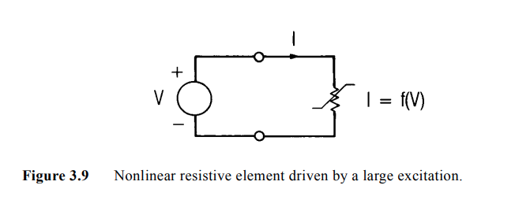

**Large-signal/small-signal analysis**, or **conversion matrix analysis**, is useful for a large class of problems wherein a nonlinear device is driven, or "pumped" by a **single large sinusoidal signal**; another signal, much smaller, is applied; and we seek only the **linear response to the small signal**.

The above nonlinear element has the $I/V$ relationship $I=f(V)$. Assuming that $V$ consists of the sum of a large-signal component $V_0$ and a small-signal component $v$, with Taylor series
$$
f(V_0+v) = f(V_0)+\frac{d}{dV}f(V)|_{V=V_0}\cdot v+\frac{1}{2}\frac{d^2}{dV^2}f(V)|_{V=V_0}\cdot v^2+...
$$
The small-signal, incremental current is found by subtracting the large-signal component of the current
$$
i(v)=I(V_0+v)-I(V_0)
$$
If $v \ll V_0$, $v^2$, $v^3$,... are negligible. Then,
$$
i(v) = \frac{d}{dV}f(V)|_{V=V_0}\cdot v
$$
$V_0$ need not be a dc quantity; it can be a time-varying large-signal voltage $V_L(t)$ and that $v=v(t)$, a function of time. Then
$$
i(t) = \frac{d}{dV}f(V)|_{V=V_L(t)}\cdot v(t)
$$

The above equation can be expressed as
$$
i(t)=g(t)v(t)
$$
where $g(t)=\frac{d}{dV}f(V)|_{V=V_L(t)}$

> If $f(V) = V^2$, then
> $$\begin{align}
> i(t) &= \frac{d}{dV}V^2|_{V=V_L(t)}\cdot v(t) \\
> &= 2V_L(t) \cdot v(t)
> \end{align}$$

A nonlinear element excited by two tones, generate mixing frequencies $m\omega_1+n\omega_w$, where $m$ and $n$ are integers. If one of those tones, $\omega_1$ has such **low level** that it does not generate harmonics and the other is a large-signal sinusoid at $\omega_p$, then the mixing frequencies are $\omega=\pm\omega_1+n\omega_p$, which shown in below figure

A more compact representation of the mixing frequencies is
$$
\omega_n=\omega_0+n\omega_p
$$
which includes only half of the mixing frequencies: the negative components of the lower sidebands and the positive components of the upper sidebands

The **frequency-domain** currents and voltages in a *time-varying* circuit element are related by a **conversion matrix**

The small-signal voltage and current can be expressed in the frequency notation as
$$
v'(t) = \sum_{n=-\infty}^{\infty}V_ne^{j\omega_nt}
$$
and
$$
i'(t) = \sum_{n=-\infty}^{\infty}I_ne^{j\omega_nt}
$$
where $v'(t)$ and $i'(t)$  are not Fourier series.

The conductance waveform $g(t)$  can be expressed by its Fourier series,
$$
g(t)=\sum_{n=-\infty}^{\infty}G_ne^{jn\omega_pt}
$$
Which is harmonics of large-signal $\omega_p$

Then the voltage and current are related by Ohm's law
$$
i'(t)=g(t)v'(t)
$$
Then
$$
\sum_{k=-\infty}^{\infty}I_ke^{j\omega_kt}=\sum_{n=-\infty}^{\infty}\sum_{m=-\infty}^{\infty}G_nV_me^{j\omega_{m+n}t}
$$



**Excerpts from:**

*Stephen Maas, Nonlinear Microwave and RF Circuits, Second Edition , Artech, 2003.*

