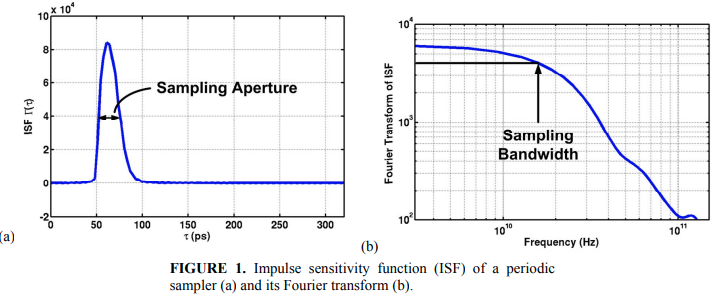
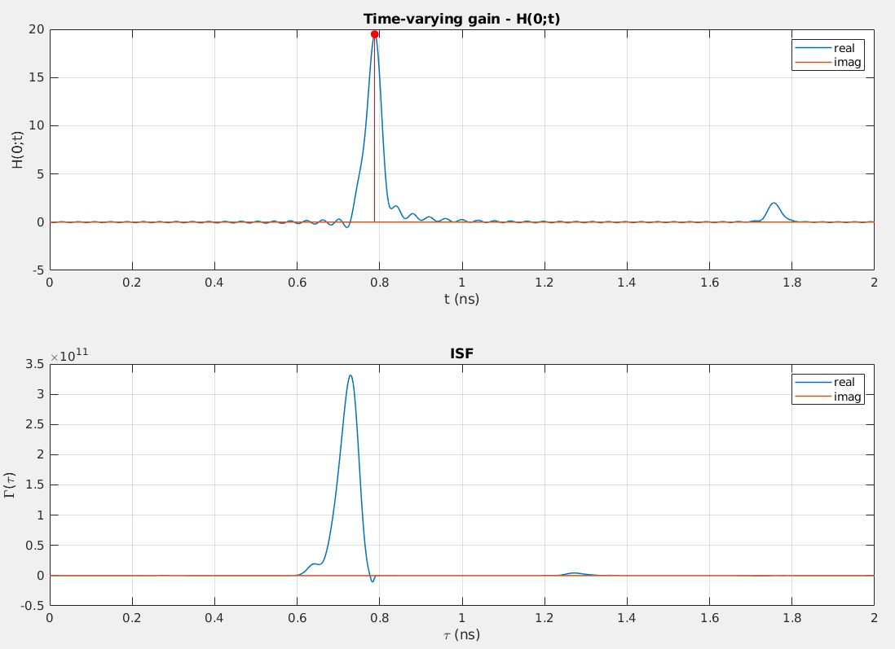

An efficient method to measure the ISFs of periodic circuits via periodic AC (PAC) analysis, which is available from RF circuit simulators such as SpectreRF and ADS


## Linear Time-varying System Theory

We define the ISF of the sampler as the sensitivity of its final output voltage to the impulse arriving at its input at different times, the ISF essentially describes the aperture of the sampler. 

An ideal sampler would have the perfect aperture, i.e. sampling the input voltage at exactly one point in time; thus, its ISF would be a Dirac delta function, $\delta(t-t_s)$ where $t_s$ is when sampling occurs. 

A realistic sampler would rather capture a weighted-average of the input voltage over a certain time window. This weighting function is called the sampling aperture and is equivalent to the ISF



 A **time-varying impulse response** $h(t, \tau)$ is defined as the circuit response at time $t$ responding to an impulse arriving at time $\tau$.

In general, the ISF can be regarded as the **time-varying impulse response** evaluated at *one particular observation time* $t=t_0$.

The system output $y(t)$ is related to the input $x(t)$ as:
$$
y(t) = \int_{-\infty}^{\infty}h(t, \tau)\cdot x(\tau)d\tau
$$
Note that in a linear time-invariant (LTI) system, $h(t,\tau)=h(t-\tau)$ and the above equation reduces to a convolution.

If $X(j\omega)$ is the Fourier transform of the input signal $x(t)$, i.e.
$$
x(t) = \frac{1}{2\pi}\int_{-\infty}^{\infty}X(j\omega)\cdot e^{j\omega t}d\omega
$$
Then
$$\begin{align}
y(t) &= \int_{-\infty}^{\infty}h(t,\tau)\left[\frac{1}{2\pi}\int_{-\infty}^{\infty}X(j\omega)\cdot e^{j\omega\tau }d\omega \right]\cdot d\tau \\
&=\frac{1}{2\pi}\int_{-\infty}^{\infty}X(j\omega)\left[\int_{-\infty}^{\infty}h(t,\tau)\cdot e^{j\omega\tau}d\tau\right]\cdot d\omega \\
&=\frac{1}{2\pi}\int_{-\infty}^{\infty}X(j\omega)\left[\int_{-\infty}^{\infty}h(t,\tau)\cdot e^{-j\omega(t-\tau)}d\tau\right]\cdot e^{j\omega t}\cdot d\omega \\
&=\frac{1}{2\pi}\int_{-\infty}^{\infty}X(j\omega)\cdot H(j\omega;t)\cdot e^{j\omega t}\cdot d\omega
\end{align}$$

where $H(j\omega;t)$ is **time-varying transfer function**, defined as the Fourier transform of the time-varying impulse response. 
$$
H(j\omega;t)=\int_{-\infty}^{\infty}h(t,\tau)\cdot e^{-j\omega(t-\tau)}d\tau
$$
And it follows that:
$$
Y(j\omega)=H(j\omega;t)\cdot X(j\omega)
$$
And

$$\begin{align}
x(\tau) & \overset{FT}{\longrightarrow} X(j\omega) \\
h(t,\tau) & \overset{FT}{\longrightarrow} H(j\omega;t)
\end{align}$$

For linear, periodically time-varying (LPTV) systems, $h(t, \tau) = h(t+T, \tau+T)$ and $H(j\omega; t) = H(j\omega; t+T)$ where $T$ is the period of the time-varying dynamics of the system.

We prove $H(j\omega; t) = H(j\omega; t+T)$:

$$\begin{align}
\because H(j\omega;t)&=\int_{-\infty}^{\infty}h(t,\tau)\cdot e^{-j\omega(t-\tau)}d\tau \\
\therefore H(j\omega;t+T) &= \int_{-\infty}^{\infty}h(t+T,\tau)\cdot e^{-j\omega(t+T-\tau)}d\tau \\
&= \int_{-\infty}^{\infty}h(t+T,\tau+T)\cdot e^{-j\omega(t+T-(\tau+T))}d(\tau+T) \\
&= \int_{-\infty}^{\infty}h(t+T,\tau+T)\cdot e^{-j\omega(t-\tau)}d\tau \\
&= \int_{-\infty}^{\infty}h(t,\tau)\cdot e^{-j\omega(t-\tau)}d\tau \\
&= H(j\omega;t)
\end{align}$$

## PAC Method

Since $H(j\omega;t)$  is periodic in $T$, The time-varying transfer function $H(j\omega;t)$ can be expressed in a Fourier series:
$$
H(j\omega;t)=\sum_{m=-\infty}^{\infty}H_m(j\omega) \cdot e^{jm\omega_c t}
$$
where $\omega_c$ is the fundamental frequency of the periodic system. $H_m(j\omega)$ represent the frequency response of the system at the *(m-th)* harmonic output sideband to a unit $j\omega$ sinusoid.

> The above equation link time-varying transfer function $H(j\omega;t)$ with PAC simulation output

The response to a periodic impulse train, that is:
$$
x(t)=\sum_{m=-\infty}^{\infty}\delta(t-\tau-nkT)
$$
The idea is that if the impulse response of the system settles to zero long before the next impulse arrives, then the system response to this impulse train would be approximately equal to the periodic repetition of the true impulse response, i.e.:
$$
y(t) \cong  \sum_{m=-\infty}^{\infty}h(t;\tau+nkT)
$$
and $y(t)$ would be approximately equal to $h(t;\tau)$ for $\tau \leq t \le t+kT$


> Without  loss of generality and for computation convenience, we set $k=1$ thereafter.

The Fourier transform $X(j\omega)$ of the **T-periodic** impulse train is:
$$
X(j\omega)=\omega_c\sum_{n=-\infty}^{\infty}\delta(\omega-n\omega_c)\cdot e^{-j\omega\tau}
$$
Then the response $y(t)$ is:
$$
y(t)=\frac{1}{T}\sum_{n=-\infty}^{\infty}H(jn\omega_c;t)\cdot e^{jn\omega_c\cdot(t-\tau)}
$$
The expression for the approximate time-varying impulse response:
$$
h(t,\tau) = \left\{ \begin{array}{cl}
\frac{1}{T}\sum_{n=-\infty}^{\infty}\sum_{m=-\infty}^{\infty}H_m(jn\omega_c)\cdot e^{jm\omega_ct+jn\omega_c\cdot (t-\tau)} & : \ \tau \leq t \lt \tau+T \\
0 & : \ \text{elsewhere}
\end{array} \right.
$$
Finally, the ISF $\Gamma(\tau)$ is equal to $h(t,\tau)$ when $t=t_0$ and $t_0 \gt \tau$
$$
\Gamma(\tau)\cong \frac{1}{T}\sum_{n=-\infty}^{\infty}\sum_{m=-\infty}^{\infty}H_m(jn\omega_c)\cdot e^{jm\omega_ct_0+jn\omega_c\cdot (t_0-\tau)}
$$
In practice, the summations are carried out over finite ranges of **n** and **m**, for example, -50~50.

For each combination of **n** and **m**, the PAC analysis needs to be performed to compute $H_m(jn\omega_c)$, the m-th harmonic response to the excitation at $n\omega_c$

The detailed procedure for characterizing the ISF of this sampler is outlined as follows:

- First, apply the proper input voltages that place the sampler in a metastable state and perform the periodic steady-state (PSS) analysis. 

- Second, perform the PAC analysis. 

- Third, based on the simulated PAC response, pick a time point $t_0$ at which the ISF is to be computed and derive the ISF

One possible candidate for the ISF measurement point $t_0$ is the time at which the  output voltage is amplified to the largest value.  PAC response of the sampler to a small signal DC input, that is, the time-varying transfer function evaluated at $\omega=0$
$$
H(j\omega;t)=\sum_{m=-\infty}^{\infty}H_m(0) \cdot e^{jm\omega_c t}
$$


> The total area under the ISF is the sampling gain, which is equal to the time-varying gain measured at $t_0$

```
time-varying gain at t0 H(0;t0): 19.486305
The total area under the ISF: 19.990230
```

### Align pss_td.pss with ISF

```
****************************************************
Periodic Steady-State Analysis `pss': fund = 500 MHz
****************************************************
Trying `homotopy = gmin' for initial conditions.
DC simulation time: CPU = 4.237 ms, elapsed = 4.27389 ms.

===============================
`pss': time = (0 s -> 102.6 ns)
===============================

Opening the PSF file ../psf/pss.tran.pss ...
...
Important parameter values in tstab integration:
    start = 0 s
    outputstart = 0 s
    stop = 102.6 ns
    period = 2 ns
    maxperiods = 20
    step = 102.6 ps
...
```

**tstab = 102.6 ns** can be observed in pss simulation log


```matlab
tstab = 102.6e-9;
tshift = mod(tstab, Tc);
tt_shift = tt - tshift;
tt_shift_start_indx = find(tt_shift>=0, 1);
isf_shift = circshift(isf_re, -tt_shift_start_indx);
```

### Align pss_fd.pss with ISF

Since both are frequency originated,  time-shift is NOT needed


```matlab
function wv = wv_fd(fname,tt)
fd = csvread(fname, 1, 0);
DC = fd(1, 2);
w = 2*pi*fd(2:end, 1);
coef = fd(2:end, 2) + 1i*fd(2:end, 3);
exp_sup = 1i*w.*tt;
wv = sum(real(coef .* exp(exp_sup)), 1) + DC;
end
```

### PSS + PAC Setup

- clock frequency should be low enough to assure system response settle to zero.
- Beat Frequency os PSS should be clock frequency
- For PAC setup,
    - the `Sweeptype` is `absolute`
    - `Input Frequency Sweep Range(Hz)` should be large enough.
    - `Sweep Type` should be `Linear` and `Step Size` should equal **PSS Beat Frequency(Hz)**
    - `SideBands` should large enough, like 50 (i.e. 50*2 +1, positive, negative and 0)
    - `Specialized Analyses` should be  `None`

> one example:
> clock, i.e. beat frequency = 8G
> PAC: input frequency sweep from -400G to 400G and step is 8G, which is beat frequency,
> here K=1 Eq.(9) of paper

> **freqaxis=out**: `freqaxis` of PAC not only affect "Direct Plot"'s output but also simuation data i.e. the phase shift(imaginary part).

matlab matrix **nonconjugate transpose**:

`transpose`, `.'`  cf. https://www.mathworks.com/help/matlab/ref/transpose.html

### `tstab` in PSS

Using shooting PSS, the steady waveform starts from `tstab+n*tperiod`.

- **pss_td.pss** is one period waveform starting from `tstab+n*tperiod`
- **pss_fd.pss** is the *complex* fourier series coefficient of expanded to left and right **pss_td.pss** waveform (`tstab+n*tperiod : tstab+(n+1)*tperiod`)

> We have to left-shift `mod(tstab, tperiod)` `pss_fd.pss` in order to align it with of **pss_tb.pss**


#### simulation log

The below `stop = 1.3 ns` is actual **tstab** time, though `Stop Time(tstab)` field of pss form is filled with `0.3n`

```
**************************************************
Periodic Steady-State Analysis `pss': fund = 1 GHz
**************************************************
DC simulation time: CPU = 208 us, elapsed = 211.954 us.

=============================
`pss': time = (0 s -> 1.3 ns)
=============================

Opening the PSF file ../psf/pss.tran.pss ...

Output and IC/nodeset summary:
                 save   1       (current)
                 save   2       (voltage)

Important parameter values in tstab integration:
    start = 0 s
    outputstart = 0 s
    stop = 1.3 ns
    period = 1 ns
    maxperiods = 20
    step = 1.3 ps
    maxstep = 40 ps
    ic = all
    useprevic = no
	...

    pss: time = 64.01 ps    (4.92 %), step = 31.63 ps     (2.43 %)
	...
    pss: time = 1.224 ns    (94.2 %), step = 40 ps        (3.08 %)
    pss: time = 1.3 ns       (100 %), step = 35.99 ps     (2.77 %)
...
```

#### PSS simulation result


#### Align pss_tb and pss_fd


```matlab
clear;
clc;

freq = 1e9;
tstab = 1.3e-9;
Tp  = 1e-9;

load('pss_td.matlab')
t = pss_td(:, 1);
ytd = pss_td(:, 2);
plot(t*1e9, ytd, 'k', 'LineWidth',6)
hold on;

% time domian from pss frequency domain information
coff_real = -0.155222;
coff_imag = -0.0247045;
wc = 2*pi*freq;
tfd = (0:1e-11:2e-9);
yfd = coff_real*cos(wc*tfd) - coff_imag*sin(wc*tfd);
plot(tfd*1e9, yfd, 'b')

% actual pss_td.pss one-period waveform
tfd_td = (tstab:1e-11:2e-9);
yfd_td = coff_real*cos(wc*tfd_td) - coff_imag*sin(wc*tfd_td);
plot(tfd_td*1e9, yfd_td, '--b', 'LineWidth', 4)

% align pss_fd with pss_tb by left shift mod(tstab, Tp) pss_fd
tshift = mod(tstab, Tp);
tfd_shift = tfd - tshift;
tfd_shift_start_indx = find(tfd_shift>=0, 1);
tfd_shift = tfd_shift(1, tfd_shift_start_indx:end);
yfd_shift = yfd(1, tfd_shift_start_indx:end);
plot(tfd_shift*1e9, yfd_shift, '-magenta', 'LineWidth', 2)
grid on;

xlabel('t (ps)');
ylabel('V(t)');
legend('Using pss\_td', 'Using pss\_fd', 'pss\_tb one period clip', 'Using pss\_fd with time shift', 'location', 'east');
```


## Transient Method

*TODO* &#128197;


## reference

J. Kim, B. S. Leibowitz and M. Jeeradit, "Impulse sensitivity function analysis of periodic circuits," 2008 IEEE/ACM International Conference on Computer-Aided Design, 2008, pp. 386-391, doi: 10.1109/ICCAD.2008.4681602. [[https://websrv.cecs.uci.edu/~papers/iccad08/PDFs/Papers/05C.2.pdf](https://websrv.cecs.uci.edu/~papers/iccad08/PDFs/Papers/05C.2.pdf)]

M. Jeeradit et al., "Characterizing sampling aperture of clocked comparators," 2008 IEEE Symposium on VLSI Circuits, Honolulu, HI, USA, 2008, pp. 68-69 [[https://people.engr.tamu.edu/spalermo/ecen689/sampling_aperature_comparators_vlsi_2008.pdf](https://people.engr.tamu.edu/spalermo/ecen689/sampling_aperature_comparators_vlsi_2008.pdf)]

T. Toifl et al., "A 22-gb/s PAM-4 receiver in 90-nm CMOS SOI technology," in IEEE Journal of Solid-State Circuits, vol. 41, no. 4, pp. 954-965, April 2006 [[https://citeseerx.ist.psu.edu/document?repid=rep1&type=pdf&doi=4d1f0442be77425ed34b9dcfd48fbfff954a707b](https://citeseerx.ist.psu.edu/document?repid=rep1&type=pdf&doi=4d1f0442be77425ed34b9dcfd48fbfff954a707b)]

Sam Palermo, ECEN 720 High-Speed Links: Circuits and Systems [[Lecture 6: RX Circuits](https://people.engr.tamu.edu/spalermo/ecen689/lecture6_ee720_rx_circuits.pdf)], [[Lab4 - Receiver Circuits](https://people.engr.tamu.edu/spalermo/ecen689/ECEN720_lab4_2023.pdf)]
