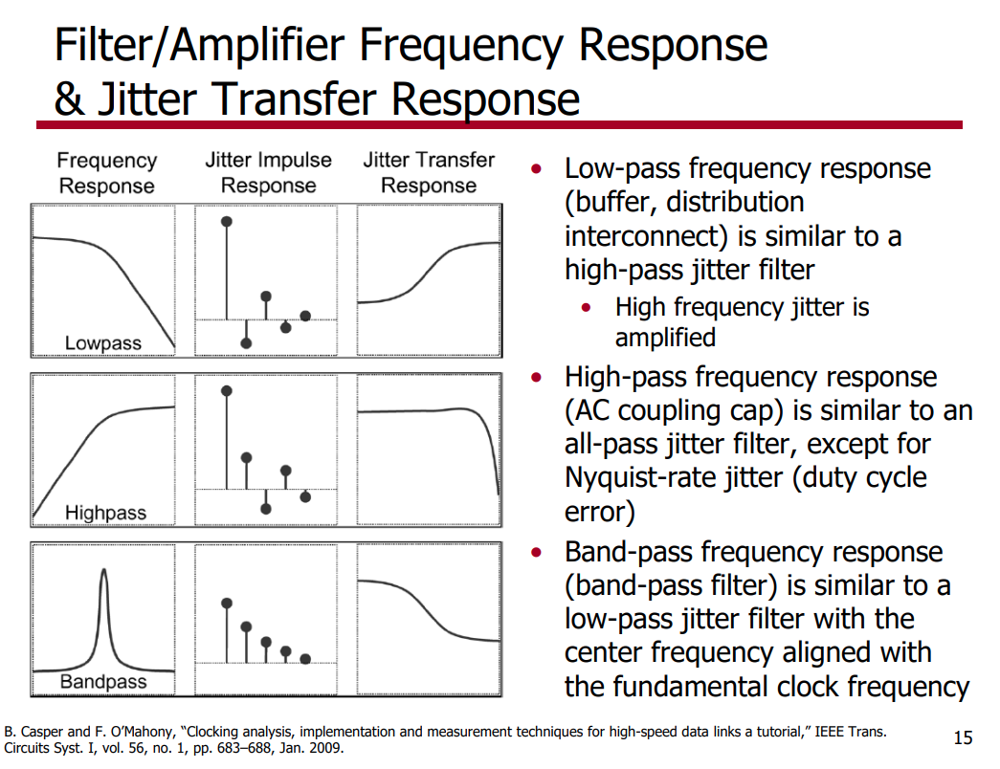
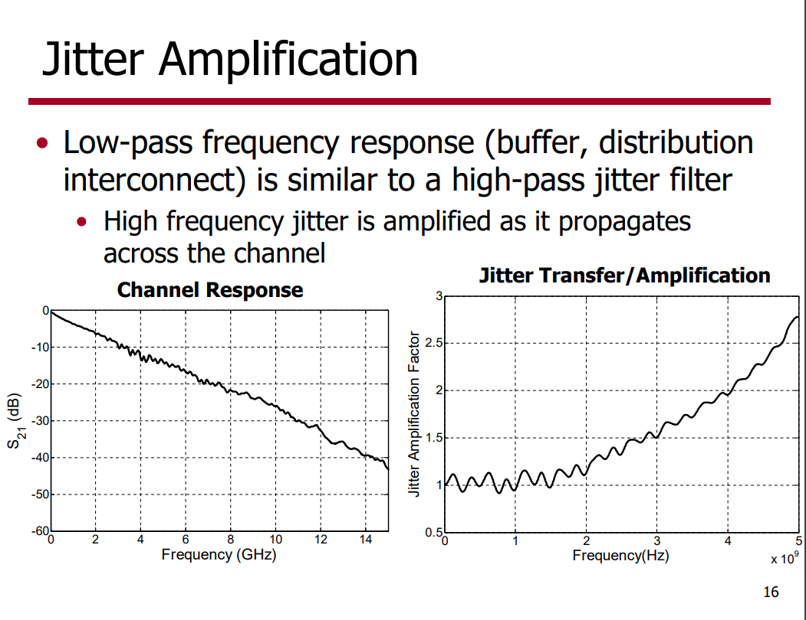
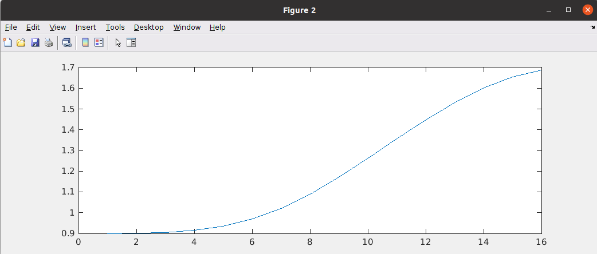
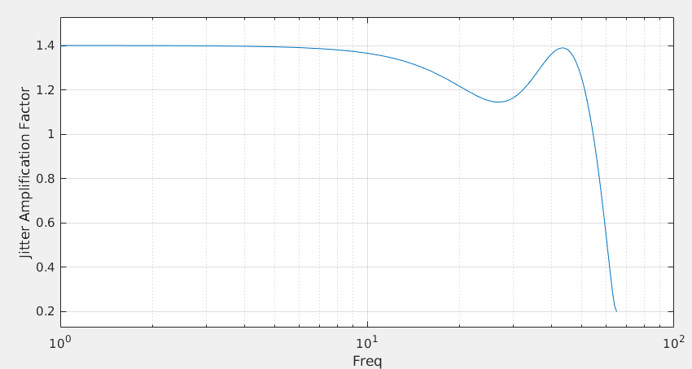
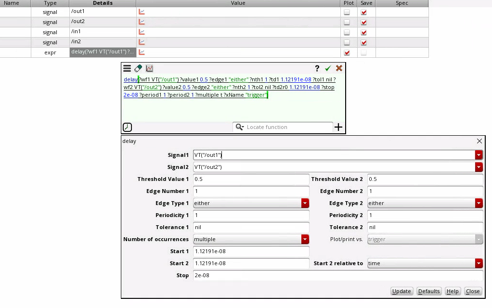
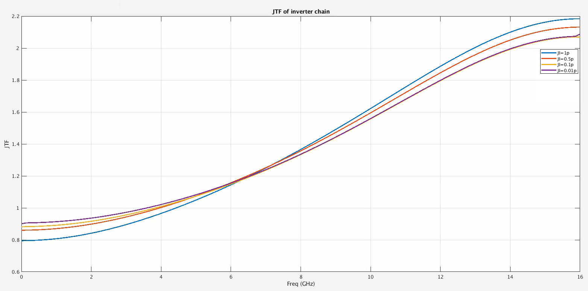

## 1. transient noise and rms_jitter function


> `RJ(rms)`: single Edge or Both Edge?
>
> `RJ(seed)`: what is it?


## 2 phase noise method

Directly compare the input phase noise and output phase noise, the input waveform maybe is the PLL output or other clock distribution end point


## 3. Jitter Impulse Response(JIR) & Jitter Impulse Response(JIR)






### Example
#### Low Pass Filter


```matlab
N = 32;
x = zeros(N,1);
x(1) = 6;
x(2) = -2;
x(3) = 0.5;
x = x/5;
figure(1)
stem(x)
Y = fft(x, N);
figure(2)
plot(abs(Y(1:N/2)));
```




#### High Pass Filter


```matlab
N = 128;
j_hp = zeros(N, 1);
j_hp(1)= 1;
j_hp(2) = 0.5;
j_hp(3) = -0.3;
j_hp(4) = 0.3;
j_hp(5) = -0.1;
jtf_hp = abs(fft(j_hp));
semilogx(jtf_hp(1:N/2+1));
xlabel('Freq');
ylabel('Jitter Amplification Factor');
grid on;
```



### inverter chain




```matlab
ji = 1e-12; % 1ps
data = importdata('/path/to/jir.csv');
jo = data.data(:, 2);
Ts = 31.25e-12;
Fs = 1/Ts;
jir = jo/ji;
N = 2^(nextpow2(length(jir)-1));
Y = fft(jir, N);
jtf = abs(Y(1:N/2+1));
freqs= Fs/N*(0:N/2);
plot(feqs/1e9, jtf, 'linewidth', 2);
grid on;
xlabel('Freq (GHz)');
ylabel('JTF');
title('JTF of inverter chain');
```



## Reference

[Sam Palermo, ECEN 720, Lecture 13 - Forwarded Clock Deskew Circuits](https://people.engr.tamu.edu/spalermo/ecen689/lecture13_ee720_fwd_clk_deskew.pdf)

B. Casper and F. O'Mahony, "Clocking Analysis, Implementation and Measurement Techniques for High-Speed Data Links—A Tutorial," in IEEE Transactions on Circuits and Systems I: Regular Papers, vol. 56, no. 1, pp. 17-39, Jan. 2009, doi: 10.1109/TCSI.2008.931647.

Phase-Locked Frequency Generation and Clocking : Architectures and Circuits for Modern Wireless and Wireline Systems by Woogeun Rhee (2020, Hardcover) 

Mathuranathan Viswanathan, Digital Modulations using Matlab : Build Simulation Models from Scratch

Tony Chan Carusone, University of Toronto, Canada, 2022 CICC Educational Sessions "Architectural Considerations in 100+ Gbps Wireline Transceivers"
