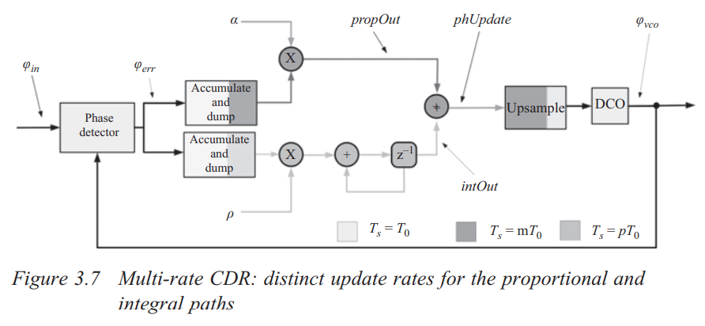

---

## CDR Loop Latency

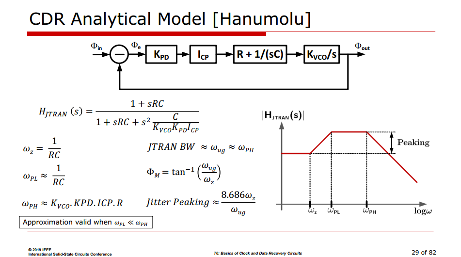

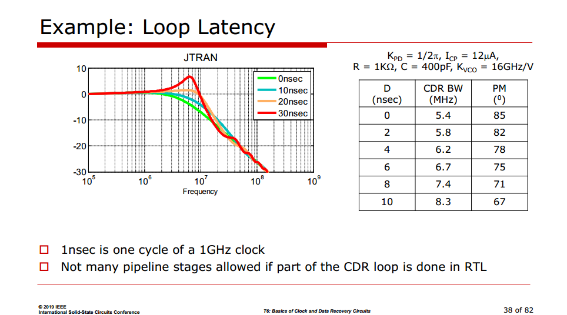

loop latency is represented as $e^{-sD}$ in linear model

---

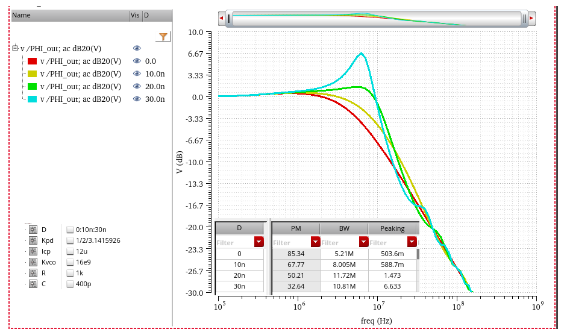

## Sensitivity to Loop Latency

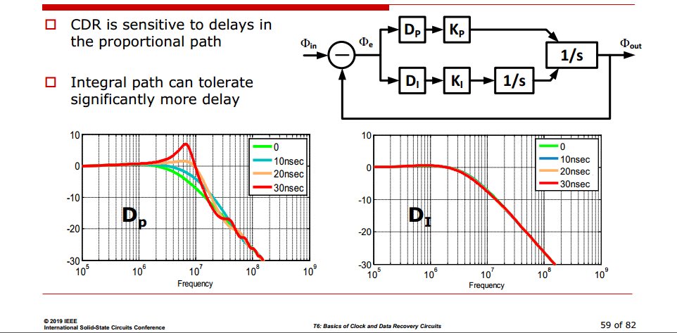

---

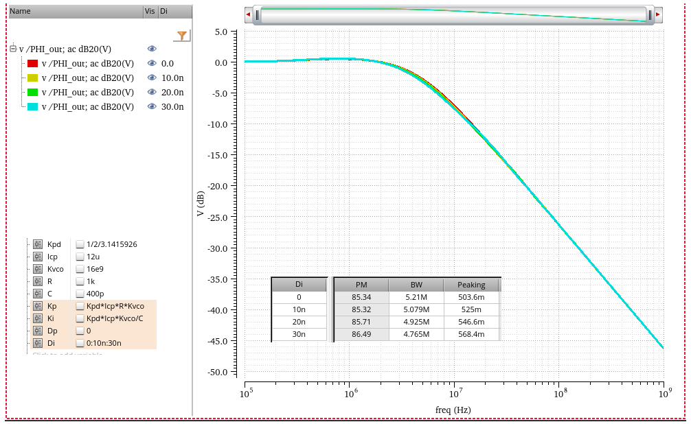

## Enhancing Resolution with a $\Delta \Sigma$ Modulator

> **Sub-Resolution Time Averaging**

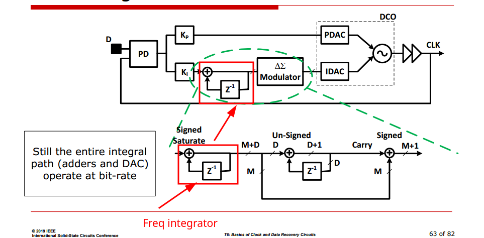

$\Delta \Sigma$ modulator effectively **dithers** the **LSB** bit between *zero and one*, such that you can get the effective resolution of a much higher resolution DAC in the number of bits

## Decimation

> how they affect sampling phase

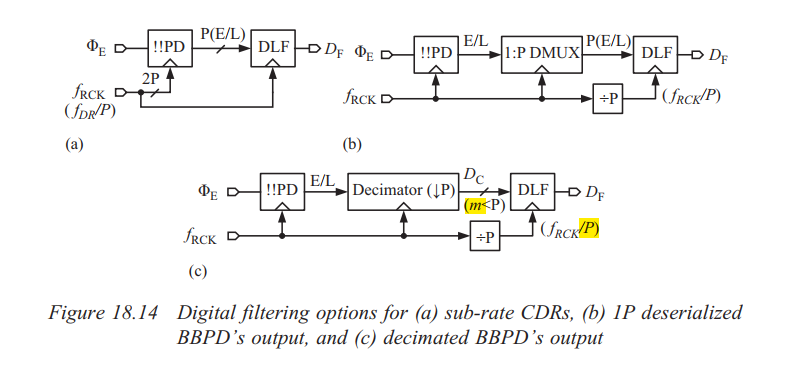

DLF's input bit-width can be reduced by *decimating* BBPD's output. Decimation is typically performed by realizing either **majority voting (MV)** or **boxcar filtering**.

> Note that **deserialization** is inherent to both **MV** and **boxcar** filtering

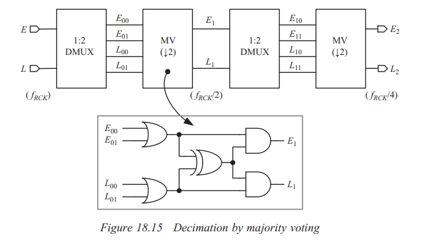

- Decimation is commonly employed to alleviate the high-speed requirement. However, decimation increases loop-latency which causes excessive dither jitter.
- Decimation is basically, widen the data and slowing it down
- Decimating by $L$ means frequency register only added once every $L$ UI, thus *integral path gain* reduced by $L$ in linear model
- *proportional path gain* is unchanged

## CDR Linear Model

> condition:
>
> Linear model of the CDR is used in a **frequency lock condition** and is approaching to achieve **phase lock**

Using this model, the power spectral density (PSD) of jitter in the recovered clock $S_{out}(f)$ is
$$
S_{out}(f)=|H_T(f)|^2S_{in}(f)+|H_G(f)|^2S_{VCO}(f)
$$
Here, we assume $\varphi_{in}$ and $\varphi_{VCO}$ are uncorrelated as they come from independent sources.

### Jitter Transfer

$$
H_T(s) = \frac{\varphi_{out}(s)}{\varphi_{in}(s)}|_{\varphi_{vco}=0}=\frac{K_{PD}K_{VCO}R_s+\frac{K_{PD}K_{VCO}}{C}}{s^2+K_{PD}K_{VCO}R_s+\frac{K_{PD}K_{VCO}}{C}}
$$

Using below notation
$$\begin{align}
\omega_n^2=\frac{K_{PD}K_{VCO}}{C} \\
\xi=\frac{K_{PD}K_{VCO}}{2\omega_n^2}
\end{align}$$

We can rewrite transfer function as follows
$$
H_T(s)=\frac{2\xi\omega_n s+\omega_n^2}{s^2+2\xi \omega_n s+\omega_n^2}
$$

> The jitter transfer represents a **low-pass filter** whose magnitude is around 1 (0 dB) for low jitter frequencies and drops at 20 dB/decade for frequencies above $\omega_n$

- the recovered clock **track** the *low-frequency jitter* of the input data
- the recovered clock **DONT** track the *high-frequency jitter* of the input data

The recovered clock does not suffer from high-frequency jitter even though the input signal may contain high-frequency jitter, which will limit the CDR tolerance to high-frequency jitter.

### Jitter Peaking in Jitter Transfer Function

The peak, slightly larger than 1 (0dB) implies that jitter will be **amplified** at some frequencies in the CDR, producing a jitter amplitude in the recovered clock, and thus also in the recovered data, that is slightly **larger** than the jitter amplitude in the input data.

This is certainly undesirable, especially in applications such as repeaters.

### Jitter Generation

If the input data to the CDR is clean with no jitter, i.e., $\varphi_{in}=0$, the jitter of the recovered clock comes directly from the VCO jitter. The transfer function that relates the VCO jitter to the recovered clock jitter is known as **jitter generation**.
$$
H_G(s)=\frac{\varphi_{out}}{\varphi_{VCO}}|_{\varphi_{in}=0}=\frac{s^2}{s^2+2\xi \omega_n s+\omega_n^2}
$$
Jitter generation is **high-pass filter** with two zeros, at zero frequency, and two poles identical to those of the jitter transfer function

### Jitter Tolerance

To quantify jitter tolerance, we often apply a sinusoidal jitter of a fixed frequency to the CDR input data and observe the BER of the CDR

The jitter tolerance curve **DONT** capture a CDR's true tolerance to **random** jitter. Because we are applying "sinusoidal" jitter, which is **deterministic** signal.

We can deal only with the jitter's amplitude and frequency instead of the PSD of the jitter thanks to deterministic sinusoidal jitter signal.
$$
JTOL(f) = \left | \varphi_{in}(f)  \right |_{\text{pp-max}} \quad \text{for a fixed BER}
$$
Where the subscript $\text{pp-max}$ indicates the maximum peak-to-peak amplitude. We can further expand this equation as follows
$$
JTOL(f)=\left| \frac{\varphi_{in}(f)}{\varphi_{e}(f)} \right| \cdot |\varphi_e(f)|_{pp-max}
$$
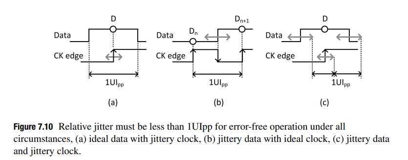

> Relative jitter, $\varphi_e$ must be less than 1UIpp for error-free operation

In an ideal CDR, the **maximum peak-to-peak amplitude** of $|\varphi_e(f)|$ is **1UI**, i.e.,$|\varphi_e(f)|_{pp-max}=1UI$

Accordingly, jitter tolerance can be expressed in terms of the number of UIs as
$$
JTOL(f)=\left| \frac{\varphi_{in}(f)}{\varphi_{e}(f)} \right|\quad \text{[UI]}
$$
Given the linear CDR model, we can write
$$
JTOL(f)=\left| 1+\frac{K_{PD}K_{VCO}H_{LF}(f)}{j2\pi f} \right|\quad \text{[UI]}
$$
Expand $H_{LF}(f)$ for the CDR, we can write
$$
JTOL(f)=\left| 1-2\xi j \left(\frac{f_n}{f}\right) - \left(\frac{f_n}{f}\right)^2 \right|\quad \text{[UI]}
$$

At frequencies far below and above the natural frequency, the jitter tolerance can be approximated by the following
$$
JTOL(f) = \left\{ \begin{array}{cl}
\left(\frac{f_n}{f}\right)^2 & : \ f\ll f_n \\
1 & : \ f\gg f_n
\end{array} \right.
$$

- the jitter tolerance at very **high jitter frequencies** is limited to **1UIpp**
  - This is consistent with that the recovered clock does not track the high-frequency jitter, limiting the maximum peak-to-peak deviation of the data edge from its nominal position to 1UI
  - The circumstance, (b) jittery data with ideal clock
- the jitter tolerance is increased at 40dB/decade for jitter frequencies below $f_c$
  - This is consistent with our obervation earlier that the recovered clock better tracks data jitter at lower jitter frequencies
  - Equivalently, the data edge and the clock edge move together in the **same direction**. As a result, the relative jitter between the data and the clock remains small, i.e., below 1UI peak-to-peak
  - The circumstance, (c) jittery data and jittery clock

### OJTF

#### Concepts of JTF and OJTF

Simplified Block Diagram of a Clock-Recovery PLL

**Jitter Transfer Function (JTF)**

- Input Signal Versus Recovered Clock
- JTF, by jitter frequency, compares how much input signal jitter is transferred to the **output of a clock-recovery's PLL (recovered clock)**
  - Input signal jitter that is within the clock recovery PLL's loop bandwidth results in jitter that is faithfully transferred (closed-loop gain) to the clock recovery PLL's output signal. JTF in this situation is approximately 1.
  - Input signal jitter that is outside the clock recovery PLL's loop bandwidth results in decreasing jitter (open-loop gain) on the clock recovery PLL's output, because the jitter is filtered out and no longer reaches the PLL's VCO

**Observed Jitter Transfer Function**

- Input Signal Versus Sampled Signal
- OJTF compares how much input signal jitter is transferred to the **output of a receiver's decision making circuit** as effected by a clock recovery's PLL. As the recovered clock is the reference for detecting the input signal
  - Input signal jitter that is **within** the clock recovery PLL's loop bandwidth results in jitter on the recovered clock which reduces the amount of jitter that can be detected. The input signal and clock signal are closer in phase
  - Input signal jitter that is **outside** the clock recovery PLL's loop bandwidth results in **reduced jitter on the recovered cloc**k which increases the amount of jitter that can be detected. The input signal and clock signal are more out of phase. Jitter that is on both the input and clock signals can not detected or is reduced

JTF and OJTF for 1st Order PLLs

> The observed jitter is a complement to the PLL jitter transfer response OJTF=1-JTF **(Phase matters!)**
>
> OTJF gives the amount of jitter which is tracked and therefore not observed at the output of the CDR as a function of the jitter rate applied to the input.

#### Jitter Measurement

$$
J_{\text{measured}} = JTF_{\text{DUT}} \cdot OJTF_{\text{instrument}}
$$

The combination of the OJTF of a jitter measurement device and the JTF of the clock generator under test gives the measured jitter as a function of frequency.

For example, a clock generator with a type 1, 1st order PLL measured with a jitter measurement device employing a golden PLL is
$$
J_{\text{measured}} = \frac{\omega_1}{s+\omega_1}\frac{s}{s+\omega_2}
$$

Accurate measurement of the clock JTF requires that the OJTF cutoff of the jitter measurement be significantly below that of the clock JTF and that the measurement is compensated for the instrument's OJTF.

The overall response is a band pass filter because the clock JTF is low pass and the jitter measurement device OJTF is high pass.

The compensation for the instrument OJTF is performed by measuring the jitter of the reference clock at each jitter rate being tested and comparing the **reference jitter** with the **jitter measured at the output of the DUT**.

The lower the cutoff frequency of the jitter measurement device the better the accuracy of the measurement will be.

The cutoff frequency is limited by several factors including the phase noise of the DUT and measurement time.

#### Digital Sampling Oscilloscope

How to analyze jitter:

- TIE (Time Interval Error) track
- histogram
- FFT

**TIE track** provides a direct view of how the phase of the clock evolves over time.

**histogram** provides valuable information about the long term variations in the timing.

**FFT** allows jitter at specific rates to be measured down to the femto-second range.

> Maintaining the record length at a minimum of $1/10$ of the inverse of the PLL loop bandwidth minimizes the response error

### reference

Dalt, Nicola Da and Ali Sheikholeslami. “Understanding Jitter and Phase Noise: A Circuits and Systems Perspective.” (2018).

neuhelium, 抖动、眼图和高速数字链路分析基础 URL: [http://www.neuhelium.com/ueditor/net/upload/file/20200826/DSOS254A/03.pdf](http://www.neuhelium.com/ueditor/net/upload/file/20200826/DSOS254A/03.pdf)

Keysight JTF & OJTF Concepts, [https://rfmw.em.keysight.com/DigitalPhotonics/flexdca/FlexPLL-UG/Content/Topics/Quick-Start/jtf-pll-theory.htm?TocPath=Quick%20Start%7C_____4](https://rfmw.em.keysight.com/DigitalPhotonics/flexdca/FlexPLL-UG/Content/Topics/Quick-Start/jtf-pll-theory.htm?TocPath=Quick%20Start%7C_____4)

Complementary Transmitter and Receiver Jitter Test Methodlogy, URL: [https://www.ieee802.org/3/bm/public/mar14/ghiasi_01_0314_optx.pdf](https://www.ieee802.org/3/bm/public/mar14/ghiasi_01_0314_optx.pdf)

SerDesDesign.com CDR_BangBang_Model URL: [https://www.serdesdesign.com/home/web_documents/models/CDR_BangBang_Model.pdf](https://www.serdesdesign.com/home/web_documents/models/CDR_BangBang_Model.pdf)

M. Schnecker, Jitter Transfer Measurement in Clock Circuits, LeCroy Corporation, DesignCon 2009. URL: [http://cdn.teledynelecroy.com/files/whitepapers/designcon2009_lecroy_jitter_transfer_measurement_in_clock_circuits.pdf](http://cdn.teledynelecroy.com/files/whitepapers/designcon2009_lecroy_jitter_transfer_measurement_in_clock_circuits.pdf)

## Link Budgets

### VCO model

*TODO* &#128197;

> respone to vctrl
> focus on phase

> [[https://designers-guide.org/verilog-ams/functional-blocks/vco/vco.va](https://designers-guide.org/verilog-ams/functional-blocks/vco/vco.va)]

### ADC Spec

*TODO* &#128197;

ENOB - Not sufficient & not accurate enough

- Based on SNDR
- Assume unbounded Gaussian distribution

> quantization noise is ~ bounded uniform distribution
>
> Using unbounded Gaussian -> pessimistic BER prediction

### AFE Nonlinearity

> ***"total harmonic distortion" (THD)*** in AFE

Relative to NRZ-based systems, PAM4 transceivers require more stringent circuit linearity, equalizers which can implement multi-level inter-symbol interference (ISI) cancellation, and improved sensitivity

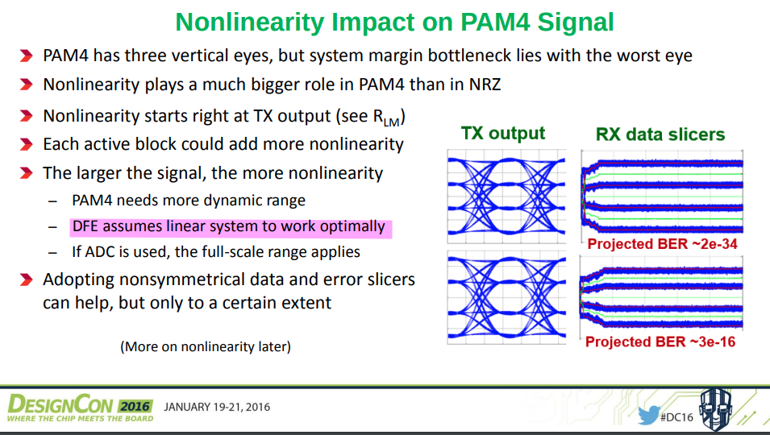

Because if it compresses, it turns out you have to use a much more complicated feedback filter. As long as *it behaves linearly*, the feedback filter itself can remain *a linear FIR*

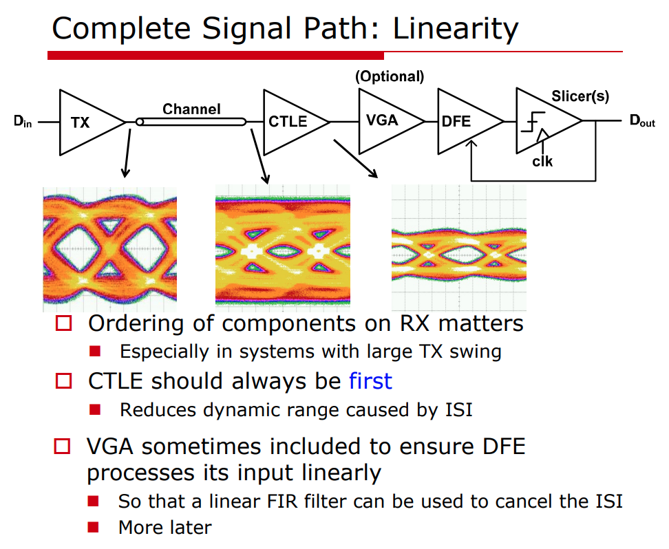

Linearity can actually be a critical constraint in these signal paths, and you really want to stay as linear as you can all the way up until the point where you've canceled all of the ISI

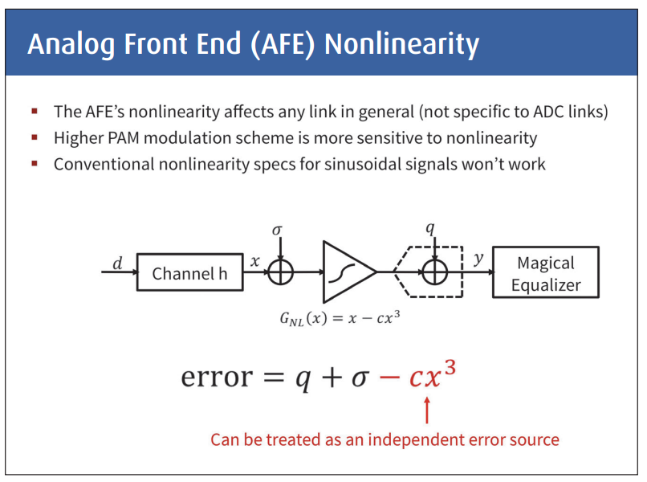

> A. Roshan-Zamir, O. Elhadidy, H. -W. Yang and S. Palermo, "A Reconfigurable 16/32 Gb/s Dual-Mode NRZ/PAM4 SerDes in 65-nm CMOS," in *IEEE Journal of Solid-State Circuits*, vol. 52, no. 9, pp. 2430-2447, Sept. 2017  [[https://people.engr.tamu.edu/spalermo/ecen689/2017_reconfigurable_16_32Gbps_NRZ_PAM4_SERDES_roshanzamir_jssc.pdf](https://people.engr.tamu.edu/spalermo/ecen689/2017_reconfigurable_16_32Gbps_NRZ_PAM4_SERDES_roshanzamir_jssc.pdf)]
>
> Hongtao Zhang, designcon2016. "PAM4 Signaling for 56G Serial Link Applications − A Tutorial"[[https://www.xilinx.com/publications/events/designcon/2016/slides-pam4signalingfor56gserial-zhang-designcon.pdf](https://www.xilinx.com/publications/events/designcon/2016/slides-pam4signalingfor56gserial-zhang-designcon.pdf)]
>
> Elad Alon, ISSCC 2014, "T6: Analog Front-End Design for Gb/s Wireline Receivers"

### BER with Quantization Noise

> $$
> \text{Var}(X) = E[X^2] - E[X]^2
> $$
>
> 

### Impulse Response or Pulse Response

###  TX FFE

TX FFE suffers from the peak power constraint, which in effect attenuates the average power of the outgoing signal -  the low-frequency signal content has been attenuated down to the high-frequency level

> [[https://www.signalintegrityjournal.com/articles/1228-feedforward-equalizer-location-study-for-high-speed-serial-systems](https://www.signalintegrityjournal.com/articles/1228-feedforward-equalizer-location-study-for-high-speed-serial-systems)]
>
> **S. Palermo**, "CMOS Nanoelectronics Analog and RF VLSI Circuits," [Chapter 9: High-Speed Serial I/O Design for Channel-Limited and Power-Constrained Systems](https://people.engr.tamu.edu/spalermo/docs/serial_links_chapter_palermo_2011.pdf), McGraw-Hill, 2011.

### Eye-Opening Monitor (EOM)

An architecture that evaluates the received signal quality

> data slicers, phase slicers, error slicers, scope slicers

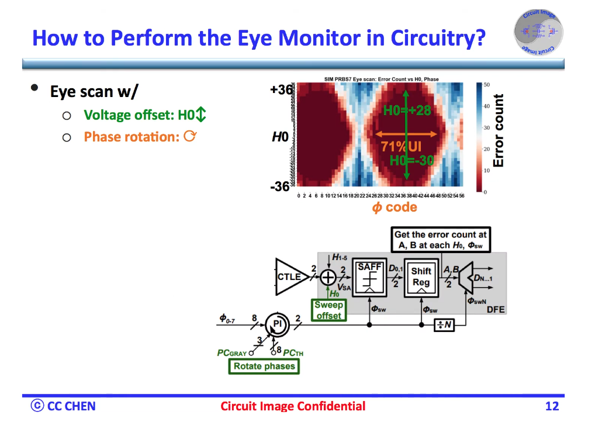

> Analui, Behnam & Rylyakov, Alexander & Rylov, Sergey & Meghelli, Mounir & Hajimiri, Ali. (2006). A 10-Gb/s two-dimensional eye-opening monitor in 0.13-??m standard CMOS. Solid-State Circuits, IEEE Journal of. 40. 2689 - 2699, [[https://chic.caltech.edu/wp-content/uploads/2013/05/B-Analui_JSSC_10-Gbs_05.pdf](https://chic.caltech.edu/wp-content/uploads/2013/05/B-Analui_JSSC_10-Gbs_05.pdf)]

### reference

G. Balamurugan, A. Balankutty and C. -M. Hsu, "56G/112G Link Foundations Standards, Link Budgets & Models," *2019 IEEE Custom Integrated Circuits Conference (CICC)*, Austin, TX, USA, 2019, pp. 1-95 [[https://youtu.be/OABG3u2H2J4?si=CxryBSGbxrUpZNBT](https://youtu.be/OABG3u2H2J4?si=CxryBSGbxrUpZNBT)]

Paul Muller Yusuf Leblebici École Polytechnique Fédérale de Lausanne (EPFL). [Pattern generator model for jitter-tolerance simulation](https://designers-guide.org/modeling/JTOL_rev1.0.pdf); [VHDL-AMS models](https://designers-guide.org/modeling/fc_jtol_src_ns.vhd)

Savo Bajic, ECE1392, Integrated Circuits for Digital Communications: **StatOpt in Python** [[https://savobajic.ca/projects/academic/statopt](https://savobajic.ca/projects/academic/statopt/)]

Anritsu Company, "Measuring Channel Operating Margin," 2016. [[https://dl.cdn-anritsu.com/en-us/test-measurement/files/Technical-Notes/White-Paper/11410-00989A.pdf](https://dl.cdn-anritsu.com/en-us/test-measurement/files/Technical-Notes/White-Paper/11410-00989A.pdf)]

JLSD - Julia SerDe [[https://github.com/kevjzheng/JLSD](https://github.com/kevjzheng/JLSD)]

Kiran Gunnam, Selected Topics in RF, Analog and Mixed Signal Circuits and Systems

H. Shakiba, D. Tonietto and A. Sheikholeslami, "High-Speed Wireline Links-Part I: Modeling," in IEEE Open Journal of the Solid-State Circuits Society, vol. 4, pp. 97-109, 2024 [[https://ieeexplore.ieee.org/stamp/stamp.jsp?arnumber=10608184](https://ieeexplore.ieee.org/stamp/stamp.jsp?arnumber=10608184)]

H. Shakiba, D. Tonietto and A. Sheikholeslami, "High-Speed Wireline Links-Part II: Optimization and Performance Assessment," in IEEE Open Journal of the Solid-State Circuits Society, vol. 4, pp. 110-121, 2024 [[https://ieeexplore.ieee.org/stamp/stamp.jsp?tp=&arnumber=10579874](https://ieeexplore.ieee.org/stamp/stamp.jsp?tp=&arnumber=10579874)]

G. Souliotis, A. Tsimpos and S. Vlassis, "Phase Interpolator-Based Clock and Data Recovery With Jitter Optimization," in IEEE Open Journal of Circuits and Systems, vol. 4, pp. 203-217, 2023 [[https://ieeexplore.ieee.org/stamp/stamp.jsp?tp=&arnumber=10184121](https://ieeexplore.ieee.org/stamp/stamp.jsp?tp=&arnumber=10184121)]

## loop dynamic

### Dithering Jitter in Bang-bang PLL

>  *hunting jitter* is also called as **dithering jitter**
>  the time error between *data clock* and input data
>
>  - proportional gain 
>  - loop latency 

where the proportional gain ($K_P$), *heavily damped systems* means that $K_P \gg K_I$

> Hanumolu, Pavan Kumar. 2006. *Design Techniques for Clocking High Performance Signaling Systems.* : Oregon State University. [https://ir.library.oregonstate.edu/concern/graduate_thesis_or_dissertations/1v53k219r](https://ir.library.oregonstate.edu/concern/graduate_thesis_or_dissertations/1v53k219r)]
>
> Hae-Chang Lee, "An Estimation Approach To Clock And Data Recovery" [[https://www-vlsi.stanford.edu/people/alum/pdf/0611_HaechangLee_Phase_Estimation.pdf](https://www-vlsi.stanford.edu/people/alum/pdf/0611_HaechangLee_Phase_Estimation.pdf)]
>
> R. Walker, “Designing Bang-Bang PLLs for Clock and Data Recovery in Serial Data Transmission Systems,” in Phase-Locking in High-Performance Systems, B. Razavi, Ed. New Jersey: IEEE Press, 2003, pp. 34-45. [[http://www.omnisterra.com/walker/pdfs.papers/BBPLL.pdf](http://www.omnisterra.com/walker/pdfs.papers/BBPLL.pdf)]
>
> J. Kim, Design of CMOS Adaptive-Supply Serial Links, Ph.D. Thesis, Stanford University, December 2002.  [[https://www-vlsi.stanford.edu/people/alum/pdf/0212_Kim_______Design_Of_CMOS_AdaptiveSu.pdf](https://www-vlsi.stanford.edu/people/alum/pdf/0212_Kim_______Design_Of_CMOS_AdaptiveSu.pdf)]
>
> P. K. Hanumolu, M. G. Kim, G. -y. Wei and U. -k. Moon, "A 1.6Gbps Digital Clock and Data Recovery Circuit," *IEEE Custom Integrated Circuits Conference 2006*, San Jose, CA, USA, 2006, pp. 603-606 [[https://sci-hub.se/10.1109/CICC.2006.320829](https://sci-hub.se/10.1109/CICC.2006.320829)]
>
> Da Dalt N. A design-oriented study of the nonlinear dynamics of digital bang-bang PLLs. IEEE Transactions on Circuits and Systems I: Regular Papers. 2005;52(1):21–31. [[https://sci-hub.se/10.1109/TCSI.2004.840089](https://sci-hub.se/10.1109/TCSI.2004.840089)]
>
> Jang S, Kim S, Chu SH, Jeong GS, Kim Y, Jeong DK. An optimum loop gain tracking all-digital PLL using autocorrelation of bang–bang phasefrequency detection. IEEE Transactions on Circuits and Systems II: Express Briefs. 2015;62(9):836–840. [[https://sci-hub.se/10.1109/TCSII.2015.2435691](https://sci-hub.se/10.1109/TCSII.2015.2435691)]

---

> 

### CDR Loop Latency 

Denoting the CDR loop latency by $\Delta T$ , we note that the loop transmission is multiplied by $exp(-s\Delta T)\simeq 1-s\Delta T$.The resulting right-half-plane zero, $f_z$ degrades the phase margin and must remain about **one decade beyond the BW**
$$
f_z\simeq \frac{1}{2\pi \Delta T}
$$

> This assumption is true in practice since the bandwidth of the CDR (few mega Hertz) is much smaller than the data rate (multi giga bits/second).

> Fernando , Marvell Italy."Considerations for CDR Bandwidth Proposal" [[https://www.ieee802.org/3/bs/public/16_03/debernardinis_3bs_01_0316.pdf](https://www.ieee802.org/3/bs/public/16_03/debernardinis_3bs_01_0316.pdf)]

### Loop Bandwidth

> The *closed-loop −3-dB bandwidth* is sometimes called the **“loop bandwidth”**

### Continuous-Time Approximation Limitations 

A rule of thumb often used to ensure slow changes in the loop is to select the *loop bandwidth* approximately equal to **one-tenth** of the *input frequency*. 

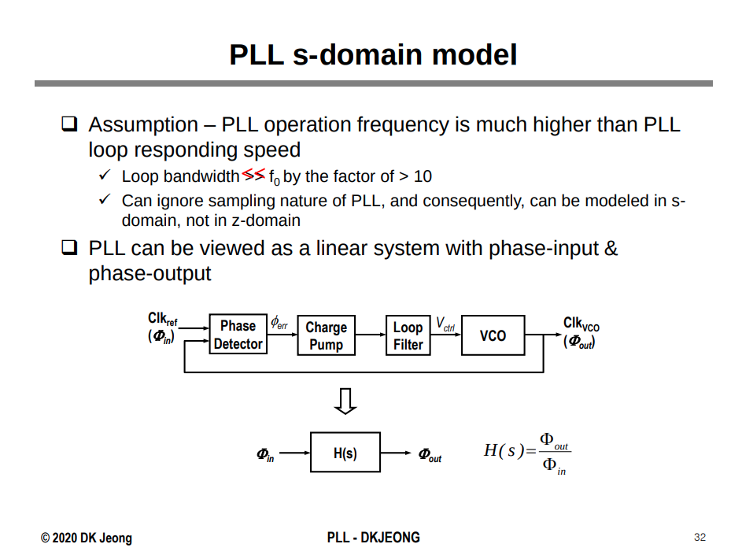

> Gardner, F.M. (1980). Charge-Pump Phase-Lock Loops. *IEEE Trans. Commun., 28*, 1849-1858.
>
> Homayoun, Aliakbar and Behzad Razavi. “On the Stability of Charge-Pump Phase-Locked Loops.” *IEEE Transactions on Circuits and Systems I: Regular Papers* 63 (2016): 741-750.
>
> N. Kuznetsov, A. Matveev, M. Yuldashev and R. Yuldashev, "Nonlinear Analysis of Charge-Pump Phase-Locked Loop: The Hold-In and Pull-In Ranges," in *IEEE Transactions on Circuits and Systems I: Regular Papers*, vol. 68, no. 10, pp. 4049-4061, Oct. 2021
>
> Deog-Kyoon Jeong, Topics in IC Design - 2.1 Introduction to Phase-Locked Loop [[https://ocw.snu.ac.kr/sites/default/files/NOTE/Lec%202%20-%20Charge-Pump%20PLL%2C%20Freuqency%20Synthesizers%2C%20and%20SSCG.pdf](https://ocw.snu.ac.kr/sites/default/files/NOTE/Lec%202%20-%20Charge-Pump%20PLL%2C%20Freuqency%20Synthesizers%2C%20and%20SSCG.pdf)]

### Limit Cycle Oscillation

> limit cycles imply self-sustained oscillators due *nonlinear nature*

> Ouzounov, S., Hegt, H., Van Roermund, A. (2007). SUB-HARMONIC LIMIT-CYCLE SIGMA-DELTA MODULATION, APPLIED TO AD CONVERSION. In: Van Roermund, A.H., Casier, H., Steyaert, M. (eds) Analog Circuit Design. Springer, Dordrecht. [[https://sci-hub.se/10.1007/1-4020-5186-7_6](https://sci-hub.se/10.1007/1-4020-5186-7_6)]

## BB PD

> It's **ternary**, because *early*, *late* and *no transition*

### Linearing BB-PD

BB Gain is the slope of average BB output $\mu$, versus phase offset $\phi$, i.e. $\frac {\partial \mu}{\partial \phi}$,

BB only produces output for a transition and this de-rates the gain. Transition density = *0.5* for random data

$$
K_{BB} = \frac{1}{2}\frac {\partial \mu}{\partial \phi}
$$

where $\mu = (1)\times \mathrm{P}(\text{late}|\phi) + (-1)\times \mathrm{P}(\text{early}|\phi)$

> Both jitter and amplitude noise distribution are same, just scaled by slope 

### Self-Noise Term

One price we pay for ***BB PD*** versus ***linear PD*** is the self-noise term. **For** **small phase errors** BB output noise is the **full magnitude** of the sliced data

> The PD output should be almost **0** for small phase errors. i.e. ideal PD output noise should be **0**

$$
\sigma_{BB}^2 = 1^2 \cdot \mathrm{P}(\text{trans}) + 0^2\cdot (1-\mathrm{P}(\text{trans})) = 0.5
$$

**Input referred jitter** from BB PD is **proportional to incoming jitter**

> John T. Stonick, ISSCC 2011 TUTORIALS *T5: DPLL-Based Clock and Data Recovery*
>
> Walker, Richard. (2003). Designing Bang-Bang PLLs for Clock and Data Recovery in Serial Data Transmission Systems.  [[pdf](https://www.omnisterra.com/walker/pdfs.papers/BBPLL.pdf)]
>
> \- Clock and Data Recovery for Serial Data Communications, focusing on bang-bang CDR design methodology, ISSCC Short Course, February 2002. [[slides](https://www.omnisterra.com/walker/pdfs.talks/ISSCC2002.pdf)]

## Digital CDR Category

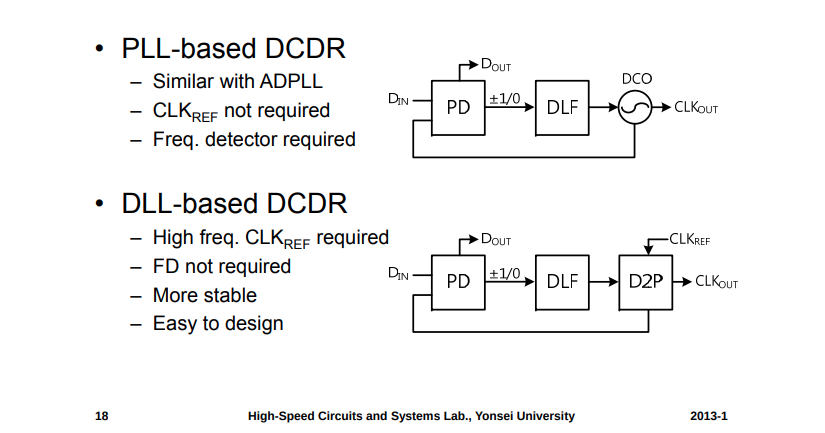

- DCO part is *analogous* so that it *cannot be perfectly modeled*
- Digital-to-phase converter is well-defined phase output, thus, very good to model real situation

## DCO

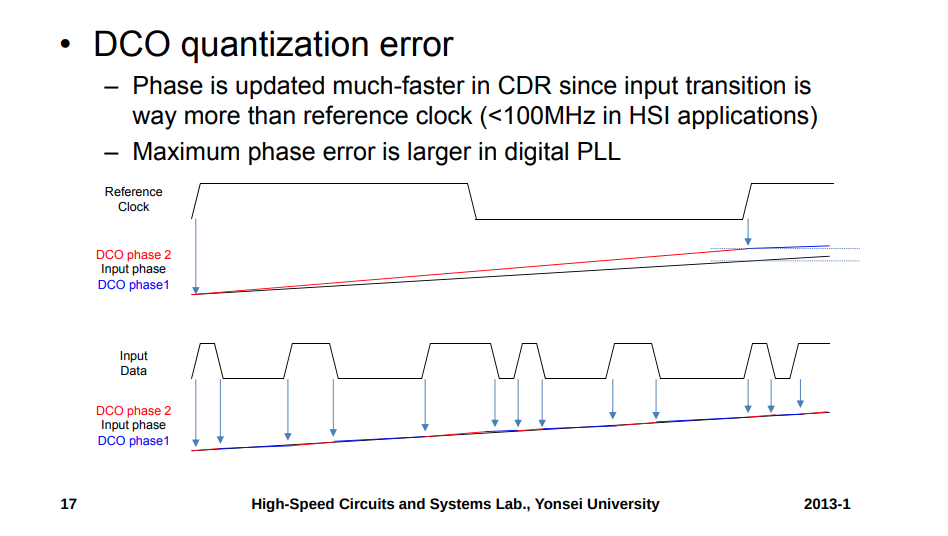

### limit cycle

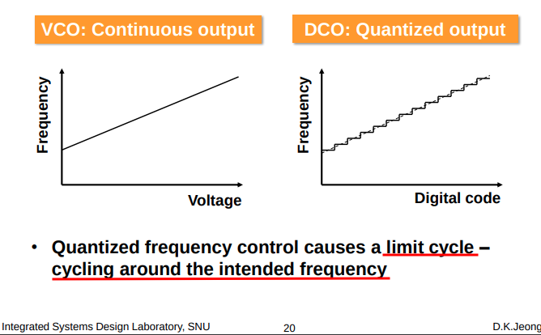

### Z-domain modeling

The difference equation is
$$
\phi[n] = \phi[n-1] + K_{DCO}V_C[n]\cdot T\cdot2\pi
$$
z-transform is
$$
\frac{\Phi(z)}{V_C(z)}=\frac{2\pi K_{DCO}T}{1-z^{-1}}
$$

where $K_{DCO}$ : $\Delta f$ (Hz/bit)

## $\Delta \Sigma$-dithering in DCO

## Quantization noise

Here, $\alpha_T$ is data transition density

BBPD quantization noise

DAC quantization noise

> M. -J. Park and J. Kim, "Pseudo-Linear Analysis of Bang-Bang Controlled Timing Circuits," in IEEE Transactions on Circuits and Systems I: Regular Papers, vol. 60, no. 6, pp. 1381-1394, June 2013  [[https://sci-hub.st/10.1109/TCSI.2012.2220502](https://sci-hub.st/10.1109/TCSI.2012.2220502)]

## Time to Digital Converter (TDC)

##  Digital to Phase Converter (DPC)

## IIR low pass filter

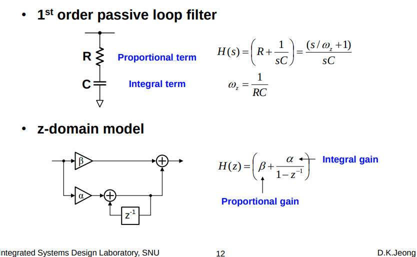

simple approximation:
$$
z = 1 + sT
$$
bilinear-z transform
$$
z =\frac{}{}
$$

## Peak-to-peak jitter in ADPLL with BBPD

## Accumulate-and-dump (AAD) decimator

accumulating the input for $N$ cycles and then latching the result and resetting the integrator

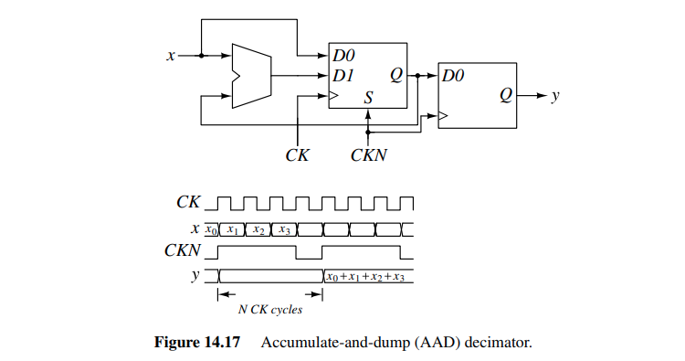

> It adds up $N$ succeeding input samples at rate $1/T$ and delivers their sum in a *single* sample at the output. Therefore, the process comprises a **filter (in the accumulation)** and a **down-sampler (in the dump)**

## Moving Average and CIC Filters

> **cascade-integrator-comb (CIC)** decimator

*TODO* &#128197;

> An Intuitive Look at Moving Average and CIC Filters [[web](https://tomverbeure.github.io/2020/09/30/Moving-Average-and-CIC-Filters.html), [code](https://github.com/tomverbeure/pdm/tree/master/modeling/cic_filters)]
>
> A Beginner's Guide To Cascaded Integrator-Comb (CIC) Filters [[https://www.dsprelated.com/showarticle/1337.php](https://www.dsprelated.com/showarticle/1337.php)]

## FAQ

### PLL vs. CDR

| PLL                                  | CDR                                                          |
| ------------------------------------ | ------------------------------------------------------------ |
| Clock edge periodic                  | Data edge random                                             |
| Phase & Frequency detecting possible | Phase detecting possible ,  Frequency detecting impossible |

> PLL or FD(Frequency Detector) for frequency detecting in CDR

## reference

J. Stonick. ISSCC 2011 "DPLL-Based Clock and Data Recovery" [[slides](https://www.nishanchettri.com/isscc-slides/2011%20ISSCC/TUTORIALS/ISSCC2011Visuals-T5.pdf),[transcript](https://www.nishanchettri.com/isscc-slides/2011%20ISSCC/TUTORIALS/Transcription_T5.pdf)]

P. Hanumolu. ISSCC 2015 "Clock and Data Recovery Architectures and Circuits" [[slides](https://www.nishanchettri.com/isscc-slides/2015%20ISSCC/TUTORIALS/ISSCC2015Visuals-T6.pdf)]

Amir Amirkhany. ISSCC 2019 "Basics of Clock and Data Recovery Circuits" 

Fulvio Spagna. INTEL, CICC2018, "Clock and Data Recovery Systems" [[slides](https://picture.iczhiku.com/resource/eetop/WhiTfzdJZSZyDcBM.pdf)]

M. Perrott. 6.976 High Speed Communication Circuits and Systems (lecture 21). Spring 2003. Massachusetts Institute of Technology: MIT OpenCourseWare, [[lec21.pdf](https://ocw.mit.edu/courses/6-976-high-speed-communication-circuits-and-systems-spring-2003/b396ec97fe1fc0eb7e39e88bf86c2979_lec21.pdf)]

Akihide Sai. ISSCC 2023, T5 "All Digital Plls From Fundamental Concepts To Future Trends" [[T5.pdf](https://www.nishanchettri.com/isscc-slides/2023%20ISSCC/TUTORIALS/T5.pdf)]

J. L. Sonntag and J. Stonick, "A Digital Clock and Data Recovery Architecture for Multi-Gigabit/s Binary Links," in *IEEE Journal of Solid-State Circuits*, vol. 41, no. 8, pp. 1867-1875, Aug. 2006  [[https://sci-hub.se/10.1109/JSSC.2006.875292](https://sci-hub.se/10.1109/JSSC.2006.875292)]

J. Sonntag and J. Stonick, "A digital clock and data recovery architecture for multi-gigabit/s binary links," *Proceedings of the IEEE 2005 Custom Integrated Circuits Conference, 2005.*. [[https://sci-hub.se/10.1109/CICC.2005.1568725](https://sci-hub.se/10.1109/CICC.2005.1568725)]

---

H. Kang et al., "A 42.7Gb/s Optical Receiver With Digital Clock and Data Recovery in 28nm CMOS," in IEEE Access, vol. 12, pp. 109900-109911, 2024 [[https://ieeexplore.ieee.org/stamp/stamp.jsp?arnumber=10630516](https://ieeexplore.ieee.org/stamp/stamp.jsp?arnumber=10630516)]

Marinaci, Stefano. "Study of a Phase Locked Loop based Clock and Data Recovery Circuit for 2.5 Gbps data-rate" [[https://cds.cern.ch/record/2870334/files/CERN-THESIS-2023-147.pdf](https://cds.cern.ch/record/2870334/files/CERN-THESIS-2023-147.pdf)]

P. Palestri *et al*., "Analytical Modeling of Jitter in Bang-Bang CDR Circuits Featuring Phase Interpolation," in *IEEE Transactions on Very Large Scale Integration (VLSI) Systems*, vol. 29, no. 7, pp. 1392-1401, July 2021 [[https://sci-hub.se/10.1109/TVLSI.2021.3068450](https://sci-hub.se/10.1109/TVLSI.2021.3068450)]

F. M. Gardner, "Phaselock Techniques", 3rd Edition, Wiley Interscience, Hoboken, NJ, 2005 [[https://picture.iczhiku.com/resource/eetop/WyIgwGtkDSWGSxnm.pdf](https://picture.iczhiku.com/resource/eetop/WyIgwGtkDSWGSxnm.pdf)]

Rhee, W. (2020). *Phase-locked frequency generation and clocking : architectures and circuits for modern wireless and wireline systems*. The Institution of Engineering and Technology

M.H. Perrott, Y. Huang, R.T. Baird, B.W. Garlepp, D. Pastorello, E.T. King, Q. Yu, D.B. Kasha, P. Steiner, L. Zhang, J. Hein, B. Del Signore, "A 2.5 Gb/s Multi-Rate 0.25μm CMOS Clock and Data Recovery Circuit Utilizing a Hybrid Analog/Digital Loop Filter and All-Digital Referenceless Frequency Acquisition," IEEE J. Solid-State Circuits, vol. 41, Dec. 2006, pp. 2930-2944 [[https://cppsim.com/Publications/JNL/perrott_jssc06.pdf](https://cppsim.com/Publications/JNL/perrott_jssc06.pdf)]

M.H. Perrott. CICC 2009 "Tutorial on Digital Phase-Locked Loops" [[https://www.cppsim.com/PLL_Lectures/digital_pll_cicc_tutorial_perrott.pdf](https://www.cppsim.com/PLL_Lectures/digital_pll_cicc_tutorial_perrott.pdf)]

-, Short Course On Phase-Locked Loops and Their Applications Day 4, PM Lecture "Examples of Leveraging Digital Techniques in PLLs" [[https://www.cppsim.com/PLL_Lectures/day4_pm.pdf](https://www.cppsim.com/PLL_Lectures/day4_pm.pdf)]

-, Short Course On Phase-Locked Loops IEEE Circuit and System Society, San Diego, CA "Digital Frequency Synthesizers" [[https://www.cppsim.com/PLL_Lectures/digital_pll.pdf](https://www.cppsim.com/PLL_Lectures/digital_pll.pdf)]

---

Deog-Kyoon Jeong Topics in IC(Wireline Transceiver Design) - 3.1. Introduction to All Digital PLL [[https://ocw.snu.ac.kr/sites/default/files/NOTE/Lec%203%20-%20ADPLL.pdf](https://ocw.snu.ac.kr/sites/default/files/NOTE/Lec%203%20-%20ADPLL.pdf)]

Deog-Kyoon Jeong Topics in IC(Wireline Transceiver Design) - 6.1 Introduction to Clock and Data Recovery [[https://ocw.snu.ac.kr/sites/default/files/NOTE/Lec%206%20-%20Clock%20and%20Data%20Recovery.pdf](https://ocw.snu.ac.kr/sites/default/files/NOTE/Lec%206%20-%20Clock%20and%20Data%20Recovery.pdf)]

High-speed Serial Interface Lect. 16 – Clock and Data Recovery 3 [[http://tera.yonsei.ac.kr/class/2013_1_2/lecture/Lect16_CDR-3.pdf](http://tera.yonsei.ac.kr/class/2013_1_2/lecture/Lect16_CDR-3.pdf)]
