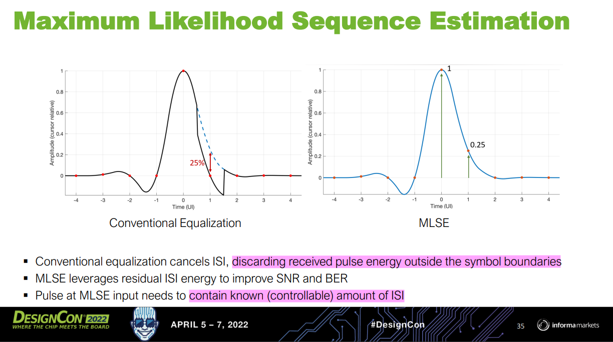

## Impulse Response or Pulse Response

## Sign-Sign LMS

###  Adaptive equalizing link architecture

dLev: desired signal level

yn: received signal at time n

ern: the error slicer sample, i.e. sign(dLev - yn)

dn-k: the data slicer sample at time n-k

### Least Mean Square Algorithm (LMS)

Loss function or cost function:
$$\begin{align}
e_n^2 &= (dLev - y_n)^2
\end{align}$$

Transmitter and channel response:
$$\begin{align}
y_{tx,n} &= \sum_{0}^{k}\omega_n^k\ast d_{tx,n-k} \\
y_n &= f_{ch}(y_{tx,_n})
\end{align}$$
$ytx_n$ is output of transmitter at time n; $f_{ch}$ is channel response, for simplicity, scaling factor $\alpha$, ($\alpha > 0$) is enough.

Update function (i.e. Gradient descent):
$$\begin{align}
\omega_{n+1}^k = \omega_{n}^k - \frac{\eta}{2}\ast\frac{\partial e_n^2}{\partial \omega_{n}^k} \\
\omega_{n+1}^k = \omega_{n}^k + \eta \ast e_n \ast\frac{\partial y_n}{\partial \omega_{n}^k}
\end{align}$$
$\eta$ is learning rate or the rate of update, which is greater than zero.

### Sign-Sign LMS (SSLMS)

**Why Sign-Sign LMS**

$ (dLev - y_n)$ and $\frac{\partial y_n}{\partial \omega_{n}^k}$ is hard to get in circuit, where the actual analog value should be obtained.

In **SSLMS algorithm**, only the polarities of samples are used since it is easy to detect by simple comparators.  Moreover, recovered data by hard decision is employed instead of $y_n$ for more simplicity.

The update function can be written as,

$$\begin{align}
\omega_{n+1}^k &= \omega_{n}^k + \eta \ast Sign(e_n) \ast Sign(\frac{\partial y_n}{\partial \omega_{n}^k}) \\
\omega_{n+1}^k &= \omega_{n}^k + \eta \ast Sign(e_n) \ast \alpha \ast Sign(\frac{\partial ytx_n}{\partial \omega_{n}^k}) \\
\omega_{n+1}^k &= \omega_{n}^k + \eta \ast Sign(er_n) \ast Sign(d_{n-k})
\end{align}$$

SSLMS algorithm useful for DFE adaptation.

> T11: Basics of Equalization Techniques: Channels, Equalization, and Circuits, 2022 IEEE International Solid-State Circuits Conference
>
> V. Stojanovic et al., "Autonomous dual-mode (PAM2/4) serial link transceiver with adaptive equalization and data recovery," in IEEE Journal of Solid-State Circuits, vol. 40, no. 4, pp. 1012-1026, April 2005, doi: 10.1109/JSSC.2004.842863.
>
> Jinhyung Lee, Design of High-Speed Receiver for Video Interface with Adaptive Equalization; Phd thesis, August 2019. [thesis link](http://dcollection.snu.ac.kr/common/orgView/000000157003)
>
> Paulo S. R. Diniz, Adaptive Filtering: Algorithms and Practical Implementation, 5th edition

### DFE h0 Estimator

summer output
$$
r_k = a_kh_0+\left(\sum_{n=-\infty,n\neq0}^{+\infty}a_{k-n}h_n-\sum_{n=1}^{\text{ntap}}\hat{a}_{k-n}\hat{h}_n\right)
$$
error slicer analog output
$$
e_k=r_k-\hat{a}_k \hat{h}_0
$$
error slicer digital output
$$
\hat{e}_k=|e_k|
$$
It's NOT possible to implement $e_k$, which need to determine $\hat{a}_k=|r_k|$ in no time. One method to approach this problem is calculate $e_k^{a_k=1}=r_k-\hat{a}_k \hat{h}_0$ and $e_k^{a_k=-1}=r_k+\hat{a}_k \hat{h}_0$, then select the right one based on $\hat{a}_k$.

The update  equation based on Sign-Sign-Least Mean square (SS-LMS) and loss function $L(\hat{h}_{\text{0~ntap}})=E(e_k^2)$
$$
\hat{h}_n(k+1) = \hat{h}_n(k)+\mu \cdot |e_k|\cdot \hat{a}_{k-n}
$$
Where $n \in [0,...,\text{ntap}]$. This way, we can obtain $\hat{h}_0$, $\hat{h}_1$, $\hat{h}_2$, ...

> $\hat{h}_0$ is used in AFE adaptation

We may encounter difficulty if the first tap of DFE is unrolled, its $e_k$ is modified as follow
$$
r_k = a_kh_0+\left(\sum_{n=-\infty,n\neq0}^{+\infty}a_{k-n}h_n-\sum_{n=2}^{\text{ntap}}\hat{a}_{k-n}\hat{h}_n\right)
$$
Where there is NO $\hat{h}_1$

To find $\hat{h}_1$, we shall use different pattern for even and odd error slicer

## MLSE

> maximum likelihood sequence estimation (MLSE)

> [IBIS-AMI Modeling and Correlation Methodology for ADC-Based SerDes Beyond 100 Gb/s [https://static1.squarespace.com/static/5fb343ad64be791dab79a44f/t/63d807441bcd266de258b975/1675102025481/SLIDES_Track02_IBIS_AMI_Modeling_and_Correlation_Tyshchenko.pdf](https://static1.squarespace.com/static/5fb343ad64be791dab79a44f/t/63d807441bcd266de258b975/1675102025481/SLIDES_Track02_IBIS_AMI_Modeling_and_Correlation_Tyshchenko.pdf)]
>
> M. Emami Meybodi, H. Gomez, Y. -C. Lu, H. Shakiba and A. Sheikholeslami, "Design and Implementation of an On-Demand Maximum-Likelihood Sequence Estimation (MLSE)," in IEEE Open Journal of Circuits and Systems, vol. 3, pp. 97-108, 2022, doi: 10.1109/OJCAS.2022.3173686.
>
> Zaman, Arshad Kamruz (2019). A Maximum Likelihood Sequence Equalizing Architecture Using Viterbi Algorithm for ADC-Based Serial Link. Undergraduate Research Scholars Program. Available electronically from [[https://hdl.handle.net/1969.1/166485](https://hdl.handle.net/1969.1/166485)]

## MLSD

> Maximum Likelihood Sequence Detection (MLSD)

There are several variants of MLSD, including:

- Viterbi Algorithm
- Decision Feedback Sequence Estimation (DFSE)
- Soft-Output MLSD

> [Evolution Of Equalization Techniques In High-Speed SerDes For Extended Reaches. [https://semiengineering.com/evolution-of-equalization-techniques-in-high-speed-serdes-for-extended-reaches/](https://semiengineering.com/evolution-of-equalization-techniques-in-high-speed-serdes-for-extended-reaches/)]

## ADC Resolution

*TODO* &#128197;

## BER with Quantization Noise

> $$
> \text{Var}(X) = E[X^2] - E[X]^2
> $$
> 

##  TX FFE

TX FFE suffers from the peak power constraint, which in effect attenuates the average power of the outgoing signal -  the low-frequency signal content has been attenuated down to the high-frequency level

> [[https://www.signalintegrityjournal.com/articles/1228-feedforward-equalizer-location-study-for-high-speed-serial-systems](https://www.signalintegrityjournal.com/articles/1228-feedforward-equalizer-location-study-for-high-speed-serial-systems)]
>
> **S. Palermo**, "CMOS Nanoelectronics Analog and RF VLSI Circuits," [Chapter 9: High-Speed Serial I/O Design for Channel-Limited and Power-Constrained Systems](https://people.engr.tamu.edu/spalermo/docs/serial_links_chapter_palermo_2011.pdf), McGraw-Hill, 2011.

## statistical eye

*TODO* &#128197;

> Sanders, Anthony, Michael Resso and John D'Ambrosia. "Channel Compliance Testing Utilizing Novel Statistical Eye Methodology." (2004).

## reference

Paul Muller Yusuf Leblebici École Polytechnique Fédérale de Lausanne (EPFL). [Pattern generator model for jitter-tolerance simulation](https://designers-guide.org/modeling/JTOL_rev1.0.pdf); [VHDL-AMS models](https://designers-guide.org/modeling/fc_jtol_src_ns.vhd)

G. Balamurugan, A. Balankutty and C. -M. Hsu, "56G/112G Link Foundations Standards, Link Budgets & Models," 2019 IEEE Custom Integrated Circuits Conference (CICC), Austin, TX, USA, 2019, pp. 1-95, doi: 10.1109/CICC.2019.8780223.

Savo Bajic, ECE1392, Integrated Circuits for Digital Communications: **StatOpt in Python** [[https://savobajic.ca/projects/academic/statopt](https://savobajic.ca/projects/academic/statopt/)]

Anritsu Company, "Measuring Channel Operating Margin," 2016. [[https://dl.cdn-anritsu.com/en-us/test-measurement/files/Technical-Notes/White-Paper/11410-00989A.pdf](https://dl.cdn-anritsu.com/en-us/test-measurement/files/Technical-Notes/White-Paper/11410-00989A.pdf)]

JLSD - Julia SerDe [[https://github.com/kevjzheng/JLSD](https://github.com/kevjzheng/JLSD)]
