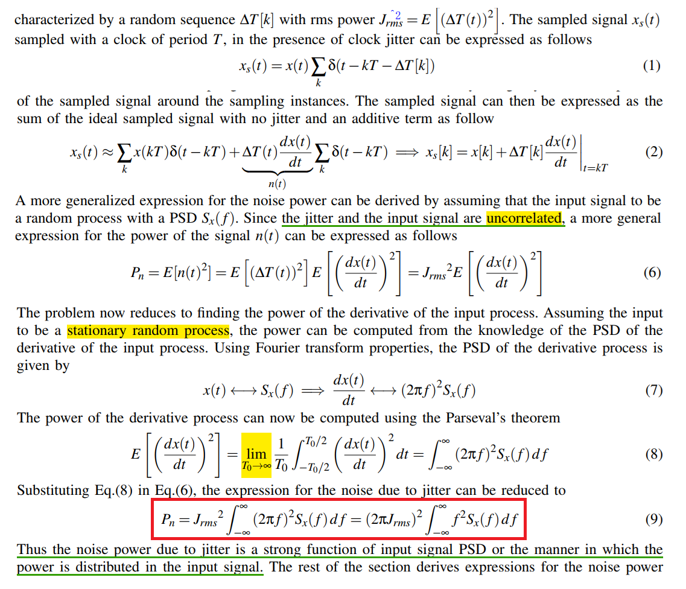
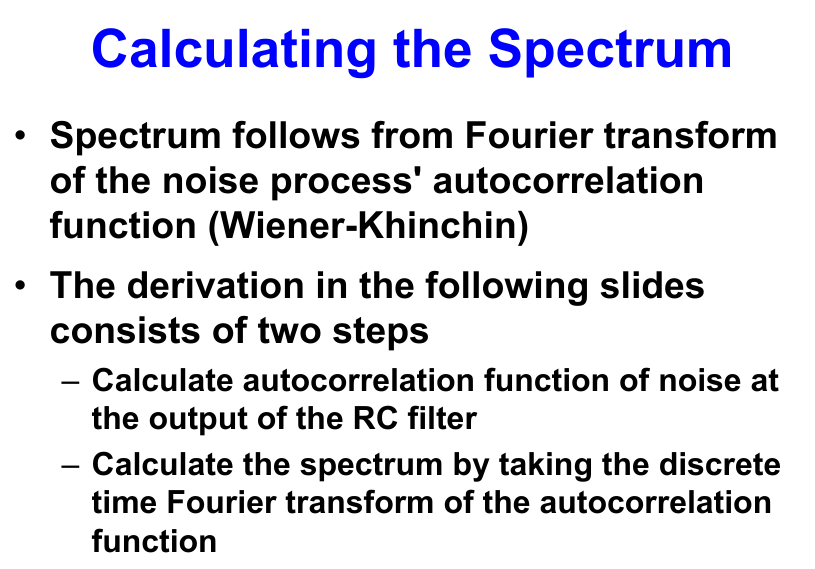
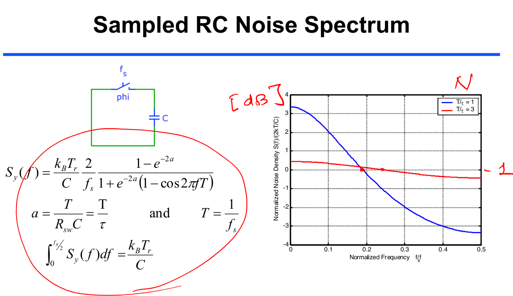

## noise power at filter output

> Chembiyan T, "Comparison Of Noise Power At Lowpass Filter Output" [[link](https://www.linkedin.com/posts/chembiyan-t-0b34b910_noise-power-at-filter-output-activity-7006486487093456896-W0Rt?utm_source=share&utm_medium=member_desktop)]
>
> —, "On Noise Power At The Bandpass Filter Output" [[link](https://www.linkedin.com/posts/chembiyan-t-0b34b910_bandpass-noise-activity-7008896204507922432-ZRXF?utm_source=share&utm_medium=member_desktop)]
>
> —, "Integrated Power of Thermal and Flicker Noise" [[link](https://www.linkedin.com/posts/chembiyan-t-0b34b910_flicker-and-thermal-noise-power-on-a-log-activity-7003063399781711872-62nh?utm_source=share&utm_medium=member_desktop)]

*TODO* &#128197;


## Pulsed Noise Signals

> Chembiyan T, "Power Spectral Density of Pulsed Noise Signals" [[link](https://www.linkedin.com/posts/chembiyan-t-0b34b910_psd-of-pulsed-noise-signal-activity-6992527460886040577-a0im?utm_source=share&utm_medium=member_desktop)]

*TODO* &#128197;


## Sampling Noise

> Chembiyan T, "Noise, Sampling and Zeta Functions" [[link](https://www.linkedin.com/posts/chembiyan-t-0b34b910_sampling-noise-signals-activity-7018929654627520512-QYr0?utm_source=share&utm_medium=member_desktop)]

A random signal $v_n(t)$ is sampled using an ideal impulse sampler


*TODO* &#128197;


## ADC SNR with Clock Jitter

> Chembiyan T "SNR of an ADC in the presence of clock jitter" [[https://www.linkedin.com/posts/chembiyan-t-0b34b910_adcsnrjitter-activity-7171178121021304833-f2Wd?utm_source=share&utm_medium=member_desktop](https://www.linkedin.com/posts/chembiyan-t-0b34b910_adcsnrjitter-activity-7171178121021304833-f2Wd?utm_source=share&utm_medium=member_desktop)]

Unlike the quantization noise and the thermal noise, the impact of the clock jitter on the ADC performance depends on the input signal properties like its PSD


The error between *the ideal sampled signal* and *the sampling with clock jitter* can be treated as noise and it results in the degradation of the SNR of the ADC




> K. Tyagi and B. Razavi, "Performance Bounds of ADC-Based Receivers Due to Clock Jitter," in *IEEE Transactions on Circuits and Systems II: Express Briefs*, vol. 70, no. 5, pp. 1749-1753, May 2023 [[https://www.seas.ucla.edu/brweb/papers/Journals/KT_TCAS_2023.pdf](https://www.seas.ucla.edu/brweb/papers/Journals/KT_TCAS_2023.pdf)]
>
> N. Da Dalt, M. Harteneck, C. Sandner and A. Wiesbauer, "On the jitter requirements of the sampling clock for analog-to-digital converters," in *IEEE Transactions on Circuits and Systems I: Fundamental Theory and Applications*, vol. 49, no. 9, pp. 1354-1360, Sept. 2002 [[https://sci-hub.se/10.1109/TCSI.2002.802353](https://sci-hub.se/10.1109/TCSI.2002.802353)]


## ISF for Oscillators

*TODO* &#128197;


##  Sampled Thermal Noise

The **aliasing of the noise**, or **noise folding**, plays an important role in switched-capacitor as it does in all switched-capacitor filters


Assume for the moment that the switch is *always closed* (that there is no hold phase), the single-sided noise density would be


---


$v_s[n]$ is the sampled version of $v_{RC}(t)$, i.e. $v_s[n]= v_{RC}(nT_C)$
$$
S_s(e^{j\omega}) = \frac{1}{T_C} \sum_{k=-\infty}^{\infty}S_{RC}(j(\frac{\omega}{T_C}-\frac{2\pi k}{T_C})) \cdot d\omega
$$
where $\omega \in [-\pi, \pi]$,  furthermore $\frac{d\omega}{T_C}= d\Omega$
$$
S_s(j\Omega) = \sum_{k=-\infty}^{\infty}S_{RC}(j(\Omega-k\Omega_s)) \cdot d\Omega
$$

> 


The noise in $S_{RC}$ is a *stationary process* and so is *uncorrelated* over $f$ allowing the $N$ rectangles to be combined by simply summing their noise powers


where $m$ is the duty cycle

---

*Below analysis focus on sampled noise*




> - Calculate autocorrelation function of noise at the output of the RC filter
> - Calculate the spectrum by taking the **discrete** time Fourier transform of the autocorrelation function





> Kundert, Ken. (2006). Simulating Switched-Capacitor Filters with SpectreRF [[https://designers-guide.org/analysis/sc-filters.pdf](https://designers-guide.org/analysis/sc-filters.pdf)]
>
> Pavan, Schreier and Temes, "Understanding Delta-Sigma Data Converters, Second Edition" ISBN 978-1-119-25827-8
>
> Boris Murmann, EE315B VLSI Data Conversion Circuits, Autumn 2013
>
> \- Noise Analysis in Switched-Capacitor Circuits, ISSCC 2011 / tutorials [[slides](https://www.nishanchettri.com/isscc-slides/2011%20ISSCC/TUTORIALS/ISSCC2011Visuals-T8.pdf), [transcript](https://www.nishanchettri.com/isscc-slides/2011%20ISSCC/TUTORIALS/Transcription_T9.pdf)]
>
> Tania Khanna, ESE568 Fall 2019, Mixed Signal Circuit Design and Modeling URL: [https://www.seas.upenn.edu/~ese568/fall2019/](https://www.seas.upenn.edu/~ese568/fall2019/)
>
> Matt Pharr, Wenzel Jakob, and Greg Humphreys. 2016. Physically Based Rendering: From Theory to Implementation (3rd. ed.). Morgan Kaufmann Publishers Inc., San Francisco, CA, USA.
>
> Bernhard E. Boser . Advanced Analog Integrated Circuits Switched Capacitor Gain Stages [[https://people.eecs.berkeley.edu/~boser/courses/240B/lectures/M05%20SC%20Gain%20Stages.pdf](https://people.eecs.berkeley.edu/~boser/courses/240B/lectures/M05%20SC%20Gain%20Stages.pdf)]
>
> R. Gregorian and G. C. Temes. Analog MOS Integrated Circuits for Signal Processing. Wiley-Interscience, 1986
>
> Trevor Caldwell, Lecture 9 Noise in Switched-Capacitor Circuits  [[http://individual.utoronto.ca/trevorcaldwell/course/NoiseSC.pdf](http://individual.utoronto.ca/trevorcaldwell/course/NoiseSC.pdf)]
>
>  Christian-Charles Enz. High precision CMOS micropower amplifiers [[pdf](https://picture.iczhiku.com/resource/eetop/wYItQFykkAQDFccB.pdf)]


## spectrum analyzer

We tried to plot a *power spectral density* together with something that we want to interpret as a *power spectrum*

> - *spectrum* of a periodic signal
> - *spectral density* of a broadband signal such as noise
>
> Sine-wave components are located in individual FFT bins, but broadband signals like noise have their power spread over all FFT bins!
>
> The **noise floor** depends on the *length of the FFT*

[[http://individual.utoronto.ca/schreier/lectures/2015/1.pdf](http://individual.utoronto.ca/schreier/lectures/2015/1.pdf)]


signal tone power
$$
P_{\text{sig}} = 2 \frac{X_{w,sig}^2}{S_1^2}
$$

noise power
$$
P_n = \frac{X_{w,n}^2}{S_2}
$$

Then, displayed **SNR** is obtained
$$\begin{align}
\mathrm{SNR} &= 10\log10\left(\frac{X_{w,sig}^2}{X_{w,n}^2}\right) \\
&= 10\log_{10}\left(\frac{P_{\text{sig}}}{P_n}\right) + 10\log_{10}\left(\frac{S_1^2}{2S_2}\right) \\
&= \mathrm{SNR}'-10\log_{10}\left(\frac{2S_2}{S_1^2}\right) \\
&= \mathrm{SNR}'-10\log_{10}(2\cdot\mathrm{NBW}) \\
\end{align}$$

> *DFT's output* $\mathrm{SNR}$

```matlab
for N=[2^6 2^8 2^10 2^12]
  wd = rectwin(N);
  nbw = enbw(wd)/N;
  snr_shift = 10*log10(nbw * 2);
  disp(snr_shift);
end
```

output:

```
-15.0515

-21.0721

-27.0927

-33.1133
```


> The solution to the scaling problem in the case of a PSD obtained from a sine-wave scaled FFT is similarly simple. All we need do is provide the value of **NBW**


> *APPENDIX A - SPECTRAL ESTIMATION - A.2 Scaling and Noise Bandwidth*
>
> Pavan, Shanthi, Richard Schreier, and Gabor Temes. (2016) 2016. Understanding Delta-Sigma Data Converters. 2nd ed. Wiley.


- For a filter with infinitely steep roll-off, the noise bandwidth (**NBW**) is equal to the filter's bandwidth,
- while for a filter with a single-pole roll-off, **NBW** is 2 times the 3-dB bandwidth


## reference

David Herres, The difference between signal under-sampling, aliasing, and folding URL: [https://www.testandmeasurementtips.com/the-difference-between-signal-under-sampling-aliasing-and-folding-faq/](https://www.testandmeasurementtips.com/the-difference-between-signal-under-sampling-aliasing-and-folding-faq/)

Pharr, Matt; Humphreys, Greg. (28 June 2010). Physically Based Rendering: From Theory to Implementation. Morgan Kaufmann. ISBN 978-0-12-375079-2. [Chapter 7 (Sampling and reconstruction)](https://web.archive.org/web/20131016055332/http://graphics.stanford.edu/~mmp/chapters/pbrt_chapter7.pdf)

Alan V Oppenheim, Ronald W. Schafer. Discrete-Time Signal Processing, 3rd edition

