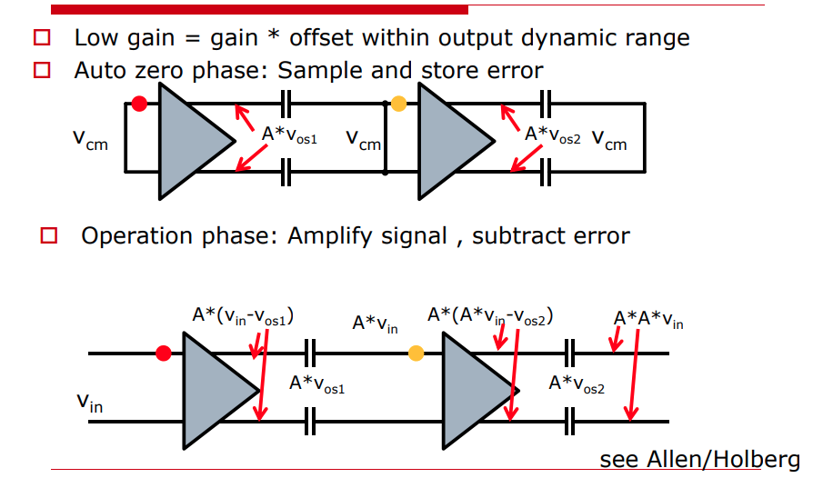
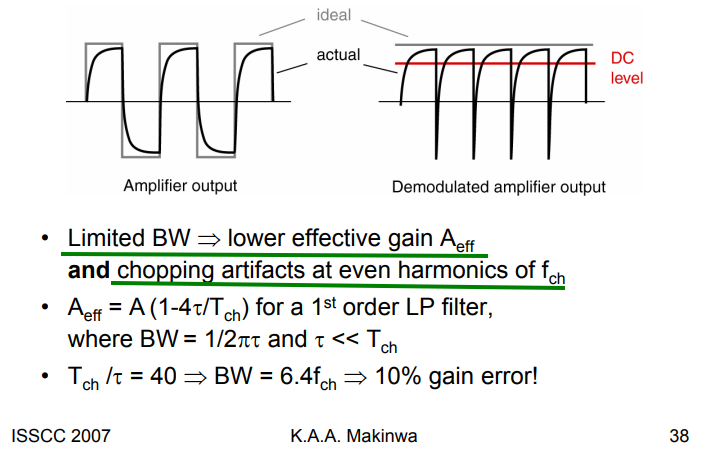
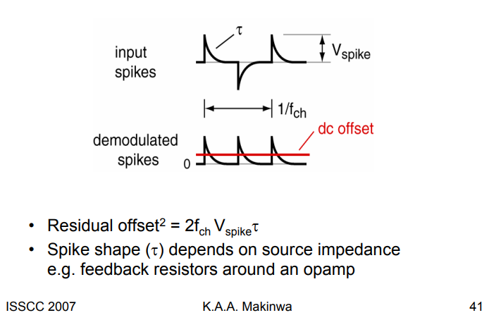

## Autozeroing

> offset is **sampled** and then subtracted from the input
>
> Measure the offset somehow and then subtract it from the input signal

###  low gain comparator

### Residual Noise of Auto-zeroing

---

*pnosie Noise* Type: **timeaverage**

## Chopping

> offset is **modulated** away from the signal band and then filtered out
>
> Modulate the offset away from DC and then filter it out

**Good**: Magically reduces offset, 1/f noise, drift

**Bad**: But creates switching spikes, chopper ripple and other artifacts …

### Chopping in the Frequency Domain

> **Square-wave Modulation**
>
> definition of convolution $y(t) = x(t)*h(t)= \int_{-\infty}^{\infty} x(\tau)h(t-\tau)d\tau$
>
> for real signal $H(j\omega)^*=H(-j\omega)$​

$$
H(j\hat{\omega})*H(j\hat{\omega}) = \int_{-\infty}^{\infty}H(j\omega)H(j(\hat{\omega}-\omega))d\omega
$$

---

The Fourier Series of squarewave $x(t)$ with amplitudes $\pm 1$, period $T_0$

$$
C_n = \left\{ \begin{array}{cl}
0 &\space \ n=0 \\
0 &\space \ n=\text{even} \\
|\frac{2}{n\pi}| &\space n=\pm 1,\pm 5,\pm9, ... \\
-|\frac{2}{n\pi}| &\space n=\pm 3,\pm 7,\pm11, ...
\end{array} \right.
$$

The Fourier transform of $s(t)=x(t)x(t)$, and we know
$$\begin{align}
S(j2n\omega_0) &= \frac{1}{2\pi}\int X(j(2n\omega_0 -\omega))X(j\omega) d\omega\\
&= \frac{1}{2\pi}\int X(j(\omega-2n\omega_0))X(j\omega) d\omega
\end{align}$$

Therefore $n=0$
$$
S(j0) = \frac{1}{2\pi} (2\pi)^2\cdot \frac{4}{\pi ^2}2\sum_{n=0}^{+\infty}\frac{1}{(2n+1)^2} \delta(\omega) = 2\pi \delta(\omega)
$$

if $n=1$

$$\begin{align}
S(j2\omega_0) &= \frac{1}{2\pi} (2\pi)^2\cdot \frac{4}{\pi ^2}\left(1 - 2\sum_{n=0}^{+\infty}\frac{1}{(2n+1)(2n+3)} \right) \\
&=  \frac{1}{2\pi} (2\pi)^2\cdot \frac{4}{\pi ^2}\left(1 - 2\sum_{n=0}^{+\infty}\frac{1}{2}\left[\frac{1}{2n+1}- \frac{1}{2n+3}\right] \right) \\
&= 0
\end{align}$$

$n=2$
$$\begin{align}
\sum &= -\frac{2}{3} + 2\left(\frac{1}{1\times 5}+ \frac{1}{3\times 7}+ \frac{1}{5\times 9} + \frac{1}{7\times 11}+...\right) \\
&= -\frac{2}{3} + 2\cdot \frac{1}{4}\left(\frac{1}{1}-\frac{1}{5}+ \frac{1}{3}- \frac{1}{7}+ \frac{1}{5} - \frac{1}{9} +\frac{1}{7}-\frac{1}{11}+...\right)  \\
&= -\frac{2}{3} + 2\cdot \frac{1}{4}\frac{4}{3} = 0
\end{align}$$

That is, the input signal **remains the same** after chopping or squarewave up/down modulation

> *EXAMPLE 2.7* in R. E. Ziemer and W. H. Tranter, Principles of Communications, 7th ed., Wiley, 2013 [[pdf](https://physicaeducator.wordpress.com/wp-content/uploads/2018/03/principles-of-communications-7th-edition-ziemer.pdf)]
>
> Prove that $\pi^2/8 = 1 + 1/3^2 + 1/5^2 + 1/7^2 + \cdots$ [[https://math.stackexchange.com/a/2348996](https://math.stackexchange.com/a/2348996)]

### Bandwidth & Gain Accuracy

- *lower effective gain*: DC level at the output of the amplifiers is a bit less than what it should be

- chopping artifacts at the *even harmonics*:  frequency of output is $2f_{ch}$

> REF. [[https://raytroop.github.io/2023/01/01/insight/#rc-charge-and-discharge](https://raytroop.github.io/2023/01/01/insight/#rc-charge-and-discharge)]

---

### Residual Offset of Chopping

assume input spikes can be expressed as
$$
V_\text{spike}(t) = V_o e^{-\frac{t}{\tau}}
$$

Then, residual offset is

$$\begin{align}
\overline{V_\text{os}} &= \frac{2\int_0^{T_{ch}/2}V_\text{spike}(t)dt}{T_{ch}} \\
&= 2f_{ch}V_o\int_0^{T_{ch}/2}  e^{-\frac{t}{\tau}}dt\\
&= 2f_{ch}V_o\tau\int_0^{T_{ch}/2\tau} e^{-\frac{t}{\tau}}d\frac{t}{\tau} \\
&\approx 2f_{ch}V_o\tau 
\end{align}$$​

## Ripple Cancellation after Chopping

> On-chip analog filter is not good enough due to limited cutoff frequency

*TODO* &#128197;

## Dynamic Element Matching (DEM)

*TODO* &#128197;

> Galton, Ian. (2010). Why dynamic-element-matching DACs work. Circuits and Systems II: Express Briefs, IEEE Transactions on. 57. 69 - 74. 10.1109/TCSII.2010.2042131. [[https://sci-hub.se/10.1109/TCSII.2010.2042131](https://sci-hub.se/10.1109/TCSII.2010.2042131)]
>
> KHIEM NGUYEN. Analog Devices Inc, "Practical Dynamic Element Matching Techniques for 3-level Unit Elements" [[https://picture.iczhiku.com/resource/eetop/shihEDaaoJjFdCVc.pdf](https://picture.iczhiku.com/resource/eetop/shihEDaaoJjFdCVc.pdf)]

## reference

C. C. Enz and G. C. Temes, "Circuit techniques for reducing the effects of op-amp imperfections: autozeroing, correlated double sampling, and chopper stabilization," in Proceedings of the IEEE, vol. 84, no. 11, pp. 1584-1614, Nov. 1996, doi: 10.1109/5.542410. [[http://www2.ing.unipi.it/~a008309/mat_stud/MIXED/archive/2019/Articles/Offset_canc_Enz_Temes_96.pdf](http://www2.ing.unipi.it/~a008309/mat_stud/MIXED/archive/2019/Articles/Offset_canc_Enz_Temes_96.pdf)]

Kofi Makinwa. Precision Analog Circuit Design: Coping with Variability, [[https://youtu.be/nA_DZtRqrTQ?si=6uyOpJhdnYm3iG9d](https://youtu.be/nA_DZtRqrTQ?si=6uyOpJhdnYm3iG9d)] [[https://youtu.be/uwRpP20Lprc?si=SGPta86jRCdECSob](https://youtu.be/uwRpP20Lprc?si=SGPta86jRCdECSob)]

 Chung-chun Chen, Why Design Challenge in Chopping Offset & Flicker Noise? [[https://youtu.be/ydjca2KrXgc?si=2raCIB99vXriMPsq](https://youtu.be/ydjca2KrXgc?si=2raCIB99vXriMPsq)]

—, Why Needs A Low Ripple after Chopping Amplifier for A Very Low DC Offset & Flicker Noise? [[https://youtu.be/y7TzJtHE7IA?si=kUeP_ESofVxp3IT_](https://youtu.be/y7TzJtHE7IA?si=kUeP_ESofVxp3IT_)]

Qinwen Fan, Evolution of precision amplifiers

Kofi Makinwa, ISSCC 2007 Dynamic-Offset Cancellation Techniques in CMOS [[https://picture.iczhiku.com/resource/eetop/sYkywlkpwIQEKcxb.pdf](https://picture.iczhiku.com/resource/eetop/sYkywlkpwIQEKcxb.pdf)]

Axel Thomsen, Silicon Laboratories  ISSCC2012Visuals-T8: "Managing Offset and Flicker Noise" [[slides](https://www.nishanchettri.com/isscc-slides/2012%20ISSCC/TUTORIALS/ISSCC2012Visuals-T8.pdf),[transcript](https://www.nishanchettri.com/isscc-slides/2012%20ISSCC/TUTORIALS/T8%20Transcription.pdf)]
