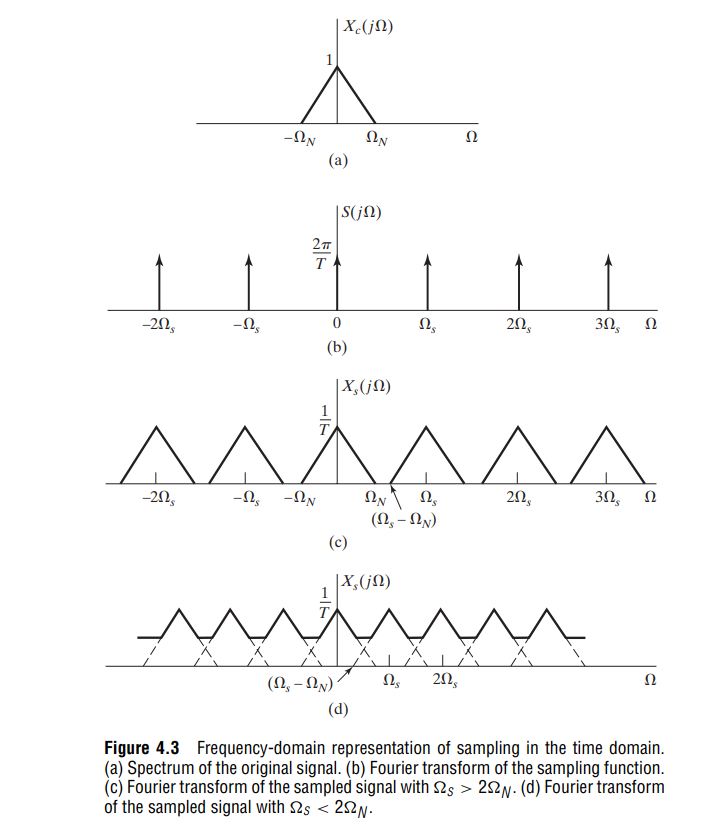
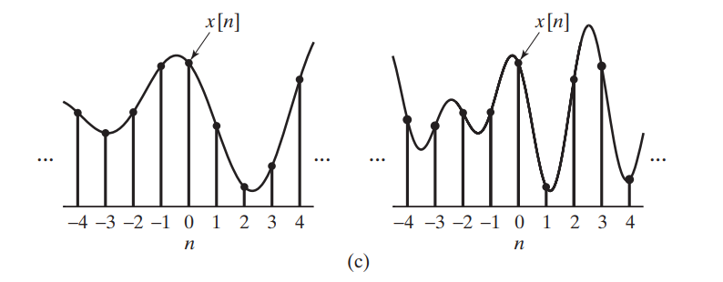
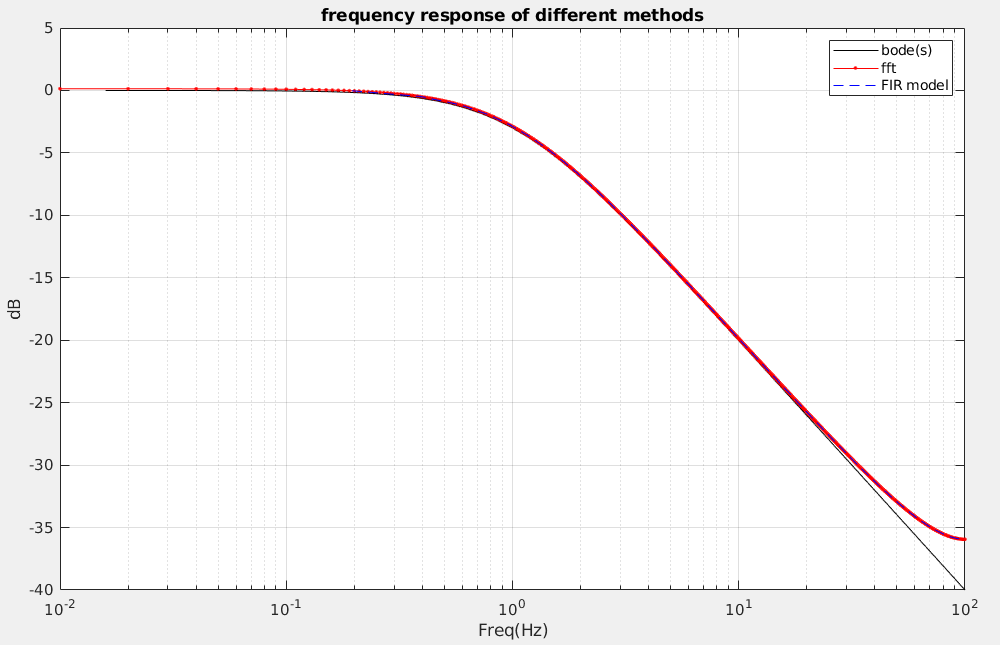

The sampling process mathematically in the two stages:

- impulse train modulator
  $$
  x_s(t)=x_c(t)s(t)
  $$

- impulse train to a sequence


## impulse train modulator


> Arrows with length proportional to their area.


The periodic impulse train is
$$
s(t) = \sum_{n=-\infty}^{+\infty}\delta (t-nT)
$$
where $\delta (t)$ is the **unit** impulse function, or Dirac delta function; $T$ is the *sampling period*, and its reciprocal, $f_s=1/T$, is the *sampling frequency*, in samples per second.

The product of $s(t)$ and $x_c (t)$ is therefore

$$\begin{align}
x_s (t) &= x_c(t)s(t) \\
&= x_c(t) \sum_{n=-\infty}^{+\infty}\delta (t-nT) = \sum_{n=-\infty}^{+\infty}x_c(t)\delta (t-nT)
\end{align}$$

The impulse train sampling $x_s(t)$ can be expressed as
$$
x_s(t) = \sum_{n=-\infty}^{+\infty}x_c(nT)\delta (t-nT)
$$
i.e., the size (area) of the *impulse* at sample time $nT$ is equal to the value of the continuous-time signal at that time.


### $x_s(t)$ in Frequency-domain

$$
X_s(j\Omega) = \frac{1}{T}\sum_{k=-\infty}^{+\infty}X_c(j(\Omega - k\Omega_s))
$$

> The relationship between the Fourier transforms of the input and the output of the *impulse train modulator*




## impulse train to a sequence



> - The $x_s(t)$ is, in a sense, a *continuous-time signal (specifically, an impulse train)* that is zero,except at integer multiples of $T$.
>
> - The sequence $x[n]$ is indexed on the integer variable $n$, which introduces a *time normalization*, $x[n]$ contains **no** explicit information about the sampling period $T$
> - The samples of $x_c(t)$ are represented by *finite numbers* in $x[n]$ rather than as the *areas of impulses* in $x_s(t)$


Our eventual objective is to express $X(e^{j\omega})$, the *discrete-time Fourier transform (DTFT) of the sequence $x[n]$*, in terms of $X_s(j\Omega)$ and $X_c(j\Omega)$. 

Toward this end, let us consider an alternative expression for $X_s(j\Omega)$,  Applying the continuous-time Fourier transform to $x_s(t) = \sum_{n=-\infty}^{+\infty}x_c(nT)\delta (t-nT)$, we obtain
$$
X_s(j\Omega) = \sum_{n=-\infty}^{+\infty}x_c(nT)e^{-j\Omega Tn}
$$
and
$$
X(e^{j\omega}) =\sum_{n=-\infty}^{+\infty}x[n]e^{-j\omega n}
$$
where DTFT is applied

Since
$$
x[n] = x_c(nT)
$$
it follows that
$$
X_s(j\Omega) = X(e^{j\omega})|_{\omega=\Omega T} = X(e^{j\Omega T})
$$
Consequently,
$$
X(e^{j\Omega T}) = \frac{1}{T}\sum_{k=-\infty}^{+\infty}X_c(j(\Omega - k\Omega_s))
$$

or equivalently,
$$
X(e^{j\omega}) = \frac{1}{T}\sum_{k=-\infty}^{+\infty}X_c \left[ j\left(\frac{\omega}{T} - \frac{2\pi k}{T}\right)\right]
$$


> $\omega$: radians per sample
>
> $\Omega$: radians per second


## Impulse Invariance

$$
h[n] = Th_c(nT)
$$

When $h[n]$ and $h_c(t)$ are related through the above equation, i.e., the impulse response of the discrete-time  system is a *scaled*, *sampled* version of $h_c(t)$, the *discrete-time system* is said to be an **impulse-invariant** version of the *continuous-time system*.

we have
$$
H(e^{j\omega}) = H_c\left(j\frac{\omega}{T}\right)
$$


## Application - Transfer function

### sampled impulse response

The below equation demonstrates how to obtain **continuous Fourier Transform** from **DTFT** .
$$
X_c(\omega) = T \cdot X(\omega)
$$

> $T$ is sample period, follow previous equation

### useful functions

- using `fft`

  The outputs of the DFT are **samples** of the DTFT

- using `freqz`

  modeling as **FIR filter**, and the impulse response sequence of an FIR filter is the same as the sequence of filter coefficients, we can express the frequency response in terms of either the filter coefficients or the impulse response

  > `fft` is used in `freqz` internally


### Practical Example

**Question**:

​	How to obtain continuous system transfer function from sampled impulse

**Answer**:

​	using above mentioned functions

---

> First order lowpass filter with 3-dB frequency **1Hz**



```matlab
clear all;
clc;

%% continuous system
s = tf('s');
h = 2*pi/(2*pi+s);
[mag, phs, wout] = bode(h);
fct = wout(:)/2/pi;
Hct_dB = 20*log10(mag(:));


fstep = 0.01;           % freq resolution
fnyqst = 100;
Ts = 1/(2*fnyqst);
Fs = 1/Ts;              % sampling freq
Ns = ceil(Fs/fstep);    % samping points
fstep = Fs/Ns;          % update fstep
t = (0:Ns-1)*Ts;        % sampling time points

y = impulse(h, t);      % impulse resp

%% modelling as discrete system
Y = fft(y);                 % dft
Hfft = Y * Ts;              % !!! multiply Ts
Hfft_dB = 20*log10(abs(Hfft(1:Ns/2+1)));
ffft = (1:Ns/2+1)*fstep - fstep;


[Hfir, ffir] = freqz(y, 1, [], 1/Ts);   % modelling as FIR
Hfir = Hfir * Ts;           % !!! multiply Ts
Hfir_dB = 20*log10(abs(Hfir));

%% plot
semilogx(fct, Hct_dB, 'k', ffft, Hfft_dB, 'r.-', ffir, Hfir_dB, 'b--');
legend('bode(s)', 'fft', 'FIR model')
xlabel('Freq(Hz)');
ylabel('dB');
xlim([1e-2 1e2]);
grid on;
title('frequency response of different methods');
```


## Gotcha

A remarkable fact of linear systems is that the **complex exponentials** are **eigenfunctions** of a linear system, as the system output to these inputs equals the input multiplied by a constant factor.

- Both amplitude and phase may change
- but the frequency does not change

Take the input signal to be a complex exponential of the form $x(t)=Ae^{j\phi}e^{j\omega t}$

$$\begin{align}
y(t) &= h(t)*x(t) \\
&= H(j\omega)Ae^{j\phi}e^{j\omega t}
\end{align}$$

The frequency response at $-\omega$ is the **complex conjugate** of the frequency response at $+\omega$, given $h(t)$ is real

$$\begin{align}
H^*(t) &= \left(\int_{-\infty}^{+\infty}h(t)e^{-j\omega t}dt\right)^* \\
&= \int_{-\infty}^{+\infty}h^*(t)e^{+j\omega t}dt \\
&= \int_{-\infty}^{+\infty}h(t)e^{-j(-\omega t)}dt \\
&= H(-j\omega)
\end{align}$$


The **real cosine signal** is actually composed of two **complex exponential signals**: one with positive frequency and the other with negative
$$
cos(\omega t + \phi) = \frac{e^{j(\omega t + \phi)} + e^{-j(\omega t + \phi)}}{2}
$$

The sinusoidal response is the sum of the complex-exponential response at the positive frequency $\omega$ and the response at the corresponding negative frequency $-\omega$ because of LTI systems's superposition property

- input:
  $$\begin{align}
  x(t) &= A cos(\omega t + \phi) \\
  &= \frac{1}{2}Ae^{\phi}e^{\omega t} + \frac{1}{2}Ae^{-\phi}e^{-\omega t}
  \end{align}$$

- output with $H(j\omega)=Ge^{j\theta}$:
$$\begin{align}
y(t) &= H(j\omega)\frac{1}{2}Ae^{\phi}e^{\omega t} +  H(-j\omega)\frac{1}{2}Ae^{-\phi}e^{-\omega t} \\
&= Ge^{j\theta}\frac{1}{2}Ae^{\phi}e^{\omega t} + Ge^{-j\theta}\frac{1}{2}Ae^{-\phi}e^{-\omega t} \\
&= GAcos(\omega t + \phi + \theta)
\end{align}$$

Its phase shift is $\theta$ and gain is $G$, which is same with $H(j\omega)$.


## reference

James H. McClellan, Ronald Schafer, and Mark Yoder. 2015. DSP First (2nd. ed.). Prentice Hall Press, USA.

[fft - https://www.mathworks.com/help/matlab/ref/fft.html](https://www.mathworks.com/help/matlab/ref/fft.html)

[freqz - https://www.mathworks.com/help/signal/ref/freqz.html](https://www.mathworks.com/help/signal/ref/freqz.html)

[Wei-Ta Chu, 2012s_DSP - Lecture 26 Frequency Response](https://www.cs.ccu.edu.tw/~wtchu/courses/2012s_DSP/Lectures/Lecture%2026%20Frequency%20Response.pdf)

Relationship between continuous-time and discrete-time Fourier transforms URL: [https://blogs.mathworks.com/steve/2010/01/18/relationship-between-continuous-time-and-discrete-time-fourier-transforms/](https://blogs.mathworks.com/steve/2010/01/18/relationship-between-continuous-time-and-discrete-time-fourier-transforms/)

Oppenheim, Alan V. and Cram. “Discrete-time signal processing : Alan V. Oppenheim, 3rd edition.” (2011).

