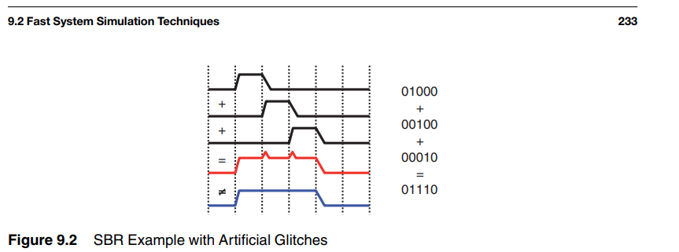
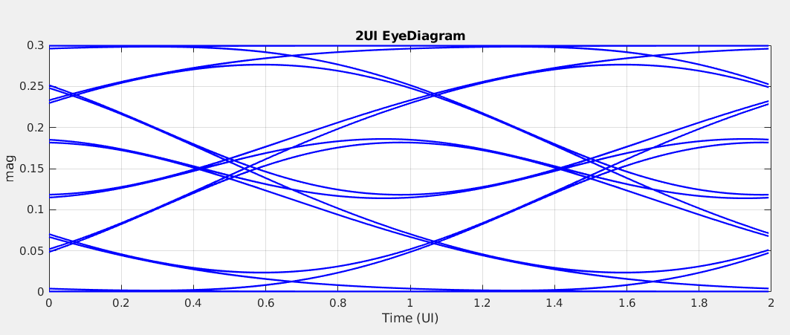
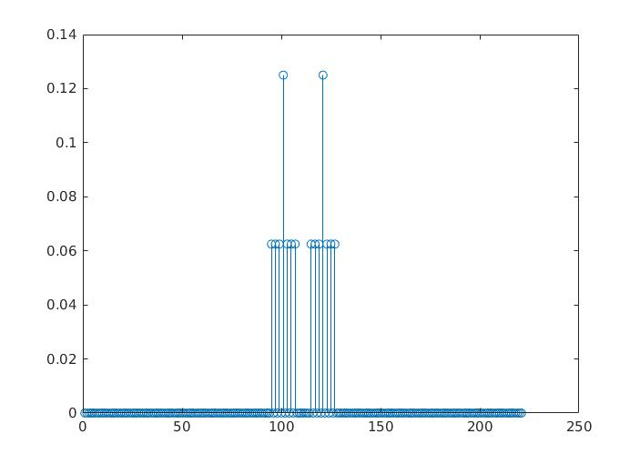
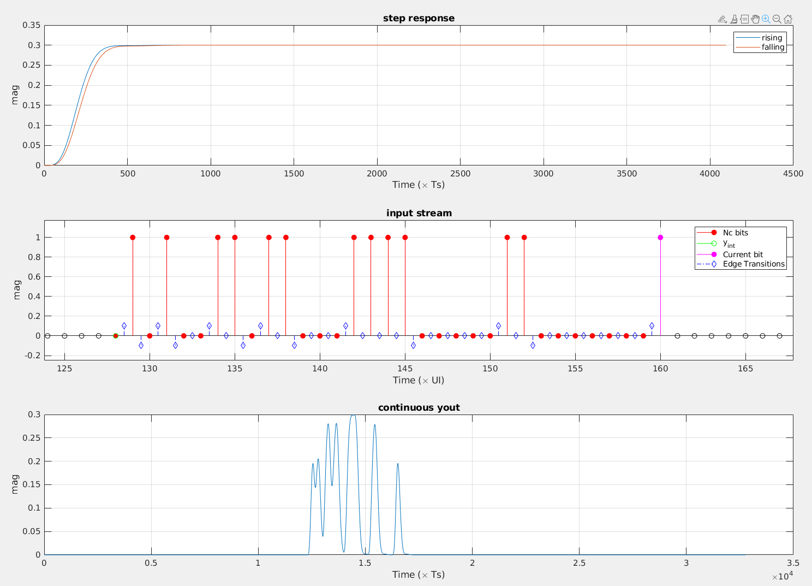
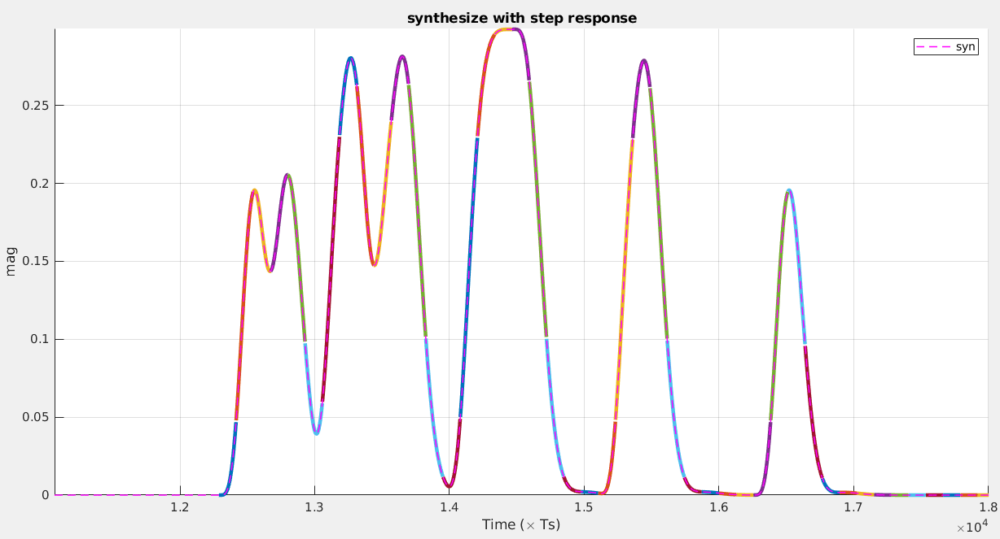

Three fast time-domain system simulation techniques: 

- **single-bit response method**
- **double-edge response method**
- **multiple-edge response method**


## Single-Bit Response (SBR) Method

To avoid spurious glitches between consecutive ones, rising and falling edge responses shall be **symmetric**. This is the limitation of SBR method.

 Let $p(t)$ be the SBR of the channel, $t_s$ be the data sampling phase, $T$ be the bit time, $N_c$ is the number of UI in stored pulse response and $b_m$ be the $m$th transmitted symbol. The voltage seen by the receiver's data sampler at the $m$th data sample is determined by
$$
y_m = \sum_{k=m-N_c+1}^{m}b_kp(t_s+(m-k)T)
$$
where $b_k \in [0, 1]$ and $p(t) \ge 0$

We always prepend $Nc-1$ 0s in random bit stream for consistency.



For computation convenient, the pulse need to be positive. For differential signal and amplitude $V_{peak}$,  the peak to peak is $-V_{peak}$ to $+V_{peak}$. After pulse added by $V_{peak}$, peak to peak is $0$ to $+2V_{peak}$. 


```matlab
hold on;

yy_sum = zeros(OSR*Ns, Ns);
for idxBit = 1:Ns
    bs_split = zeros(1, Ns+Nc-1);
    bs_split(idxBit) = bs(idxBit);
    yy = zeros(OSR, Ns);
    for ii = Nc:Nc+Ns-1
        bb = bs_split(ii:-1:ii-Nc+1);
        yy(:,ii-Nc+1) = sum(bb.*yrps, 2);
    end
    yy_cont2 = reshape(yy, [], 1);
    h = plot(yy_cont2);
    h.Annotation.LegendInformation.IconDisplayStyle = 'off';
    yy_sum(:, idxBit) = yy_cont2;
end
yy_sum = sum(yy_sum, 2);    % merge
plot(yy_sum, 'k--');
plot(yy_cont, 'm-.');
grid on;
legend('sum', 'syn');
title('merge all single bit');
ylabel('mag');
xlabel('Time (\times Ts)');
```

> The pulse response contain rising and falling edge. The **1 bit ** first rise from -1 to 1,  then fall to -1; The **0 bit** just do nothing for synthesized waveform with the help of falling edge of **1 bit**. 
>
> The DC shift help deal with continuous **0 bits**.





### another SBR example

```matlab
A = zeros(10,21);
n = [1:10];

% post cursor
for m = 1:3
    A(m, 11+n(m)) = 0.5;
    A(m, 11-n(m)) = 0.5;
end

% one
for m = 4:10
    A(m, 11) = 1;
end

% h0 or main cursor
h0 = zeros(1, 21);
h0(1, 1) = 0.5;
h0(1, 21) = 0.5;
out = h0;

for m = 1:10
    out = conv(out, A(m, :), "full");
end


stem(out)
```




## Double-Edge Response (DER) Method

To handle the more general cases, with **asymmetric rising and falling edges**, the system response can be constructed in terms of **edge transitions instead of bit responses**. 

The DER method decomposes the input data pattern, in terms of **rising and falling edge transitions**. The system response can be calculated by *superimposing the shifted versions of the rising and falling edge responses* :
$$
y_m = \sum_{k=m-N_c+1}^{m}(b_k-b_{k-1})s_k(t_s+(m-k)T) + y_{int}
$$
where

$$\begin{align}
s_i(t) &= r(t) -V_{low} \quad \text{if} \: (b_i\gt b_{i-1}) \\
&= V_{high}-f(t) \quad \text{otherwise}
\end{align}$$

$r(t)$ and $f(t)$ are the rising and falling edge responses,respectively.  $V_{high}$ and $V_{low}$ are the steady state DC levels, in response to a constant stream of ones and zeros, respectively. $y_{int}$ is the initial DC state (either $V_{high}$ or $V_{low}$ ).

We always prepend $Nc$ 0s in random bit stream for consistency.






```matlab
figure(1)
subplot(3, 1, 1)
plot(yrc); 
hold on;
plot(yfc); 
hold off;
legend('rising', 'falling')
grid on;
ylabel('mag');
xlabel('Time (\times Ts)');
title('step response');

subplot(3, 1, 2)
stem(bs, 'k'); grid on;
hold on;
stem((idxPreRspStart:idxPreRspEnd), bs(idxPreRspStart:idxPreRspEnd), "filled", 'r');
stem(idxPreRspStart, bs(idxPreRspStart), 'go');
stem(idxCurData, bs(idxCurData), "filled", 'm');
stem((idxPreRspStart:idxPreRspEnd)+0.5, 0.1.*bd(idxPreRspStart:idxPreRspEnd), 'bd-.');
hold off;
legend('', 'Nc bits', 'y_{int}', 'Current bit', 'Edge Transitions');
ylabel('mag');
xlabel('Time (\times UI)');
title('input stream');

subplot(3, 1, 3)
yy_cont = reshape(yy, [], 1);   % continuous version
plot(yy_cont); grid on;
title('continuous yout')
ylabel('mag');
xlabel('Time (\times Ts)');

figure(2)
hold on;
for idx = idxPreRspStart+1-Nc:idxCurData+32-Nc
    ys = yy(:, idx);
    tt = ((idx-1)*OSR+1:idx*OSR);
    h = plot(tt(:), ys(:), 'LineWidth',3);
    h.Annotation.LegendInformation.IconDisplayStyle = 'off';
end
plot(yy_cont, 'm--', 'LineWidth',1); 
hold off;
legend('syn')
ylabel('mag');
xlabel('Time (\times Ts)');
title('synthesize with step response');
grid on;
```


## Reference

Oh, Kyung Suk Dan, and Xing Chao Chuck Yuan. High-Speed Signaling: Jitter Modeling, Analysis, and Budgeting. Prentice Hall, 2011.

Ren, Jihong and Kyung Suk Oh. “Multiple Edge Responses for Fast and Accurate System Simulations.” *IEEE Transactions on Advanced Packaging* 31 (2008): 741-748.

Shi, Rui. “Off-chip wire distribution and signal analysis.” (2008).

X. Chu, W. Guo, J. Wang, F. Wu, Y. Luo and Y. Li, "Fast and Accurate Estimation of Statistical Eye Diagram for Nonlinear High-Speed Links," in IEEE Transactions on Very Large Scale Integration (VLSI) Systems, vol. 29, no. 7, pp. 1370-1378, July 2021, doi: 10.1109/TVLSI.2021.3082208.
