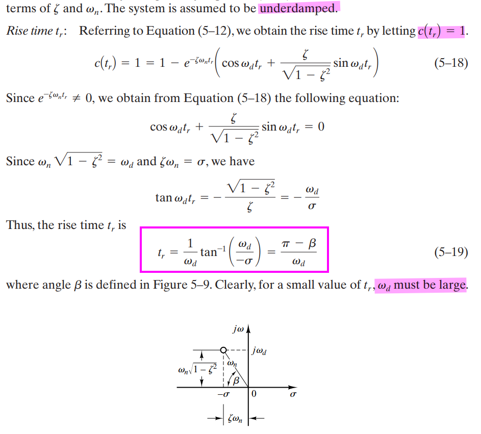
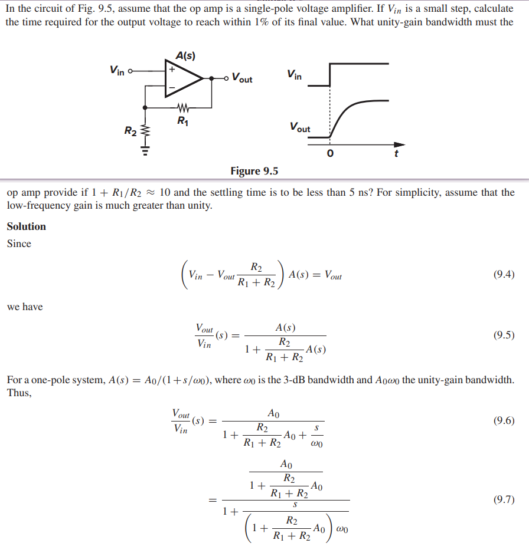

## Second-order system

### Rise Time

> Katsuhiko Ogata, Modern Control Engineering Fifth Edition

> For *underdamped* second order systems, the *0% to 100% rise time* is normally used

For $\text{PM}=70^o$

-  $\omega_2=3\omega_u$, that is $\omega_n = 1.7\omega_u$. 
-  $\zeta = 0.87$

Then
$$
t_r = \frac{3.1}{\omega_u}
$$

### Settling Time

>   Gene F. Franklin, Feedback Control of Dynamic Systems, 8th Edition

As we know
$$
\zeta \omega_n=\frac{1}{2}\sqrt{\frac{\omega_2}{\omega_u}}\cdot \sqrt{\omega_u\omega_2}=\frac{1}{2}\omega_2
$$

Then
$$
t_s = \frac{9.2}{\omega_2}
$$

For $\text{PM}=70^o$, $\omega_2 = 3\omega_u$, that is
$$
t_s \simeq \frac{3}{\omega_u} \space\space \text{, for PM}=70^o
$$

For $\text{PM}=45^o$, $\omega_2 = \omega_u$, that is
$$
t_s \simeq \frac{9.2}{\omega_u} \space\space \text{, for PM}=45^o
$$

> Above equation is valid only for **underdamped**, $\zeta=\frac{1}{2}\sqrt{\frac{\omega_2}{\omega_u}}\lt 1$, that is $\omega_2\lt 4\omega_u$

---

## single-pole voltage amplifier

$$
\tau \simeq \frac{1}{\beta \omega_\text{ugb}}
$$

## Feedback Rearrange

The closed loop transfer function of $Y/X$ and $Y_1/X_1$ are almost same, except sign

$$\begin{align}
\frac{Y}{X} &= +\frac{H_1(s)H_2(s)}{1+H_1(s)H_2(s)} \\
\frac{Y_1}{X_1} &= -\frac{H_1(s)H_2(s)}{1+H_1(s)H_2(s)} 
\end{align}$$

