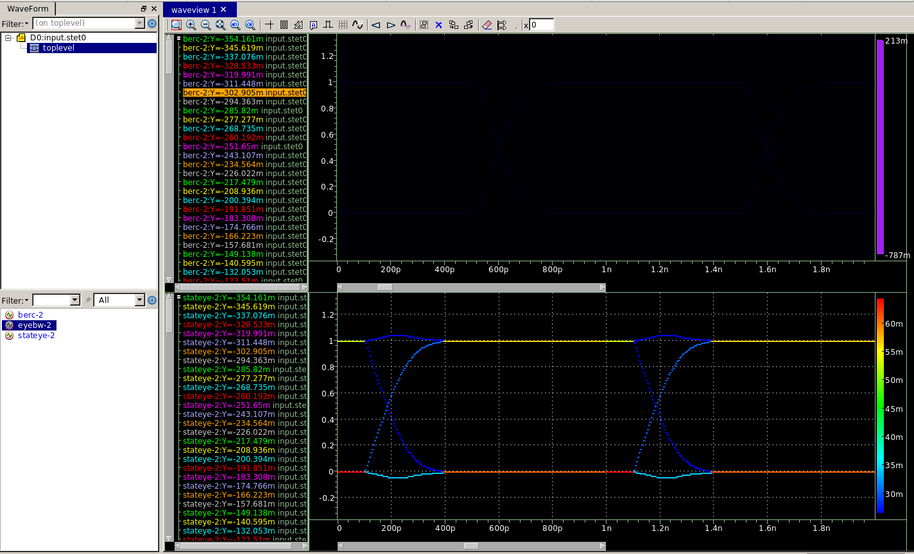

## How to use  StatEye Analysis in HSPICE

### create netlist with hspiceD in Virtuoso


### modify netlist

```
P1 vi 0  port=1  Z0=0 LFSR (1 0 0 100p 100p 1G 1 [5,2])
P2 vo 0  port=2  Z0=1G
.stateye T=1ns trf=100p incident_port=1 probe_port=2
.probe stateye eye(2) berC(2) eyeBW(2)
.print stateye eye(2) berC(2) eyeBW(2)
```

> Note both`Z0=0` and `Z0=1G` are used to remove port's effect, which is used as ideal voltage source and voltage monitor



> The `.probe stateye` command generates `netlist.stet#` and `netlist.stev#` for following purposes:
>
> - netlist.stet#: eye(t,v), eyeBW(t,v), eyeV(t), ber(t,v) and bathtubV(t)
> - netlist.stet#: eye(t,v), eyeBW(t,v), eyeV(t), ber(t,v) and bathtubV(t)

## setup

### .cdsinit

```
load( strcat( getShellEnvVar("HSPICE_HOME") "/hspice/interface/snpsSimADE.ile" ))
```

### environment variable

```
export CDS_LOAD_ENV=CSF
export SNPSSIMADE_LOAD_MODE=HSPICE
```

## reference

HSPICE® User Guide: Signal Integrity Modeling and Analysis, Version Q-2020.03, March 2020
