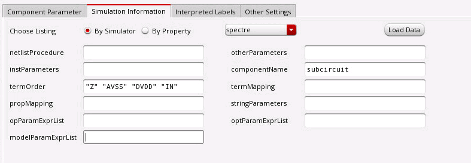
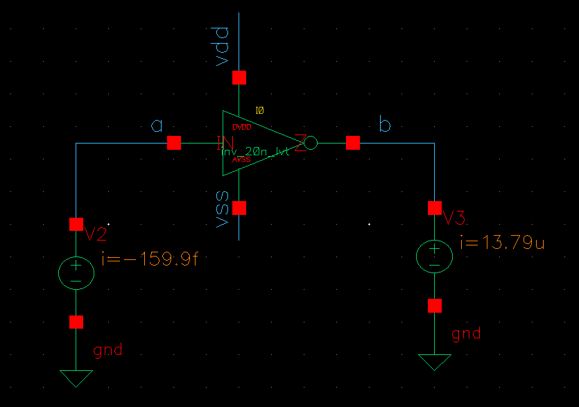
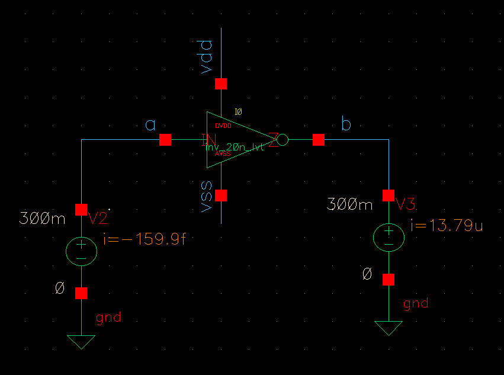
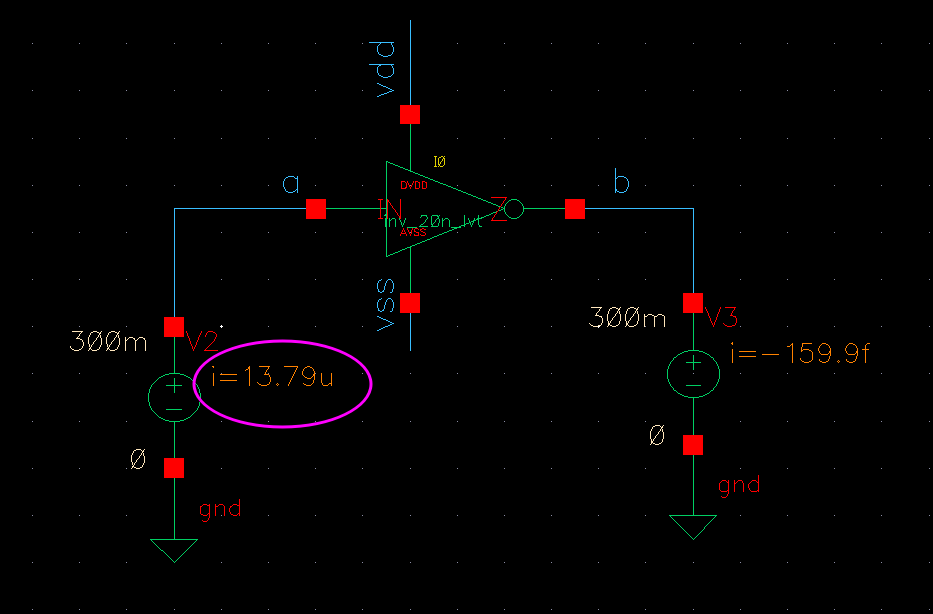

### Case Sensitivity

| **netlist format** | **default option** |
| ---------------- | ------------------ |
| Spectre netlist  | *case sensitive*   |
| dspf format      | *case insensitive* |

> For a **dspf format**, it will be treated as a *spice netlist format*, which is *by default case insensitive*

Pay attention to *VerilogIn* block, which may contain upper case / lower case net name, e.g NET1 and net1. 

The extracted DSPF using extraction tool also contain NET1 and net1, which **shall not** be shorted together.

### Port Order

> If you use `.dspf_include`, the following rules apply:
>
> - The subcircuit description is taken from the DSPF file even if the same subcircuit description is available in the schematic netlist.
> - Depending on the `port_order` option, the port order of the subcircuit definition is taken from the pre-layout schematic netlist or from the DSPF file subcircuit definition, as shown below.
>   - `port_order=sch` – (Default). The port order is taken from schematic subcircuit definition. The same port number and names are required. If the schematic subcircuit definition is not available, a warning is issued in the log file, and DSPF port order is used.
>   - `port_order=spf` – The port order is taken from the DSPF subcircuit definition.

**SPICE_SUBCKT_FILE** of StarRC

The StarRC tool reads the files specified by the *SPICE_SUBCKT_FILE* command to obtain
**port ordering information**. The files control the port ordering of the top cell as well. The port
order and the port list members read from the **.subckt** for a skip cell are preserved in the
output netlist.

> The file usually is the *cdl netlist* of extracted cell, this way, port order is not problem

**CDF termOrder**

#### DSPF same order

**DSPF**

**input.scs**

#### different order

manual change DSPF's pin order shown as below

#### port_order=sch

*dspf port is mapping to schematic by name*, and the simulation result is right

##### port_order=spf

dspf pin order is retained, and **no mapping** between spectre netlist and dspf.

The simulation result is wrong

>  bus_delim="_ <>"
>
> The way this works is that the first part of *bus_delim* is the "schematic" delimiter (i.e. what's in the spectre netlist), and the other part is the DSPF delimiter

### reference

Article (20502176) Title: How does Spectre understand case-sensitive net names when using various post-layout netlists such as dspf, av_extracted view, or smart view?
URL: [https://support.cadence.com/apex/ArticleAttachmentPortal?id=a1O3w000009fthoEAA](https://support.cadence.com/apex/ArticleAttachmentPortal?id=a1O3w000009fthoEAA)

spf in cadence [https://community.cadence.com/cadence_technology_forums/f/custom-ic-design/31326/spf-in-cadence/1342278#1342278](https://community.cadence.com/cadence_technology_forums/f/custom-ic-design/31326/spf-in-cadence/1342278#1342278)

Spectre Tech Tips: Using DSPF Post-Layout Netlists in Spectre Circuit Simulator - Analog/Custom Design - Cadence Blogs - Cadence Community [https://shar.es/afO6e1 ](https://shar.es/afO6e1 )

StarRC™ User Guide and Command Reference Version O-2018.06, June 2018
