##  Energy signals vs Power signal

> Topic 5 Energy & Power Signals, Correlation & Spectral Density [[https://www.robots.ox.ac.uk/~dwm/Courses/2TF_2021/N5.pdf](https://www.robots.ox.ac.uk/~dwm/Courses/2TF_2021/N5.pdf)]

---

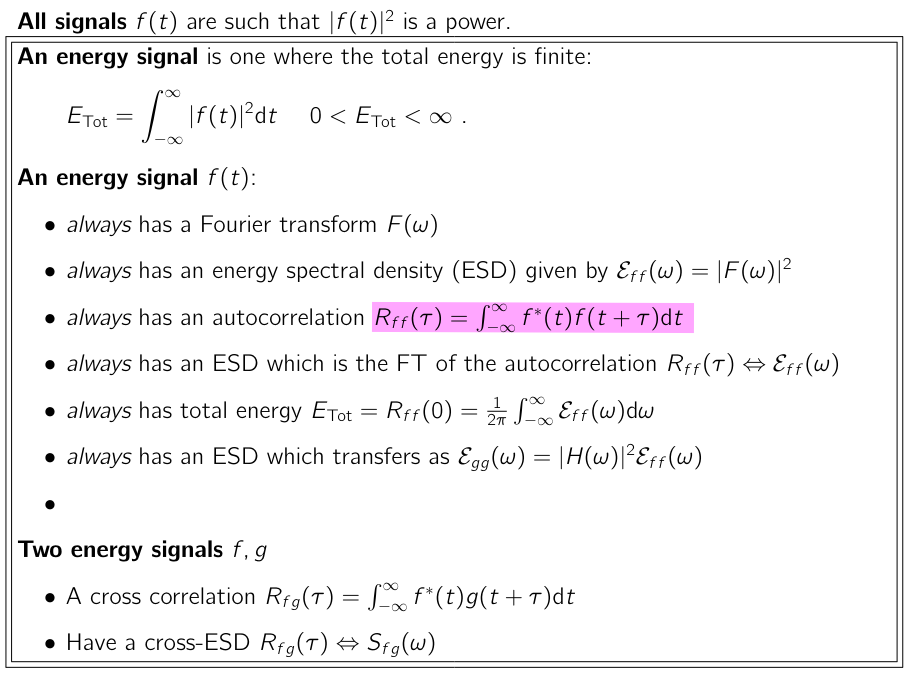

> 

---

---

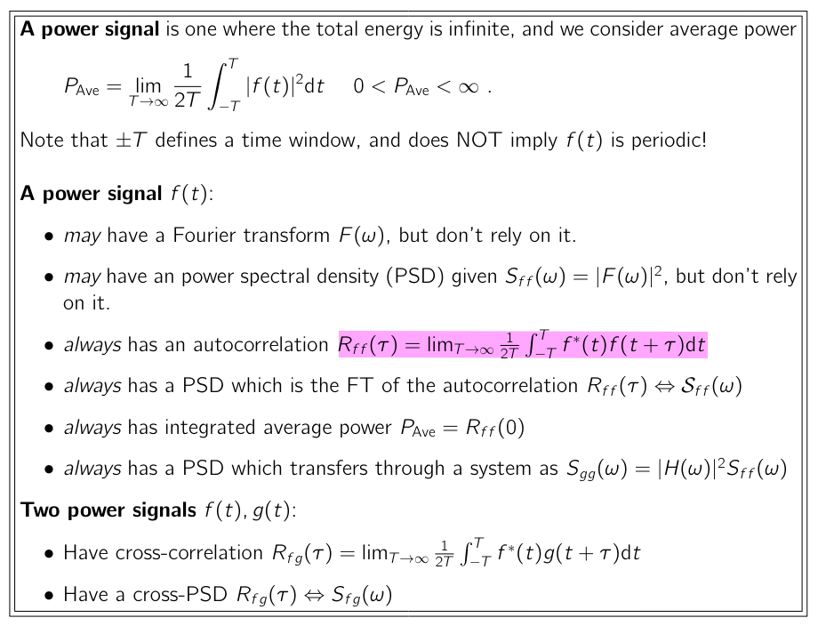

> 


## modulation & demodulation


> Hossein Hashemi, RF Circuits, [[https://youtu.be/0f3yZMvD2Jg?si=2c1Q4y6WJq8Jj8oN](https://youtu.be/0f3yZMvD2Jg?si=2c1Q4y6WJq8Jj8oN)]


## Coherent Sampling

To avoid **spectral leakage** completely, the method of **coherent sampling** is recommended. Coherent sampling requires that the input- and clock-frequency generators are **phase locked**, and that the input frequency be chosen based on the following relationship:
$$
\frac{f_{\text{in}}}{f_{\text{s}}}=\frac{M_C}{N_R}
$$

where:

- $f_{\text{in}}$ = the desired input frequency
- $f_s$ = the clock frequency of the data converter under test
- $M_C$ = the number of cycles in the data window (to make all samples unique, choose odd or prime numbers)
- $N_R$ = the data record length (for an 8192-point FFT, the data record is 8192s long)


$$\begin{align}
f_{\text{in}} &=\frac{f_s}{N_R}\cdot M_C \\
&= f_{\text{res}}\cdot M_C
\end{align}$$

---

**irreducible ratio**

An **irreducible ratio** ensures identical code sequences not to be repeated multiple times. Unnecessary repetition of the same code is not desirable as it increases ADC test time.

> Given that $\frac{M_C}{N_R}$ is irreducible, and $N_R$ is a power of 2, an **odd number** for $M_C$ will always produce an **irreducible ratio**


Assuming there is a common factor $k$ between $M_C$ and $N_R$, i.e. $\frac{M_C}{N_R}=\frac{k M_C'}{k N_R'}$

The samples  ($n\in[1, N_R]$)

$$\begin{align}
y[n] &= \sin\left( \omega_{\text{in}} \cdot t_n \right) \\
&= \sin\left( \omega_{\text{in}} \cdot n\frac{1}{f_s} \right)  \\
& = \sin\left( \omega_{\text{in}} \cdot n\frac{1}{f_{\text{in}}}\frac{M_C}{N_R} \right) \\
& = \sin\left( 2\pi n\frac{M_C}{N_R} \right)
\end{align}$$

Then

$$\begin{align}
y[n+N_R'] &= \sin\left( 2\pi (n+N_R')\frac{M_C}{N_R} \right) \\
& = \sin\left( 2\pi n \frac{M_C}{N_R} + 2\pi N_R'\frac{M_C}{N_R}\right) \\
& = \sin\left( 2\pi n \frac{M_C}{N_R} + 2\pi N_R'\frac{kM_C'}{kN_R'} \right) \\
& = \sin\left( 2\pi n \frac{M_C}{N_R} + 2\pi M_C' \right) \\
& = \sin\left( 2\pi n \frac{M_C}{N_R}\right) 
\end{align}$$


So,  the samples is repeated $y[n] = y[n+N_R']$.  Usually, no additional information is gained by repeating with the same sampling points.

---

**Example**
$$
N \cdot \frac{1}{F_s} = M \cdot \frac{1}{F_{in}}
$$

where $F_s$ is sample frequency, $F_{in}$ input signal frequency. 

And $N$ often is 256, 512; M is 3, 5, 7, 11.


## channel loss

- skin effect loss
- dielectric loss


## phase delay & group delay


- Phase delay directly measures the device or system time delay of *individual sinusoidal frequency components* in the **steady-state conditions**.
- In the ideal case the envelope delay is equal to the phase delay
- envelope delay is a more sensitive measure of aberrations than phase delay


### phase delay

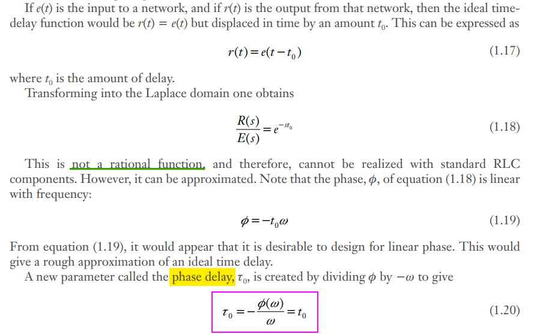


> If the phase delay peaks (exceeds the low-frequency value) you can expect to see high-frequency
> components late in the step response. This causes ***ringing***. 


### group delay


---

steady-state at this frequency is a polarity flip; a 180 degrees phase shift; which is a transfer function of H(s)=-1. 
$$
H(s) = e^{j\pi}
$$
That is $\phi(\omega) = \pi$
$$
\tau_p = \frac{\pi}{\omega}
$$
and
$$
\tau_g = \frac{\partial \pi}{\partial \omega}=0
$$


---


> Hollister, Allen L. *Wideband Amplifier Design*. Raleigh, NC: SciTech Pub., 2007.
>
> Pupalaikis, Peter. (2006). Group Delay and its Impact on Serial Data Transmission and Testing.  [[https://cdn.teledynelecroy.com/files/whitepapers/group_delay-designcon2006.pdf](https://cdn.teledynelecroy.com/files/whitepapers/group_delay-designcon2006.pdf)]
>
> [Pupalaikis et al., “Eye Patterns in Scopes”, DesignCon, Santa Clara CA, 2005[https://cdn.teledynelecroy.com/files/whitepapers/eye_patterns_in_scopes-designcon_2005.pdf](https://cdn.teledynelecroy.com/files/whitepapers/eye_patterns_in_scopes-designcon_2005.pdf)]
>
> Starič, P. & Margan, E.. (2006). Wideband Amplifiers. 10.1007/978-0-387-28341-8. 
>
> Alan V. Oppenheim, Alan S. Willsky, and S. Hamid Nawab. 1996. Signals & systems (2nd ed.). Prentice-Hall, Inc., USA.
>
> Phase delay vs group delay: Common misconceptions. [[https://audiosciencereview.com/forum/index.php?threads/phase-delay-vs-group-delay-common-misconceptions.39591/](https://audiosciencereview.com/forum/index.php?threads/phase-delay-vs-group-delay-common-misconceptions.39591/)]


## z-domain & sampled analysis

*TODO* &#128197;


A sampled system almost always has more stability problems than arise in continuous-time systems. 

- In particular, an analog, second-order PLL is unconditionally stable for any value of loop gain
- but the sampled equivalent will go unstable if the gain is made too large

> F. Gardner, "Charge-Pump Phase-Lock Loops," in *IEEE Transactions on Communications*, vol. 28, no. 11, pp. 1849-1858, November 1980, doi: 10.1109/TCOM.1980.1094619


## Feedback Rearrange


The closed loop transfer function of $Y/X$ and $Y_1/X_1$ are almost same, except sign

$$\begin{align}
\frac{Y}{X} &= +\frac{H_1(s)H_2(s)}{1+H_1(s)H_2(s)} \\
\frac{Y_1}{X_1} &= -\frac{H_1(s)H_2(s)}{1+H_1(s)H_2(s)}
\end{align}$$


define $-Y_1=Y_n$, then
$$
\frac{Y_n}{X_1} = \frac{H_1(s)H_2(s)}{1+H_1(s)H_2(s)}
$$


> 
>
> Saurabh Saxena, IIT Madras. Clocking for Serial Links - Frequency and Jitter Requirements, Phase-Locked Loops, Clock and Data Recovery


## Convolution of probability distributions

The probability distribution of the *sum of two or more **independent** random variables* is the **convolution** of their individual distributions.

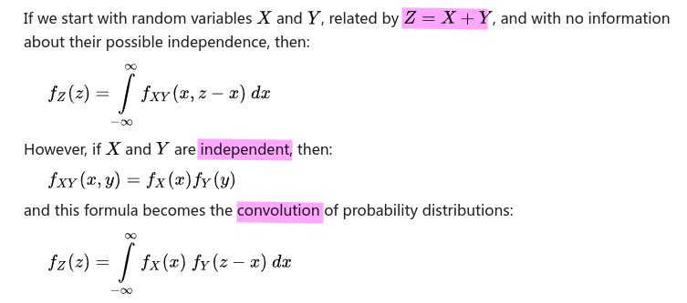


## Thermal noise

Thermal noise in an ideal resistor is approximately **white**, meaning that its power spectral density is nearly **constant** throughout the frequency spectrum.

When limited to a *finite bandwidth* and viewed in the time domain, thermal noise has a nearly **Gaussian amplitude distribution**


> 


## Barkhausen criteria

Barkhausen criteria are *necessary* but **not sufficient conditions** for sustainable **oscillations**


it simply *"latches up"* rather than oscillates


## NRZ Bandwidth


> Maxim Integrated,NRZ Bandwidth - HF Cutoff vs. SNR [[https://pdfserv.maximintegrated.com/en/an/AN870.pdf](https://pdfserv.maximintegrated.com/en/an/AN870.pdf)]


## $0.35/T_r$

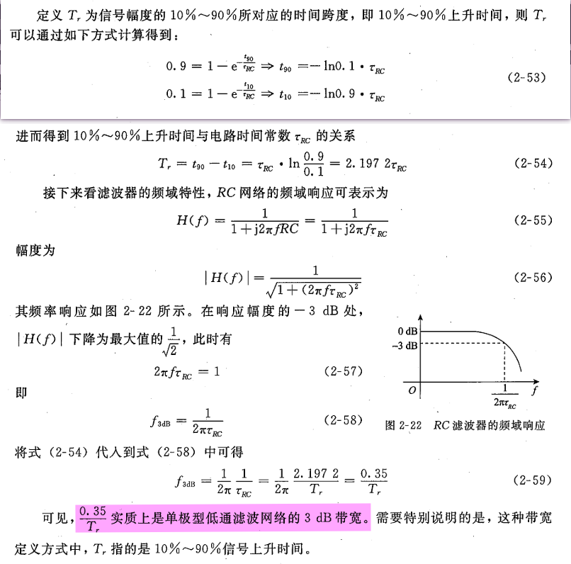


## $0.5/T_r$

*TODO* &#128197;


## System Type

> Control of Steady-State Error to Polynomial Inputs: System Type


control systems are assigned a **type** number according to the maximum degree of the 
input polynominal for which the steady-state error is a *finite constant*. i.e.

> - Type 0: Finite error to a step (position error) 
> - Type 1: Finite error to a ramp (velocity error)
> - Type 2: Finite error to a parabola (acceleration error)

The open-loop transfer function can be expressed as
$$
T(s) = \frac{K_n(s)}{s^n}
$$

where we collect all the terms except the pole ($s$) at eh origin into $K_n(s)$, 

The polynomial inputs, $r(t)=\frac{t^k}{k!} u(t)$, whose transform is
$$
R(s) = \frac{1}{s^{k+1}}
$$

Then the equation for the error is simply
$$
E(s) = \frac{1}{1+T(s)}R(s)
$$


Application of the *Final Value Theorem* to the error formula gives the result

$$\begin{align}
\lim _{t\to \infty} e(t) &= e_{ss} = \lim _{s\to 0} sE(s) \\
&= \lim _{s\to 0} s\frac{1}{1+\frac{K_n(s)}{s^n}}\frac{1}{s^{k+1}} \\
&= \lim _{s\to 0} \frac{s^n}{s^n + K_n}\frac{1}{s^k}
\end{align}$$

- if $n > k$, $e=0$
- if $n < k$, $e\to \infty$
- if $n=k$
  - $e_{ss} = \frac{1}{1+K_n}$ if $n=k=0$
  - $e_{ss} = \frac{1}{K_n}$ if $n=k \neq 0$​

where we define $K_n(0) = K_n$


## PID

*TODO* &#128197;

- a Proportional term to close the feedback loop
- an Integral term to assure zero error to constant reference and disturbance inputs
- a Derivative term to improve (or realize!) stability and good dynamic response


## Nyquist's Stability Criterion

*TODO* &#128197;


[[Michael H. Perrott, High Speed Communication Circuits and Systems, Lecture 15 Integer-N Frequency Synthesizers](https://www.cppsim.com/CommCircuitLectures/lec15.pdf)]


## $s$- and $z$-Domains Conversion 


> Staszewski, Robert Bogdan, and Poras T. Balsara. All-digital frequency synthesizer in deep-submicron CMOS. John Wiley & Sons, 2006.


## Spectral content of NRZ


> Lecture 26 Autocorrelation Functions of Random Binary Processes [[https://bpb-us-w2.wpmucdn.com/sites.gatech.edu/dist/a/578/files/2003/12/ECE3075A-26.pdf](https://bpb-us-w2.wpmucdn.com/sites.gatech.edu/dist/a/578/files/2003/12/ECE3075A-26.pdf)]
>
> Lecture 32 Correlation Functions & Power Density Spectrum, Cross-spectral Density [[https://bpb-us-w2.wpmucdn.com/sites.gatech.edu/dist/a/578/files/2003/12/ECE3075A-32.pdf](https://bpb-us-w2.wpmucdn.com/sites.gatech.edu/dist/a/578/files/2003/12/ECE3075A-32.pdf)]


## sinusoidal steady-state and frequency response

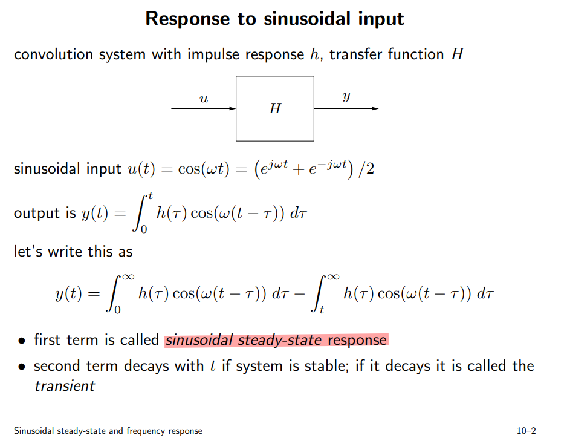

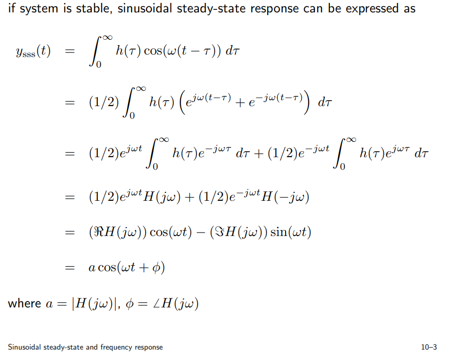

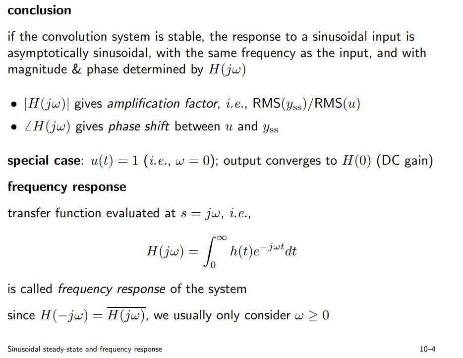

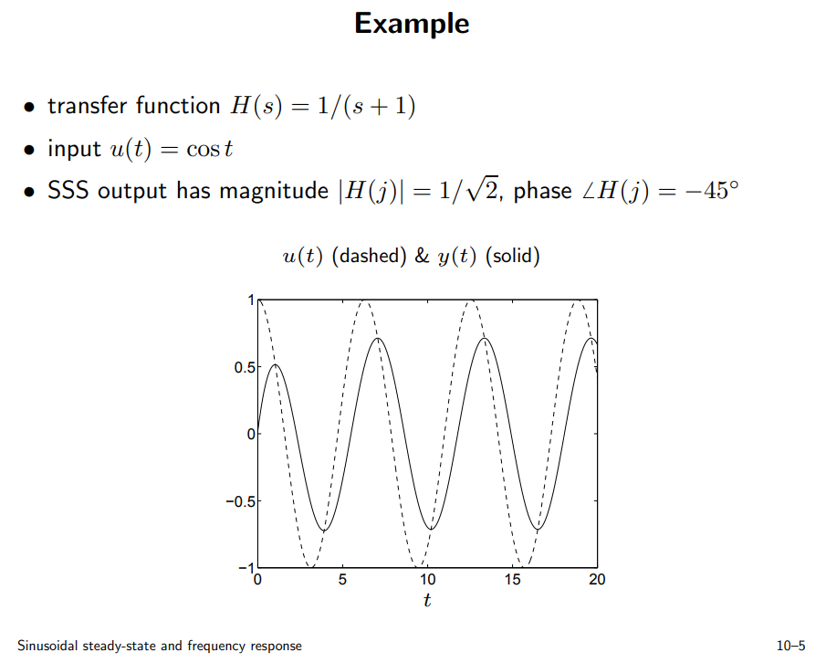

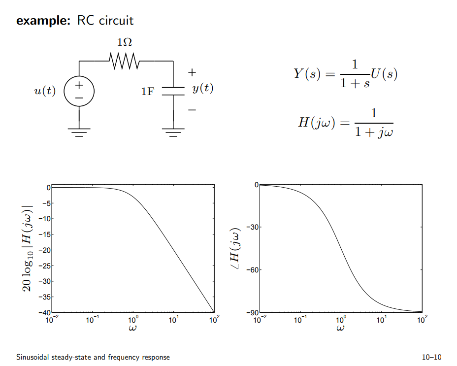

Due to KCL and $u(t)=e^{j\omega t}$ and $y(t)=H(j\omega)e^{j\omega t}$, we have ODE:

$$\begin{align}
\frac{u(t) - y(t)}{R} = C \frac{dy(t)}{dt} \\
e^{j\omega t} - H(j\omega) e^{j\omega t} = H(j\omega)\cdot j\omega e^{j\omega t} \\
\end{align}$$

$H(j\omega)$ is obtained as below
$$
H(j\omega) = \frac{1}{1+j\omega}
$$


## Initial Value Theorem & Final Value Theorem

Two valuable *Laplace transform* theorem

- Initial Value Theorem, which states that it is always possible to determine the **initial value** of the time function $f(t)$ from its Laplace transform
  $$
  \lim _{s\to \infty}sF(s) = f(0^+)
  $$

- Final Value Theorem allows us to compute the **constant steady-state value** of a time function given its Laplace transform
  $$
  \lim _{s\to 0}sF(s) = f(\infty)
  $$

  > If $f(t)$ is step response, then $f(0^+) = H(\infty)$ and $f(\infty) = H(0)$, where $H(s)$ is transfer function


## Butterworth filter

> function varargout = butter(n, Wn, varargin)
>
> %   BUTTER Butterworth digital and analog filter design.
>
> %   [B,A] = BUTTER(N,Wn) designs an Nth order lowpass digital
>
> %   Butterworth filter and returns the filter coefficients in length
>
> %   N+1 vectors B (numerator) and A (denominator). The coefficients
>
> %   are listed in descending powers of z. The cutoff frequency
>
> %   Wn must be **0.0 < Wn < 1.0**, with 1.0 corresponding to
>
> %   half the sample rate.

$$
w_n = \frac{f_c}{0.5f_s}
$$

where $f_c$ is cutoff frequency, $f_s$ is sampling frequency


$$
\Phi = \omega T_s \text { ,}\Phi \in [0,2\pi]
$$

Find the relationship between $\omega_n$ and \Phi

$$\begin{align}
\Phi &= 2\pi f_c \frac{1}{f_s}  \\
&=\pi \frac{f_c}{0.5f_s} \\
&= \pi \omega _n
\end{align}$$


Given $f_c$ is 300 Hz and $f_s$ is 1000 Hz, we get
$$
\omega_n = \frac{f_c}{0.5*f_s} = 0.6
$$
and in `rad/sample` unit, cutoff frequency is 
$$
\Phi = \pi * \omega_n = 0.6 \pi \text {, unit: rad/sample}
$$

### Z-transform

$$
z= e^{-j\Phi}
$$

```matlab
fc = 300;
fs = 1000;

[b,a] = butter(6,fc/(fs/2));
fprintf('The numerator b is:\n ');
fprintf('%g ', b);
fprintf('\n');
fprintf('The denominator a is:\n ');
fprintf('%g ', a);
fprintf('\n');

figure(1)
freqz(b, a);
ylim([-400, 100])
```

> The numerator (`b`) and denominator (`a`) depend on the cutoff frequency and the order; the cutoff frequency is denominated with $\omega_n$ . Just multiply the $\pi$, we get the Z-transform $\Phi$ rad/sample, which is the plot of `freqz(b, a)`


### Transfer function with sample information

$$
z = e^{-j\omega T_s}
$$

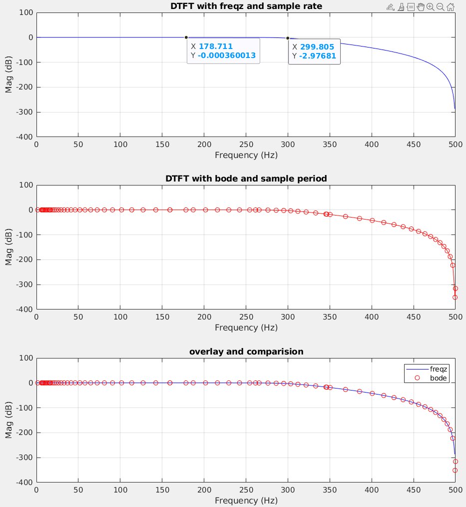

```verilog
figure(2)
ylim([-400, 100])
[h,f] = freqz(b,a,[],fs);
hdb20 = 20*log10(abs(h));
subplot(3,1,1)
plot(f, hdb20, 'b')
ylim([-400, 100])
title('DTFT with freqz and sample rate')
xlabel('Frequency (Hz)')
ylabel('Mag (dB)')
grid on;

subplot(3,1,2)
sys = tf(b, a, 1/fs);
[mag, phs, wout] = bode(sys);
wout = wout(:);
whz = wout/2/pi;
hdb = 20*log10(mag(:));
plot(whz, hdb, 'r-o');
ylim([-400, 100])
title('DTFT with bode and sample period')
xlabel('Frequency (Hz)')
ylabel('Mag (dB)')
grid on;


subplot(3,1,3)
plot(f, hdb20,'b', whz, hdb, 'ro');
legend('freqz', 'bode')
ylim([-400, 100])
title('overlay and comparision')
xlabel('Frequency (Hz)')
ylabel('Mag (dB)')
grid on;

```

### Time Domain from Frequency Domain

Assume input is **sampled by** $f_s$

```verilog
figure(3)
% assume x is sampled by fs
x = rand(1, 50);
y = filter(b, a, x);
xt = (1:50);
plot(xt, x, '-s', xt, y, '-o')
legend('input', 'output')
xlabel('Sample')
ylabel('mag')
title('filter in Time domain')
grid on;
```

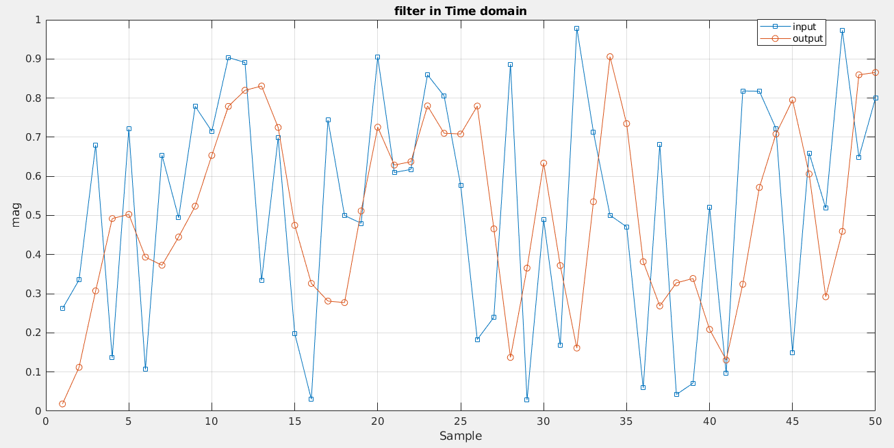


## Bilinear Transformation

**Bilinear Transformation**, also known as **Bilinear Approximation**,  an algebraic transformation between the variables $s$ and $z$ that maps the entire $j\Omega$-axis in the $s$-plane to *one revolution of the unit circle* in the $z$-plane. 

That is, with this approach, $-\infty \le \Omega \le +\infty$ maps onto $-\pi \le \omega \le +\pi$, the transformation between the continuous-time and discrete-time frequency variables is necessarily **nonlinear**.

With $H_c(s)$ denoting the continuous-time system function and $H(z)$ the discrete-time system function, the bilinear transformation corresponds to replacing $s$ by
$$
s=\frac{2}{T_d}\left( \frac{1-z^{-1}}{1+z^{-1}} \right)
$$


that is,
$$
H(z) = H_c\left( \frac{2}{T_d}\left( \frac{1-z^{-1}}{1+z^{-1}} \right) \right)
$$


## Different Variants of the PSD Definition

In the practice of engineering, it has become customary to use slightly different variants of the PSD definition, depending on the particular application or research field. 

- **Two-Sided PSD**, $S_x(f)$

  this is a synonym of the PSD defined as the Fourier Transform of the **autocorrelation**.

- **One-Sided PSD**, $S'_x(f)$

   this is a variant derived from the *two-sided PSD* by considering only the *positive frequency* semi-axis.

  To **conserve the total power**, the value of the one-sided PSD is **twice** that of the two-sided PSD
  $$
  S'_x(f) = \left\{ \begin{array}{cl}
  0 & : \ f \geq 0 \\
  S_x(f) & : \ f = 0 \\
  2S_x(f) & : \ f \gt 0 
  \end{array} \right.
  $$
  


  


> Note that the one-sided PSD definition makes sense only if the two-sided is an even function of $f$


If $S'_x(f)$ is even symmetrical around a positive frequency $f_0$, then two additional definitions can be adopted:

- **Single-Sideband PSD**, $S_{SSB,x}(f)$

  This is obtained from $S'_x(f)$ by moving the origin of the frequency axis to $f_0$
  $$
  S_{SSB,x}(f) =S'_x(f+f_0)
  $$
  This concept is particularly useful for describing phase or amplitude modulation schemes in wireless communications, where $f_0$ is the carrier frequency. 

  > Note that there is no difference in the values of the one-sided versus the SSB PSD; it is just a pure translation on the frequency axis. 

- **Double-Sideband PSD**, $S_{DSB,x}(f)$

  this is a variant of the SSB PSD obtained by considering only the positive frequency semi-axis.

  As in the case of the one-sided PSD, to conserve total power, the value of the DSB PSD is twice that of the SSB
  $$
  S_{DSB,x}(f) = \left\{ \begin{array}{cl}
  0 & : \ f \geq 0 \\
  S_{SSB,x}(f) & : \ f = 0 \\
  2S_{SSB,x}(f) & : \ f \gt 0 
  \end{array} \right.
  $$
  


> Note that the DSB definition makes sense only if the SSB PSD is even symmetrical around zero


## Poles and Zeros of transfer function

### poles

$$
H(s) = \frac{1}{1+s/\omega_0}
$$

magnitude and phase at $\omega_0$ and $-\omega_0$
$$\begin{align}
H(j\omega_0) &=  \frac{1}{1+j} = \frac{1}{\sqrt{2}}e^{-j\pi/4} \\
H(-j\omega_0) &=  \frac{1}{1-j} = \frac{1}{\sqrt{2}}e^{j\pi/4}
\end{align}$$

system response $y(t)$ of input $\cos(\omega_0 t)$, note $\cos(\omega_0t) = \frac{1}{2}(e^{j\omega_0 t} + e^{-j\omega_0 t})$
$$\begin{align}
y(t) &= H(j\omega_0)\cdot \frac{1}{2}e^{j\omega_0 t} + H(-j\omega_0)\cdot \frac{1}{2}e^{-j\omega_0 t} \\
&=  \frac{1}{\sqrt{2}}\cos(\omega_0t-\pi/4)
\end{align}$$

> $\cos(\omega_0 t)$, with frequency same with *pole* **DON'T** have *infinite response*
>
> That is,  pole indicate decrease trending 


### zeros

> similar with poles, $\cos(\omega_0 t)$, with frequency same with *zero* **DON'T** have *zero response*

$$
H(s) = 1+s/\omega_0
$$

magnitude and phase at $\omega_0$ and $-\omega_0$
$$\begin{align}
H(j\omega_0) &= 1+j = \sqrt{2}e^{j\pi/4} \\
H(-j\omega_0) &= 1-j = \sqrt{2}e^{-j\pi/4}
\end{align}$$

system response $y(t)$ of input $\cos(\omega_0 t)$, note $\cos(\omega_0t) = \frac{1}{2}(e^{j\omega_0 t} + e^{-j\omega_0 t})$
$$\begin{align}
y(t) &= H(j\omega_0)\cdot \frac{1}{2}e^{j\omega_0 t} + H(-j\omega_0)\cdot \frac{1}{2}e^{-j\omega_0 t} \\
&=  \sqrt{2}\cos(\omega_0t+\pi/4)
\end{align}$$


## baud rate

**symbol rate**, **modulation rate** or **baud rate** is the number of symbol changes per unit of time.

- Bit rate refers to the number of **bits** transmitted between two devices per unit of time
- The baud or symbol rate refers to the number of **symbols** that can be sent in the same amount of time


## reference

Stephen P. Boyd. EE102 Lecture 10 Sinusoidal steady-state and frequency response [[https://web.stanford.edu/~boyd/ee102/freq.pdf](https://web.stanford.edu/~boyd/ee102/freq.pdf)]

*Gene F. Franklin, J. David Powell, and Abbas Emami-Naeini. 2018. Feedback Control of Dynamic Systems (8th Edition) (8th. ed.). Pearson.*

Inter-Symbol Interference (or Leaky Bits) [[http://blog.teledynelecroy.com/2018/06/inter-symbol-interference-or-leaky-bits.html](http://blog.teledynelecroy.com/2018/06/inter-symbol-interference-or-leaky-bits.html)]

[AN001] Designing from zero an IIR filter in Verilog using biquad structure and bilinear discretization. URL:[[https://www.controlpaths.com/articles/an001_designing_iir_biquad_filter_bilinear/](https://www.controlpaths.com/articles/an001_designing_iir_biquad_filter_bilinear/)]

Frequency warping using the bilinear transform. URL:[[https://www.controlpaths.com/2022/05/09/frequency-warping-using-the-bilinear-transform/](https://www.controlpaths.com/2022/05/09/frequency-warping-using-the-bilinear-transform/)]

Digital control loops. Theoretical approach. URL:[[https://www.controlpaths.com/2022/02/28/digital-control-loops-theoretical-approach/](https://www.controlpaths.com/2022/02/28/digital-control-loops-theoretical-approach/)]

Simulation of DSP algorithms in Verilog. URL:[[https://www.controlpaths.com/2023/05/20/simulation-of-dsp-algorithms-in-verilog/](https://www.controlpaths.com/2023/05/20/simulation-of-dsp-algorithms-in-verilog/)]

Implementing a digital biquad filter in Verilog. URL:[[https://www.controlpaths.com/2021/04/19/implementing-a-digital-biquad-filter-in-verilog/](https://www.controlpaths.com/2021/04/19/implementing-a-digital-biquad-filter-in-verilog/)]

Implementing a FIR filter using folding. URL:[[https://www.controlpaths.com/2021/05/17/implementing-a-fir-filter-using-folding/](https://www.controlpaths.com/2021/05/17/implementing-a-fir-filter-using-folding/)]

Oppenheim, Alan V. and Cram. “Discrete-time signal processing : Alan V. Oppenheim, 3rd edition.” (2011).

Extras: PID Compensator with Bilinear Approximation URL:[[https://ctms.engin.umich.edu/CTMS/index.php?aux=Extras_PIDbilin](https://ctms.engin.umich.edu/CTMS/index.php?aux=Extras_PIDbilin)]

