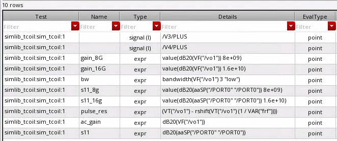

- Broaden the bandwidth
- Create a constant, resistive input impedance in the presence of a heavy load capacitance (ESD protection circuit)

> L<sub>1</sub> = L<sub>2</sub> for impedance matching


The use of T-coils can dramatically increase the **bandwidth** and improve the **return loss** in both TXs and RXs.

## Tcoil in RX


> **ppwl**: Independent Piece-Wise Linear Resistive Source



## simple model

> L1, L2, Km, Cb


## equivalent model

```
simulator lang=spectre
include "/path/to/INDL0.scs"
subckt for_import(p0 p1 p2 gnd)
	xmod (p0 p1 p2 gnd) INDL0
ends for_import

x_1 (p_1_1 p_1_2 p_1_3 0) for_import
v_1_1 (p_1_1 0) vsource mag=-1
v_1_2 (p_1_2 0) vsource mag=0
v_1_3 (p_1_3 0) vsource mag=0
save v_1_1:p v_1_2:p v_1_3:p

x_2 (p_2_1 p_2_2 p_2_3 0) for_import
v_2_1 (p_2_1 0) vsource mag=0
v_2_2 (p_2_2 0) vsource mag=-1
v_2_3 (p_2_3 0) vsource mag=0
save v_2_1:p v_2_2:p v_2_3:p

x_3 (p_3_1 p_3_2 p_3_3 0) for_import
v_3_1 (p_3_1 0) vsource mag=0
v_3_2 (p_3_2 0) vsource mag=0
v_3_3 (p_3_3 0) vsource mag=-1
save v_3_1:p v_3_2:p v_3_3:p
Y ac start=1.000000e+08 stop=2.000000e+10 step=1.000000e+08

xsp (p_1 p_2 p_3 0) for_import
port1 (p_1 0) port
port2 (p_2 0) port
port3 (p_3 0) port
S sp start=1.000000e+08 stop=2.000000e+10 step=1.000000e+08 ports=[ port1 port2 port3]
```


### `EMX_plot_tcoil` in `emxform.ils`

```
(define (EMX_plot_tcoil bgui wid what)
  (needNCells 'adtComplex 100000)
  (letseq ((to_z (lambda (ys)
		   (letseq ((y11 (EMX_matrix_ref ys 0 0))
			    (y12 (EMX_matrix_ref ys 0 1))
			    (y21 (EMX_matrix_ref ys 1 0))
			    (y22 (EMX_matrix_ref ys 1 1))
			    (det y11*y22-y12*y21)
			    (z11 y22/det)
			    (z12 -y12/det)
			    (z22 y11/det))
		     (list z11 z12 z22))))
	   (ground
	    (lambda (y p)
	      (letseq ((n (EMX_matrix_rows y))
		       (yg (make_EMX_matrix n-1)))
		(do ((i 0 i+1))
		    ((i >= n-1))
		  (do ((j 0 j+1))
		      ((j >= n-1))
		    (EMX_matrix_set yg i j (EMX_matrix_ref y i+(if (i >= p) 1 0) j+(if (j >= p) 1 0)))))
		yg)))
	   (reduce
	    (lambda (yys)
	      (letseq ((xvec (drGetWaveformXVec (car yys)))
		       (n (drVectorLength xvec))
		       (yyvecs (mapcar drGetWaveformYVec yys))
		       (zz1 (drCreateVec 'doublecomplex n))
		       (zz2 (drCreateVec 'doublecomplex n))
		       (zz3 (drCreateVec 'doublecomplex n)))
		(do ((i 0 i+1))
		    ((i >= n))
		  (let ((ys (mapcar (lambda (w) (drGetElem w i)) yyvecs)))
		    (setq ys (ground (as_EMX_matrix 3 3 ys) 2))
		    (let ((zz (to_z ys)))
		      (drSetElem zz1 i (nth 0 zz))
		      (drSetElem zz2 i (nth 1 zz))
		      (drSetElem zz3 i (nth 2 zz)))))
		(list (drCreateWaveform xvec zz1)
		      (drCreateWaveform xvec zz2)
		      (drCreateWaveform xvec zz3)))))
	   (get_k
	    (lambda (l12 l1122)
	      (letseq ((xvec (drGetWaveformXVec l12))
		       (n (drVectorLength xvec))
		       (l12v (drGetWaveformYVec l12))
		       (l1122v (drGetWaveformYVec l1122))
		       (resultv (drCreateVec 'double n)))
		(do ((i 0 i+1))
		    ((i >= n))
		  (letseq ((l12i (drGetElem l12v i))
			   (l1122i (drGetElem l1122v i))
			   (kk (if (l1122i > 0.0)
				   l12i/(sqrt l1122i)
				   0.0))
			   (k (if ((abs kk) < 2.0) kk 0.0)))
		    (drSetElem resultv i k)))
		(drCreateWaveform xvec resultv)))))
  (EMX_plot_aux bgui wid what 3
		'("Inductance" "Q" "k")
		'("Henry" "" "")
		(lambda (ys)
		  (letseq ((zs (reduce ys))
			   (z11 (nth 0 zs))
			   (z12 (nth 1 zs))
			   (z22 (nth 2 zs))
			   (pi 3.14159265358979)
			   (f (xval z11))
			   (l11 (imag z11)/(2*pi*f))
			   (q11 (imag z11)/(real z11))
			   (l12 (imag z12)/(2*pi*f))
			   (l22 (imag z22)/(2*pi*f))
			   (q22 (imag z22)/(real z22))
			   (k (get_k l12 l11*l22)))
		    `((,l11 ,l22) (,q11 ,q22) (,k))))
		'(("L1" "L2") ("Q1" "Q2") ("k")))))
```

## tcoil and tapped inductor

tcoil and tapped inductor share same EM simulation result, and use modelgen with different model formula.

The relationship is
$$
L_{\text{sim}} = L1_{\text{sim}}+L2_{\text{sim}}+2\times k_{\text{sim}} \times \sqrt{L1_{\text{sim}}\cdot L2_{\text{sim}}}
$$
where $L1_{\text{sim}}$, $L2_{\text{sim}}$ and $k_{\text{sim}}$ come from tcoil model result,  $L_{\text{sim}}$ comes from tapped inductor model result

> $k_{\text{sim}}$ in EMX have assumption, induce current from P1 and P2
> Given Dot Convention:
>
> Same direction : k > 0
>
> Opposite direction : k < 0
>
> So, the $k_{\text{sim}}$ is negative if routing coil in same direction


```matlab
% EMX - shield tcoil model
L1 = csvread('./L1sim.csv', 1, 0);
L2 = csvread('./L2sim.csv', 1, 0);
k = csvread('./ksim.csv', 1, 0);

% EMX - Tapped shield inductor
L = csvread('./Lsim.csv', 1, 0);

freq = L1(:, 1)/1e9;    % GHz
L1 = L1(:, 2);
L2 = L2(:, 2);
k = -k(:, 2);   % Caution: minus of EMX ksim due to same current direction

L = L(:, 2);

Lcalc = L1 + L2 + 2*k.*(L1.*L2).^0.5;

plot(freq, L*1e9, 'r', 'LineWidth', 3);
hold on;
plot(freq, Lcalc*1e9, '--b', 'LineWidth', 3);
grid on;
xlabel('Freq (GHz)');
ylabel('Inductance (nH)');
legend('Tapped inductor model', 'tcoil model calc');
```


## reference

B. Razavi, "The Bridged T-Coil [A Circuit for All Seasons]," IEEE Solid-State Circuits Magazine, Volume. 7, Issue. 40, pp. 10-13, Fall 2015.

B. Razavi, "The Design of Broadband I/O Circuits [The Analog Mind]," IEEE Solid-State Circuits Magazine, Volume. 13, Issue. 2, pp. 6-15, Spring 2021.

S. Galal and B. Razavi, "Broadband ESD protection circuits in CMOS technology," in IEEE Journal of Solid-State Circuits, vol. 38, no. 12, pp. 2334-2340, Dec. 2003, doi: 10.1109/JSSC.2003.818568.

M. Ker and Y. Hsiao, "On-Chip ESD Protection Strategies for RF Circuits in CMOS Technology," 2006 8th International Conference on Solid-State and Integrated Circuit Technology Proceedings, 2006, pp. 1680-1683, doi: 10.1109/ICSICT.2006.306371.

M. Ker, C. Lin and Y. Hsiao, "Overview on ESD Protection Designs of Low-Parasitic Capacitance for RF ICs in CMOS Technologies," in IEEE Transactions on Device and Materials Reliability, vol. 11, no. 2, pp. 207-218, June 2011, doi: 10.1109/TDMR.2011.2106129.

[David J. Allstot Bandwidth Extension Techniques for CMOS Amplifiers](https://pdfs.semanticscholar.org/29db/7f450d63eee941424655fb787de7d644a3c2.pdf)

[Bob Ross, "T-Coil Topics" DesignCon IBIS Summit 2011](https://ibis.org/summits/feb11/ross.pdf)

