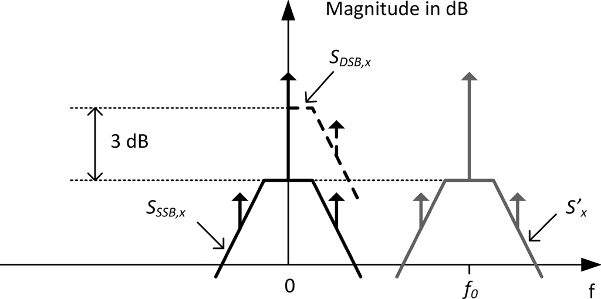

In the practice of engineering, it has become customary to use slightly different variants of the PSD definition, depending on the particular application or research field. 

- **Two-Sided PSD**, $S_x(f)$

  this is a synonym of the PSD defined as the Fourier Transform of the **autocorrelation**.

- **One-Sided PSD**, $S'_x(f)$

   this is a variant derived from the *two-sided PSD* by considering only the *positive frequency* semi-axis.

  To **conserve the total power**, the value of the one-sided PSD is **twice** that of the two-sided PSD
  $$
  S'_x(f) = \left\{ \begin{array}{cl}
  0 & : \ f \geq 0 \\
  S_x(f) & : \ f = 0 \\
  2S_x(f) & : \ f \gt 0 
  \end{array} \right.
  $$
  

  

> Note that the one-sided PSD definition makes sense only if the two-sided is an even function of $f$

If $S'_x(f)$ is even symmetrical around a positive frequency $f_0$, then two additional definitions can be adopted:

- **Single-Sideband PSD**, $S_{SSB,x}(f)$

  This is obtained from $S'_x(f)$ by moving the origin of the frequency axis to $f_0$
  $$
  S_{SSB,x}(f) =S'_x(f+f_0)
  $$
  This concept is particularly useful for describing phase or amplitude modulation schemes in wireless communications, where $f_0$ is the carrier frequency. 

  > Note that there is no difference in the values of the one-sided versus the SSB PSD; it is just a pure translation on the frequency axis. 

- **Double-Sideband PSD**, $S_{DSB,x}(f)$

  this is a variant of the SSB PSD obtained by considering only the positive frequency semi-axis.

  As in the case of the one-sided PSD, to conserve total power, the value of the DSB PSD is twice that of the SSB
  $$
  S_{DSB,x}(f) = \left\{ \begin{array}{cl}
  0 & : \ f \geq 0 \\
  S_{SSB,x}(f) & : \ f = 0 \\
  2S_{SSB,x}(f) & : \ f \gt 0 
  \end{array} \right.
  $$
  

> Note that the DSB definition makes sense only if the SSB PSD is even symmetrical around zero

## reference

Da Dalt, N., & Sheikholeslami, A. (2018). Understanding jitter and phase noise: A circuits and systems perspective. Cambridge University Press.
